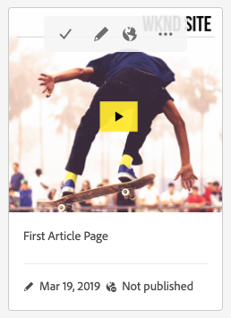

# Sites 콘솔 {#sites-console}

사용 방법 알아보기 **사이트** 콘솔을 사용하여 AEM 페이지를 관리하고 구성합니다.

## 방향 {#orientation}

다음 **사이트** 콘솔을 사용하여 페이지 계층 구조를 볼 수 있습니다.

페이지를 관리하고 구성하는 데 도움이 되는 다양한 보기와 도구 모음을 제공합니다.

* [콘솔 도구 모음](#toolbar) 는 탐색하는 데 도움이 되도록 항상 존재합니다.
* [세 가지 다른 보기](#views) 를 사용하면 페이지를 쉽게 찾아 선택할 수 있습니다.
* [작업 도구 모음](#action-toolbar) 작업을 수행할 항목을 선택하면 나타납니다.
* [사이드 패널](#side-panel) 에는 선택한 페이지에 대한 자세한 정보를 표시하는 여러 옵션이 있습니다.

## 콘솔 도구 모음 {#console-toolbar}

콘솔 도구 모음은 항상 콘솔에 있으며 콘텐츠 방향을 지정하고 콘텐츠를 탐색하는 데 도움이 됩니다.

### 사이드 패널 선택기 {#side-panel-selector}

사이드 패널 선택기를 사용하여 콘솔에서 선택한 항목에 대한 추가 정보를 표시할 수 있습니다.

제공된 옵션은 현재 콘솔에 따라 다릅니다. 예를 들어 **Sites**&#x200B;에서 콘텐츠 전용(기본값), 타임라인, 참조 또는 필터 사이드 패널을 선택할 수 있습니다.

사이드 패널에 대한 자세한 내용은 문서를 참조하십시오 [사이트 콘솔 사이드 패널.](/help/sites-cloud/authoring/sites-console/console-side-panel.md)

### 이동 경로 {#breadcrumbs}

레일의 중간에 위치하며 항상 현재 선택한 항목에 대한 설명을 표시하는 탐색 표시를 사용하면 웹 사이트 수준을 탐색할 수 있습니다.

이동 경로 텍스트를 탭하거나 클릭하여 현재 선택한 항목의 계층 구조 수준을 나열하는 드롭다운을 표시합니다. 해당 위치로 이동하려면 항목을 탭하거나 클릭합니다.

### 모두 선택 {#select-all}

탭 또는 클릭 **모두 선택** 버튼은 콘솔의 현재 보기에 있는 모든 항목을 선택합니다.

모든 항목을 선택한 경우 도구 모음의 오른쪽 상단에 선택한 항목의 수가 표시됩니다. **모두 선택** 단추가 나타났습니다.

모든 항목을 선택 해제하고 다음 방법으로 선택 모드를 종료할 수 있습니다.

* 클릭 또는 탭 **X** 카운트 옆에 있습니다.
* 사용 **탈출** 키.

### 만들기 버튼 {#create-button}

다음 **만들기** 버튼을 사용하면 새 페이지를 사이트에 추가할 수 있을 뿐만 아니라 라이브 카피 또는 론치와 같은 추가 Sites 개체를 만들 수 있습니다.

클릭하면 콘솔/컨텍스트에 해당하는 옵션이 표시됩니다. 가장 일반적인 방법은 다음과 같습니다.

* [페이지](/help/sites-cloud/authoring/sites-console/creating-pages.md)
* [Site](/help/sites-cloud/administering/site-creation/create-site.md)
* [Live Copy](/help/sites-cloud/administering/msm/overview.md)
* [실행](/help/sites-cloud/authoring/launches/overview.md)
* [언어 복사](/help/sites-cloud/administering/translation/overview.md)
* [CSV 보고서](/help/sites-cloud/authoring/sites-console/csv-export.md)

작동 방식에 대한 자세한 내용은 이들 기능에 대한 링크를 참조하십시오.

## 페이지 보기 및 선택 {#views}

다음 **사이트** 콘솔에서는 콘텐츠 계층 구조에 대한 세 가지 보기를 제공합니다. 사용 가능한 보기에서 리소스를 보고, 탐색하고, (추가 작업을 위해) 선택할 수 있습니다.

* [열 보기](#column-view)
* [카드 보기](#card-view)
* [목록 보기](#list-view)

다음 **보기** 아이콘 AEM 도구 모음의 맨 오른쪽에 선택된 현재 보기를 나타냅니다.

탭하거나 클릭하여 다른 보기를 선택할 수 있습니다.

열 보기, 카드 보기 및 목록 보기 간에 전환할 수 있습니다. 목록 보기에서 보기 설정도 표시됩니다.

>[!NOTE]
>
>**보기 설정** 옵션은 **목록 보기** 모드에서만 사용할 수 있습니다.

보기, 탐색 및 선택은 모든 보기에서 개념적으로는 같지만 사용 중인 보기에 따라 처리 방식이 약간 다릅니다.

>[!NOTE]
>
>기본적으로 AEM Assets은 보기의 썸네일로 UI에 있는 자산의 원본 표현물을 표시하지 않습니다. 관리자인 경우, 오버레이를 사용하여 AEM Assets을 구성한 뒤 원본 표현물을 썸네일로 표시할 수 있습니다.

### 리소스 선택 {#selecting-resources}

특정 리소스를 선택하는 방법은 보기 및 디바이스 조합에 따라 다릅니다.

| 보기 | 터치 선택 | 데스크탑 선택 | 터치 선택 해제 | 데스크탑 선택 해제 |
|---|---|---|---|---|
| 열 | 썸네일 선택 | 썸네일 클릭 | 썸네일 선택 | 썸네일 클릭 |
| 카드 | 카드를 선택하고 길게 | 마우스를 위에 놓고 확인 표시 빠른 작업 사용 | 카드 선택 | 카드 클릭 |
| 목록 | 썸네일 선택 | 썸네일 클릭 | 썸네일 선택 | 썸네일 클릭 |

#### 선택 예 {#selecting-example}

1. 예를 들면 카드 보기에서 다음 작업을 수행합니다.

   

1. 리소스를 선택하면 상단 헤더에는 현재 선택한 리소스에 적용할 수 있는 작업에 대한 액세스를 제공하는 [작업 도구 모음](#actions-toolbar)이 표시됩니다.

1. 선택 모드를 종료하려면 오른쪽 상단에서 **X**&#x200B;를 선택하거나 **Esc** 키를 사용하십시오.

### 열 보기 {#column-view}

열 보기를 사용하면 일련의 계단식 열을 통해 콘텐츠 트리를 시각적으로 탐색할 수 있습니다. 이 보기에서는 웹 사이트의 트리 구조를 시각화하고 트래버스할 수 있습니다.

맨 왼쪽 열의 리소스를 선택하면 오른쪽 열에 하위 리소스가 표시됩니다. 오른쪽 열에서 리소스를 선택하면 오른쪽의 다른 열에 하위 리소스가 표시됩니다.

* 리소스 이름 또는 리소스 이름 오른쪽에 있는 V자형 화살표를 탭하거나 클릭하여 트리에서 위아래로 탐색할 수 있습니다.

   * 탭하거나 클릭하면 리소스 이름과 V자형 화살표가 강조 표시됩니다.
   * 클릭하거나 탭한 리소스의 하위 항목은 클릭하거나 탭한 리소스의 오른쪽에 있는 열에 표시됩니다.
   * 하위 항목이 없는 리소스 이름을 선택하면 해당 세부 정보가 마지막 열에 표시됩니다.

* 썸네일을 탭하거나 클릭하면 리소스가 선택됩니다.

   * 선택하면 확인 표시가 썸네일에 오버레이되고 리소스 이름이 강조 표시됩니다.
   * 선택한 리소스의 세부 정보가 마지막 열에 표시됩니다.
   * 작업 도구 모음을 사용할 수 있습니다.

* [열 보기]에서 페이지를 선택하면 선택한 페이지가 다음 세부 정보와 함께 마지막 열에 표시됩니다.

   * 페이지 제목
   * 페이지 이름(페이지 URL 일부)
   * 페이지의 기반이 되는 템플릿
   * 수정 세부 사항
   * 페이지 언어
   * 게시 및 세부 정보 미리보기

### 카드 보기 {#card-view}

카드 보기에서 계층 구조의 현재 수준에 있는 각 항목이 큰 카드로 표시됩니다.

* 카드는 다음과 같은 정보를 제공합니다.

   * 페이지 컨텐츠의 시각적 표현.
   * 페이지 제목.
   * 중요한 날짜(예: 마지막 편집 날짜, 마지막 게시 날짜).
   * 페이지가 잠겨 있거나 숨겨져 있거나 라이브 카피의 일부인 경우
   * 워크플로우의 일부로 항목에 대해 작업을 수행해야 하는 경우 표시기입니다.

카드 보기의 오퍼 [빠른 작업](#quick-actions) 선택 항목 및 일반적인 작업(예: 편집)

카드를 탭하거나 클릭하여 트리 아래를 탐색하거나(빠른 작업을 탭하지 않도록 주의) 를 사용하여 트리 위로 다시 탐색할 수 있습니다. [헤더의 이동 경로](#the-header).

### 목록 보기 {#list-view}

목록 보기는 목록의 현재 수준에서 각 리소스에 대한 정보를 제공합니다.

* 리소스 이름을 탭/클릭하여 트리를 탐색하고 [헤더에서 [이동 경로]](#the-header)를 사용하여 백업할 수 있습니다.
* 목록의 모든 항목을 쉽게 선택하려면 [**모두 선택** 확인란을 선택합니다.](#select-all)

* [보기] 버튼 아래에 있는 **보기 설정** 옵션을 사용하여 표시할 열을 선택합니다. 다음 열이 표시될 수 있습니다.

   * **이름** - 페이지 이름이며, 페이지 URL의 일부이고 언어와 관계없이 변경되지 않으므로 다국어 제작 환경에서 유용할 수 있습니다.
   * **수정됨** - 마지막 수정 일자 및 수정자
   * **게시됨** - 게시 상태
   * **미리보기** 상태 미리보기
   * **템플릿** - 페이지의 기반이 되는 템플릿
   * **작업**
   * **워크플로** - 페이지에 현재 적용된 워크플로입니다. 마우스로 가리키거나 타임라인을 열면 자세한 정보를 사용할 수 있습니다.
   * **번역됨**
   * **페이지 보기 수**
   * **고유 방문자 수**
   * **페이지에서 시간**

기본적으로 페이지 URL 부분을 구성하는 **이름** 열이 표시됩니다. 일부 경우에는 작성자가 다른 언어로 된 페이지에 액세스해야 하며 작성자가 페이지의 언어를 모르는 경우 페이지 이름(일반적으로 변경되지 않음)을 확인하면 도움이 될 수 있습니다.

* 목록에서 각 항목의 맨 오른쪽에 있는 점선 세로 막대를 사용하여 항목 순서를 변경합니다.

수직 선택 막대를 선택하고 항목을 목록의 새 위치로 드래그합니다.

>[!NOTE]
>
>순서 변경은 `jcr:primaryType` 값이 `sling:OrderedFolder`인 순서가 지정된 폴더 내에서만 작동합니다.

## 작업 도구 모음 {#actions-toolbar}

리소스를 선택할 때마다 선택한 항목에 대해 다양한 작업을 수행할 수 있습니다. 이러한 작업은 작업 도구 모음에 표시됩니다.

작업 도구 모음은 콘솔에서 리소스를 선택한 경우에만 나타납니다. 작업 도구 모음에서 사용할 수 있는 작업은 선택한 특정 항목에서 수행할 수 있는 작업을 반영하도록 변경됩니다. 가장 일반적인 작업은 다음과 같습니다.

* [**만들기**](#create-action) - 새 콘텐츠 또는 콘텐츠 관련 작업 만들기
* **편집** - 선택한 페이지를 만든 방법에 따라 **편집** 그러면 적절한 편집기가 열립니다.
   * [페이지 편집기](/help/sites-cloud/authoring/page-editor/introduction.md) - AEM 페이지 편집기로 만든 페이지의 경우
   * [유니버설 편집기](/help/sites-cloud/authoring/universal-editor/authoring.md) - 범용 편집기로 만든 페이지
* [**속성**](/help/sites-cloud/authoring/sites-console/page-properties.md) - 페이지 속성 창을 엽니다.
* [**잠금**](/help/sites-cloud/authoring/sites-console/managing-pages.md#locking-a-page) - 다른 사용자가 변경하지 못하도록 페이지 잠금
* [**복사**](/help/sites-cloud/authoring/sites-console/managing-pages.md#copying-and-pasting-a-page) - 페이지 복사
* [**이동**](/help/sites-cloud/authoring/sites-console/managing-pages.md#moving-or-renaming-a-page) - 페이지 이동 또는 이름 바꾸기
* [**빠른 게시**](/help/sites-cloud/authoring/sites-console/publishing-pages.md#quick-publish) - 페이지를 즉시 게시
* [**게시 관리**](/help/sites-cloud/authoring/sites-console/publishing-pages.md#manage-publication) - 게시할 페이지 예약
* [**복원**](/help/sites-cloud/authoring/sites-console/page-versions.md#restore-version) - 페이지 또는 페이지 트리의 버전 복원
* [**삭제**](/help/sites-cloud/authoring/sites-console/managing-pages.md#deleting-a-page) - 페이지 삭제

일부 창은 공간이 제한되어 있으므로 도구 모음이 사용할 수 있는 공간보다 바로 길어질 수 있습니다. 이 경우 추가 옵션이 표시됩니다. 생략 부호(세 점 또는 **...**) 나머지 모든 작업을 포함하는 드롭다운 선택기를 엽니다.

### 작업 만들기 {#create-action}

만들기 작업은 다음과 유사한 옵션을 제공합니다. [**만들기** 도구 모음 단추](#create-button) 새 페이지 및 유사한 항목을 만들 때 사용합니다.

또한 페이지 관련 작업을 만들 수 있는 기능도 제공합니다.

* [**워크플로**](/help/sites-cloud/authoring/workflows/overview.md) - 페이지에 워크플로우 적용
* [**버전**](/help/sites-cloud/authoring/sites-console/page-versions.md) - 페이지 버전 만들기

## 템플릿

[**열 보기**](/help/sites-cloud/authoring/basic-handling.md#column-view) 또는 [**목록 보기**](/help/sites-cloud/authoring/basic-handling.md#list-view)&#x200B;에서 페이지를 선택하면 페이지의 기본 템플릿을 쉽게 볼 수 있습니다.
