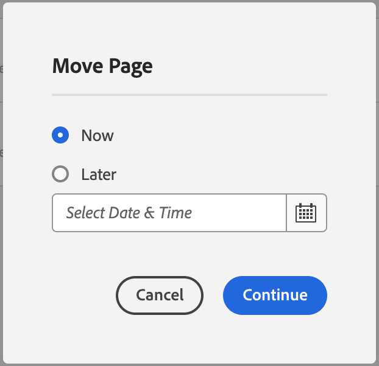

# 페이지 관리 {#managing-pages}

이동, 복사 및 삭제를 포함하여 AEM에서 웹 사이트의 페이지를 관리하는 방법에 대해 알아봅니다.

>[!TIP]
>
>페이지 관리를 시작하기 전에 다음 사항에 익숙해지도록 합니다 [AEM에서 페이지를 구성하는 방법.](/help/sites-cloud/authoring/sites-console/organizing-pages.md)

>[!TIP]
>
>몇 개 있습니다 [키보드 단축키](/help/sites-cloud/authoring/sites-console/keyboard-shortcuts.md) 를 사용하면 웹 사이트 콘솔에서 페이지를 보다 효율적으로 구성할 수 있습니다.

## 액세스 권한 {#access-privileges}

생성, 복사, 이동, 편집, 삭제와 같은 페이지에서 작업을 수행하려면 계정에 적절한 액세스 권한과 권한이 있어야 합니다.

문제가 발생하면 시스템 관리자에게 문의하십시오.

## 편집할 페이지 열기 {#opening-a-page-for-editing}

다음 이후 [페이지 만들기](/help/sites-cloud/authoring/sites-console/creating-pages.md) 또는 를 사용하여 기존 페이지로 이동 [다음 **사이트** 콘솔,](/help/sites-cloud/authoring/sites-console/introduction.md) 편집을 위해 열 수 있습니다.

1. 열기 [다음 **사이트** 콘솔.](/help/sites-cloud/authoring/sites-console/introduction.md)
1. 편집할 페이지로 이동합니다.
1. 다음 중 하나를 사용하여 페이지를 선택합니다.

   * [빠른 작업](/help/sites-cloud/authoring/basic-handling.md#quick-actions)
   * [선택 모드](/help/sites-cloud/authoring/basic-handling.md#selecting-resources) 및 도구 모음

1. 을(를) 탭하거나 클릭합니다 **편집** 아이콘.

   

1. 페이지가 열리고, 필요에 따라 페이지를 편집할 수 있습니다. 선택한 페이지를 만든 방법에 따라 **편집** 그러면 적절한 편집기가 열립니다.
   * [페이지 편집기](/help/sites-cloud/authoring/page-editor/introduction.md) - AEM 페이지 편집기로 만든 페이지의 경우
   * [유니버설 편집기](/help/sites-cloud/authoring/universal-editor/authoring.md) - 범용 편집기로 만든 페이지

## 페이지 복사 및 붙여넣기 {#copying-and-pasting-a-page}

페이지 및 모든 하위 페이지를 새 위치에 복사할 수 있습니다.

1. 열기 [다음 **사이트** 콘솔.](/help/sites-cloud/authoring/sites-console/introduction.md)
1. 복사할 페이지로 이동하여 찾습니다.
1. 다음 중 하나를 사용하여 페이지를 선택합니다.

   * [빠른 작업](/help/sites-cloud/authoring/basic-handling.md#quick-actions)
   * [선택 모드](/help/sites-cloud/authoring/basic-handling.md#selecting-resources) 및 도구 모음

1. 을(를) 탭하거나 클릭합니다 **복사** 페이지 아이콘.

   

1. 페이지의 새 사본을 위한 위치로 이동합니다.
1. 다음 항목 선택 **붙여넣기** 아이콘을 사용할 수 있습니다.

   

1. 붙여넣기 대화 상자에 붙여넣기 트랜잭션 및 다음과 같은 기능에 대한 요약이 표시됩니다.
   * **새 사이트 이름:** 붙여넣은 페이지의 이름 바꾸기
   * **하위 항목을 포함하지 않고 붙여넣기:** 붙여넣을 때 선택한 페이지의 하위 페이지 생략(기본값: 하위 페이지도 붙여짐)

   

1. 다음 항목 선택 **붙여넣기** 단추를 클릭하여 붙여넣기 트랜잭션을 확인하고 새 페이지를 만듭니다.

>[!NOTE]
>
>페이지를 원본과 동일한 이름의 페이지가 이미 있는 위치에 복사하는 경우 숫자가 추가되어 변형된 이름이 자동으로 생성됩니다. 예를 들어 `beach`가 이미 존재하는 경우, `beach`를 사용하는 새 페이지는 `beach1`이 됩니다.

>[!NOTE]
>
>선택 모드에서 붙여넣기 작업을 시작하면 페이지가 복사되는 즉시 자동으로 종료됩니다.

## 페이지 이동 또는 이름 바꾸기 {#moving-or-renaming-a-page}

페이지 이동 절차와 이름 바꾸기 절차는 기본적으로 동일하며 두 작업은 모두 페이지 이동 마법사에 의해 처리됩니다. 이 마법사를 사용하여 다음과 같은 작업을 수행할 수 있습니다.

* 페이지를 이동하지 않고 이름을 변경합니다.
* 이름을 변경하지 않고 페이지를 이동합니다.
* 동시에 이동하여 이름을 변경합니다.

AEM에서는 이름을 바꾸거나 이동하는 페이지를 참조하는 모든 내부 링크를 업데이트하는 기능을 제공합니다. 페이지별로 다른 기준을 적용할 수 있으므로 완벽한 유연성이 발휘됩니다.

1. 열기 [다음 **사이트** 콘솔.](/help/sites-cloud/authoring/sites-console/introduction.md)
1. 이동할 페이지를 찾습니다.
1. 다음 중 하나를 사용하여 페이지를 선택합니다.

   * [빠른 작업](/help/sites-cloud/authoring/basic-handling.md#quick-actions)
   * [선택 모드](/help/sites-cloud/authoring/basic-handling.md#selecting-resources) 및 도구 모음

1. 을(를) 탭하거나 클릭합니다 **이동** 페이지 아이콘 - 페이지 이동 마법사를 엽니다.

   

1. 다음에서 **이름 바꾸기** 마법사의 단계에서는 다음 중 하나를 수행할 수 있습니다.

   * 페이지가 이동되면 사용할 페이지의 이름을 지정한 다음 을 선택합니다 **다음** 계속합니다.
   * 프로세스를 중단하려면 **취소**&#x200B;를 클릭/탭합니다.

   

   * 페이지를 이동하는 경우에만 페이지 이름이 동일하게 유지될 수 있습니다.

   >[!NOTE]
   >
   >페이지를 동일한 이름의 페이지가 이미 있는 위치로 이동하는 경우 숫자가 추가되어 변형된 이름이 자동으로 생성됩니다. 예를 들어 `beach`가 이미 존재하는 경우, `beach`를 사용하는 새 페이지는 `beach1`이 됩니다.

1. 다음에서 **대상 선택** 마법사의 단계에서는 다음 중 하나를 수행할 수 있습니다.

   * [열 보기](/help/sites-cloud/authoring/basic-handling.md#column-view)를 사용하여 페이지의 새 위치를 탐색할 수 있습니다.

      * 대상의 썸네일을 클릭하여 대상을 선택합니다.
      * 계속하려면 **다음**&#x200B;을 클릭하십시오.

   * **뒤로**&#x200B;를 사용하여 페이지 이름 지정으로 돌아갑니다.

   >[!NOTE]
   >
   >기본적으로 이동/이름을 바꾼 페이지의 상위 페이지는 대상으로 선택됩니다.

   

   >[!NOTE]
   >
   >페이지를 동일한 이름의 페이지가 이미 있는 위치로 이동하는 경우 숫자가 추가되어 변형된 이름이 자동으로 생성됩니다. 예를 들어 `winter`가 이미 존재하는 경우, `winter`는 `winter1`이 됩니다.

1. 페이지가 연결되거나 참조된 경우 또는 게시된 경우, 세부 사항이 **조정/다시 게시** 단계에서 나열됩니다.

   * 조정 및/또는 다시 게시해야 하는 사항을 적절히 표시할 수 있습니다.

   >[!NOTE]
   >
   >페이지가 연결 또는 참조되지 않은 경우 이 단계를 사용할 수 없습니다.

   

1. 탭 또는 클릭 **이동** 이동 작업을 언제 수행할지 정의합니다.

   * **지금** 이(가) 다음을 트리거합니다. [비동기 작업](#asynchronous-actions) 페이지를 즉시 이동합니다.
   * **나중에** 이동을 처리할 날짜를 예약할 수 있습니다.

   

1. 탭 또는 클릭 **계속** 을 클릭하여 페이지 이동을 완료합니다.

>[!NOTE]
>
>페이지가 이미 게시된 경우, 페이지를 이동하면 자동으로 게시가 취소됩니다. 기본적으로 이동이 완료되면 다시 게시되지만, **조정/다시 게시** 단계에서 **다시 게시** 필드를 선택 해제하여 변경할 수 있습니다.

>[!NOTE]
>
>페이지 이름 바꾸기는 새 페이지 이름을 지정할 때의 [페이지 이름 지정 규칙](#page-naming-conventions)을 따릅니다.

>[!NOTE]
>
>페이지는 페이지가 기반으로 하는 템플릿이 허용되는 위치로만 이동할 수 있습니다. 자세한 내용은 [템플릿 가용성](/help/implementing/developing/components/templates.md#template-availability)을 참조하십시오.

### 비동기 작업 {#asynchronous-actions}

페이지 이동 작업은 항상 비동기적으로 처리되므로 사용자는 방해받지 않고 UI에서 계속 작성할 수 있습니다.

비동기 작업의 상태는 [**비동기 작업 상태** 대시보드](/help/operations/asynchronous-jobs.md#monitor-the-status-of-asynchronous-operations) 위치: **전역 탐색** > **도구** > **작업** > **작업**

>[!TIP]
>
>비동기 작업 처리와 페이지 이동/이름 바꾸기 작업에 대한 제한을 구성하는 방법에 대한 자세한 내용은 작업 사용 안내서에서 [비동기 작업](/help/operations/asynchronous-jobs.md) 문서를 참조하십시오.

### 페이지 삭제 {#deleting-a-page}

1. 열기 [다음 **사이트** 콘솔.](/help/sites-cloud/authoring/sites-console/introduction.md)
1. 삭제할 페이지로 이동합니다.
1. [선택 모드](/help/sites-cloud/authoring/basic-handling.md#viewing-and-selecting-resources)를 사용하여 필요한 페이지를 선택한 다음, 도구 모음에서&#x200B;**삭제**&#x200B;를 사용합니다.

   

1. 확인을 묻는 대화 상자가 표시됩니다.

   

   * **삭제하기 전에 페이지를 보관하시겠습니까?** - 이 확인란을 선택한 경우 삭제하도록 선택한 페이지의 버전이 삭제 시 생성됩니다.
      * [버전은 나중에 복원할 수 있습니다](/help/sites-cloud/authoring/sites-console/page-versions.md).
      * 이전 버전 없이 삭제된 페이지는 복원할 수 없습니다.
1. 탭 또는 클릭 **취소** 작업을 중단하려면 또는 **삭제** 작업을 확인합니다.
   * 페이지에 참조가 없으면 페이지가 삭제됩니다.
   * 페이지에 참조가 있으면, 메시지 상자에 다음과 같이 표시됩니다 **하나 이상의 페이지가 참조되었습니다.** 다음을 선택할 수 있습니다. **강제 삭제** 또는 **취소**.

>[!NOTE]
>
>페이지가 이미 게시되어 있으면 삭제하기 전에 자동으로 게시 취소됩니다.

### 페이지 잠금 {#locking-a-page}

콘솔에서 또는 개별 페이지를 편집할 때 [페이지 잠금/잠금 해제](/help/sites-cloud/authoring/page-editor/edit-content.md#locking-a-page)할 수 있습니다. 페이지가 잠겨 있는지 여부도 두 위치 모두에 표시됩니다.

### 새 폴더 만들기 {#creating-a-new-folder}

파일 및 페이지 구성에 도움이 되도록 폴더를 만들 수 있습니다.

1. 열기 [다음 **사이트** 콘솔.](/help/sites-cloud/authoring/sites-console/introduction.md)
1. 필요한 위치로 이동합니다.
1. 옵션 목록을 열려면 도구 모음에서 **만들기**&#x200B;를 선택합니다.
1. 폴더 대화 상자를 열려면 **폴더**&#x200B;를 선택합니다. 여기에서 **이름** 및 **제목**&#x200B;을 입력할 수 있습니다.

   

1. 폴더를 만들려면 **만들기**&#x200B;를 선택합니다.

>[!NOTE]
>
>* 폴더도 새 폴더 이름을 지정할 때 [페이지 이름 지정 규칙](#page-naming-conventions)을 따릅니다.
>* 폴더는 **Sites**&#x200B;나 다른 폴더 아래에서만 직접 만들 수 있습니다. 페이지 아래에서는 만들 수 없습니다.
>* 표준 작업인 이동, 복사, 붙여넣기, 삭제, 게시, 게시 취소 및 보기/편집 속성은 폴더에서 수행할 수 있습니다.
>* Live Copy 내에서는 폴더를 선택할 수 없습니다.
