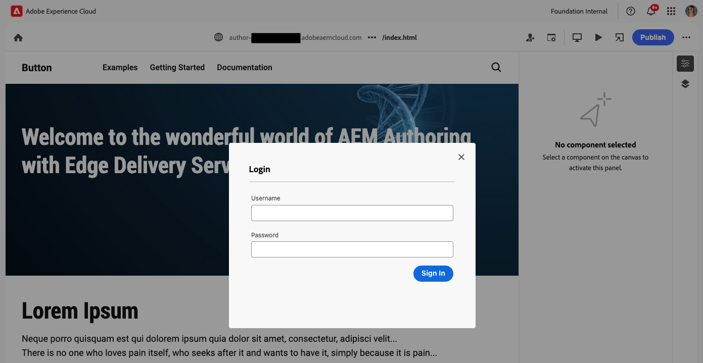

# Universal Editor로 콘텐츠 작성 {#authoring}

콘텐츠 작성자가 Universal Editor를 사용하여 얼마나 쉽고 직관적으로 콘텐츠를 만들 수 있는지 알아봅니다.

## 소개 {#introduction}

범용 편집기를 사용하면 모든 구현에서 콘텐츠의 모든 측면을 편집할 수 있으므로 탁월한 경험을 제공하고 콘텐츠 속도를 높일 수 있습니다.

이를 위해 제공되는 Universal Editor는 콘텐츠 작성자가 최소한의 교육만 받으면 사용할 수 있어 바로 부담 없이 콘텐츠 편집을 시작할 수 있습니다. 이 문서에서는 Universal Editor의 작성 환경에 대해 설명합니다.

>[!NOTE]
>
>이 문서에서는 사용자가 이미 유니버설 편집기에 액세스하고 탐색하는 방법을 잘 알고 있다고 가정합니다. 그렇지 않은 경우 [범용 편집기 액세스 및 탐색](/help/sites-cloud/authoring/universal-editor/navigation.md)을 참조하십시오.

>[!TIP]
>
>유니버설 편집기에 대한 자세한 소개는 [유니버설 편집기 소개](/help/implementing/universal-editor/introduction.md)를 참조하십시오.

## 콘텐츠 편집 {#editing-content}

콘텐츠 편집은 간단하고 직관적입니다. 편집기에서 콘텐츠 위로 마우스를 가져가면 편집 가능한 콘텐츠가 가는 파란색 윤곽선으로 강조 표시됩니다.

>[!TIP]
>
>기본적으로 콘텐츠를 탭하거나 클릭하면 편집할 콘텐츠가 선택됩니다. 다음 링크를 통해 콘텐츠를 탐색하려면 [미리 보기 모드](/help/sites-cloud/authoring/universal-editor/navigation.md#preview-mode)(으)로 전환하세요.

선택한 콘텐츠에 따라 즉석 편집 옵션이 다를 수 있으며 [속성 패널](/help/sites-cloud/authoring/universal-editor/navigation.md#properties-rail)에서 콘텐츠에 대한 추가 정보 및 옵션을 사용할 수 있습니다.

### 일반 텍스트 편집 {#edit-plain-text}

구성 요소를 두 번 클릭하거나 두 번 탭하여 텍스트를 편집할 수 있습니다.

얇은 파란색 윤곽선이 짙은 파란색 윤곽선으로 바뀌면 선택 표시가 나타나고 커서가 나타납니다. 변경한 다음 Enter/Return 키를 누르거나 텍스트 상자 바깥쪽을 선택하여 변경 내용을 저장합니다.

텍스트 구성 요소를 선택하면 자세한 정보가 [속성 패널](/help/sites-cloud/authoring/universal-editor/navigation.md#properties-rail)에 표시됩니다. 패널에서 텍스트를 편집할 수도 있습니다.

텍스트에 대한 자세한 내용은 속성 패널에서 확인할 수 있습니다. 포커스가 속성 패널의 편집된 필드를 떠나면 변경 사항이 자동으로 저장됩니다.

### 리치 텍스트 편집 {#edit-rich-text}

구성 요소를 두 번 클릭하거나 두 번 탭하여 텍스트를 편집할 수 있습니다.

사용자의 편의를 위해 서식 옵션 및 텍스트에 대한 세부 사항을 두 곳에서 사용할 수 있습니다.

#### 컨텍스트 메뉴 {#context-menu}

상황에 맞는 메뉴가 서식 있는 텍스트 블록 위에 열리고 상황에 맞는 기본 서식 옵션을 제공합니다. 공간 제약으로 인해 일부 옵션이 줄임표 버튼 뒤에 숨겨질 수 있습니다.

포커스가 편집된 필드를 떠나면 변경 사항이 자동으로 저장됩니다.

#### 속성 패널 {#properties-rail}

[속성 패널](/help/sites-cloud/authoring/universal-editor/navigation.md#properties-rail)에 선택한 텍스트에 대한 항목이 표시됩니다. 텍스트를 편집하려면 더 큰 캔버스를 표시하는 대화 상자를 열려면 항목을 탭하십시오.

변경 내용을 취소하거나 저장하려면 각각 **취소** 또는 **완료**&#x200B;를 탭하거나 클릭합니다.

### 미디어 편집 {#edit-media}

[속성 패널](/help/sites-cloud/authoring/universal-editor/navigation.md#properties-rail)에서 자세한 내용을 볼 수 있습니다.

1. [속성] 패널에서 선택한 이미지의 미리 보기를 탭하거나 클릭합니다.
1. 자산을 선택할 수 있는 [자산 선택기](/help/assets/overview-asset-selector.md#using-asset-selector) 창이 열립니다.
1. 새 자산을 선택하려면 를 선택합니다.
1. 자산을 바꾼 속성 패널로 돌아가려면 **Select**&#x200B;을(를) 선택하십시오.

변경 사항은 콘텐츠에 자동으로 저장됩니다.

### 콘텐츠 조각 편집 {#edit-content-fragment}

[콘텐츠 조각](/help/sites-cloud/administering/content-fragments/overview.md)을(를) 선택하면 [속성 패널](/help/sites-cloud/authoring/universal-editor/navigation.md#properties-rail)에서 세부 정보를 편집할 수 있습니다.

선택한 콘텐츠 조각의 콘텐츠 모델에 정의된 필드가 표시되고 속성 패널에서 편집할 수 있습니다.

콘텐츠 조각과 관련된 필드를 선택하면 콘텐츠 조각이 구성 요소 패널에 로드되고 해당 필드는 자동으로 스크롤됩니다.

포커스가 속성 패널의 편집된 필드를 떠나면 변경 사항이 자동으로 저장됩니다.

대신 [콘텐츠 조각 편집기](/help/sites-cloud/administering/content-fragments/authoring.md)에서 콘텐츠 조각을 편집하려면 속성 패널에서 [**CF 편집기에서 열기** 단추](/help/sites-cloud/authoring/universal-editor/navigation.md#edit)를 탭하거나 클릭합니다.

>[!TIP]
>
>핫키 `e`을(를) 사용하여 콘텐츠 조각 편집기에서 선택한 콘텐츠 조각을 편집합니다.

워크플로우의 필요에 따라 범용 편집기에서 또는 콘텐츠 조각 편집기에서 직접 콘텐츠 조각을 편집할 수 있습니다.

>[!NOTE]
>
>유니버설 편집기 [모델에 따라 콘텐츠 조각 필드의 유효성을 검사합니다](/help/assets/content-fragments/content-fragments-models.md#validation). 정규식 패턴 및 고유성 제약 조건과 같은 데이터 무결성 규칙을 적용할 수 있습니다.
>
>이렇게 하면 콘텐츠가 게시되기 전에 특정 비즈니스 요구 사항을 충족할 수 있습니다.

### 컨테이너에 구성 요소 추가 {#adding-components}

1. [콘텐츠 트리](/help/sites-cloud/authoring/universal-editor/navigation.md#content-tree-mode) 또는 편집기에서 컨테이너 구성 요소를 선택하십시오.

   

1. 그런 다음 속성 패널에서 추가 아이콘을 선택합니다.

   

구성 요소가 컨테이너에 삽입되며 편집기에서 편집할 수 있습니다.

>[!TIP]
>
>단축키 `a`를 사용하여 선택한 컨테이너에 구성 요소를 추가합니다.

### 컨테이너의 구성 요소 복제 {#duplicating-components}

1. [콘텐츠 트리](/help/sites-cloud/authoring/universal-editor/navigation.md#content-tree-mode) 또는 편집기를 사용하여 컨테이너에서 구성 요소를 선택합니다.
1. 그런 다음 속성 패널에서 **복제** 아이콘을 선택합니다.

   
1. 구성 요소가 복제되고 선택한 구성 요소 아래에 삽입됩니다.

구성 요소가 컨테이너에 삽입되며 편집기에서 편집할 수 있습니다.

### 컨테이너에서 구성 요소 삭제 {#deleting-components}

1. [콘텐츠 트리](/help/sites-cloud/authoring/universal-editor/navigation.md#content-tree-mode) 또는 편집기에서 컨테이너 구성 요소를 선택하십시오.
1. 컨테이너의 V자형 아이콘을 선택하여 콘텐츠 트리에서 해당 콘텐츠를 확장합니다.
1. 그런 다음 콘텐츠 트리에서 컨테이너 내의 구성 요소를 선택합니다.
1. 속성 패널에서 삭제 아이콘을 선택합니다.

   

선택한 구성 요소가 삭제되었습니다.

>[!TIP]
>
>단축키 `Shift+Backspace`를 사용하여 해당 컨테이너에서 선택한 구성 요소를 삭제합니다.

### 구성 요소 재정렬 {#reordering-components}

1. [콘텐츠 트리 모드](/help/sites-cloud/authoring/universal-editor/navigation.md#content-tree-mode)에 있지 않은 경우 전환하십시오.
1. 콘텐츠 트리 또는 편집기에서 컨테이너 구성 요소를 선택합니다.
1. 컨테이너의 V자형 아이콘을 선택하여 콘텐츠 트리에서 해당 콘텐츠를 확장합니다.
1. 컨테이너 내의 구성 요소 옆에 있는 드래그 핸들 아이콘은 구성 요소를 재정렬할 수 있음을 나타냅니다. 구성 요소를 드래그하여 컨테이너 내에서 재정렬합니다.

   

1. 드래그한 구성 요소는 콘텐츠 트리에서 회색으로 바뀌고 삽입 지점은 파란색 선으로 표시됩니다. 구성 요소를 놓아 새 위치에 배치합니다.

콘텐츠 트리와 편집기 모두에서 구성 요소의 순서가 변경되었습니다.

>[!NOTE]
>
>대상 컨테이너 [구성 요소 필터](/help/implementing/universal-editor/filtering.md)에서 선택한 구성 요소를 허용하는 경우에만 컨테이너 간에 구성 요소를 이동할 수 있습니다.

## 콘텐츠 미리보기 {#previewing-content}

콘텐츠 편집을 마치면 콘텐츠를 탐색하여 다른 페이지의 콘텐츠에서 어떻게 보이는지 확인하고 싶은 경우가 많습니다. [미리보기 모드](/help/sites-cloud/authoring/universal-editor/navigation.md#preview-mode)에서 링크를 클릭하여 독자처럼 콘텐츠를 탐색할 수 있습니다. 콘텐츠는 게시될 때 편집기에서 렌더링됩니다.

미리보기 모드에서 콘텐츠를 탭하거나 클릭하면 콘텐츠 판독기와 동일하게 반응합니다. 편집할 콘텐츠를 선택하려면 [미리 보기 모드](/help/sites-cloud/authoring/universal-editor/navigation.md#preview-mode)에서 나가십시오.

## 구성 요소 상속 편집 {#inheritance}

상속은 콘텐츠를 연결할 수 있는 메커니즘으로, 콘텐츠를 변경하면 자동으로 다른 콘텐츠가 변경됩니다.

범용 편집기를 사용하면 콘텐츠를 업데이트하여 콘텐츠의 상속을 취소할 수 있습니다. 편집기는 해당 페이지에서 작성자가 변경한 모든 사항에 대한 상속을 자동으로 비활성화하여 블루프린트에서 업데이트가 동기화될 때 수정된 콘텐츠가 유지되도록 합니다.

프로그램에 대해 **AEM MSM(Multi-Site-Management) 확장**&#x200B;을 사용할 수 있는 경우 유니버설 편집기 내에서 개별 구성 요소의 상속 상태를 보고 변경할 수 있는 [추가 도구 모음 옵션](#inheritance-extension)이 있습니다.

유니버설 편집기를 사용하여 상속이 작동하는 방법에 대한 자세한 내용은 [유니버설 편집기의 콘텐츠 상속](/help/sites-cloud/authoring/universal-editor/inheritance.md)을 참조하십시오.

## 옵션 도구 모음 기능 {#toolbar-options}

페이지와 컨텐츠를 보다 세밀하게 관리하는 데 도움이 되는 추가 기능을 유니버설 편집기의 확장으로 사용할 수 있습니다. [이러한 확장 프로그램은 관리자가 프로그램에서 사용하도록 설정해야 합니다](/help/implementing/universal-editor/extending.md) [유니버설 편집기 도구 모음에서 콘텐츠 작성자로 볼 수 있습니다.](/help/sites-cloud/authoring/universal-editor/navigation.md#universal-editor-toolbar)

### 상속 {#inheritance-extension}

**AEM MSM(다중 사이트 관리) 확장**&#x200B;은(는) 선택한 구성 요소의 현재 상속 상태를 표시하고 [상속을 중단하거나 복원할 수 있도록 허용합니다.](/help/sites-cloud/authoring/universal-editor/inheritance.md)

범용 편집기 도구 모음의 **상속 설치** 아이콘은 선택한 구성 요소에 대해 상속이 여전히 활성 상태임을 보여 줍니다.

선택한 구성 요소의 상속을 중단하려면 아이콘을 탭하거나 클릭합니다. 구성 요소를 편집하면 상속이 자동으로 중단됩니다.

**상속 중단** 아이콘은 선택한 구성 요소에 대한 상속이 중단되었음을 보여 줍니다.

아이콘을 탭하거나 클릭하여 선택한 구성 요소의 상속을 복원합니다. 상속된 콘텐츠를 표시하려면 페이지를 다시 로드하여 콘텐츠를 새로 고쳐야 합니다.

이 확장을 사용하는 방법에 대한 자세한 내용은 [Extension Manager 설명서를 참조하십시오.](https://developer.adobe.com/uix/docs/extension-manager/feature-highlights/#enablingdisabling-extensions)

>[!NOTE]
>
>**상속 설치** 및 **상속 중단** 아이콘은 구성 요소를 선택하고 페이지가 블루프린트를 기반으로 하는 경우에만 표시됩니다.

>[!NOTE]
>
>**AEM MSM(다중 사이트 관리) 확장**&#x200B;은(는) 콘텐츠 조각이 아닌 페이지에만 작동합니다.

### 페이지 속성 액세스 {#page-properties}

**AEM 페이지 속성 확장**&#x200B;을 사용하면 현재 편집 중인 페이지의 [페이지 속성 창](/help/sites-cloud/authoring/sites-console/page-properties.md)에 빠르게 액세스할 수 있습니다.

범용 편집기 도구 모음에서 **페이지 속성** 아이콘을 탭하거나 클릭하여 페이지의 페이지 속성을 새 브라우저 탭에서 엽니다.

이 확장을 사용하는 방법에 대한 자세한 내용은 [Extension Manager 설명서를 참조하십시오.](https://developer.adobe.com/uix/docs/extension-manager/feature-highlights/#enablingdisabling-extensions)

>[!NOTE]
>
>**AEM 페이지 속성 확장**&#x200B;은(는) 콘텐츠 조각이 아닌 페이지에만 작동합니다.

### 사이트 콘솔에 액세스 {#sites-console}

**AEM 사이트 관리자 확장**&#x200B;을 사용하면 AEM의 [사이트 콘솔 내에서 편집 중인 페이지에 빠르게 액세스할 수 있으며,](/help/sites-cloud/authoring/sites-console/introduction.md)을(를) 통해 사이트 트리를 탐색하거나 콘솔에서 페이지 수준 작업을 수행할 수 있습니다.

아이콘을 탭하거나 클릭하여 새 브라우저 탭에서 사이트 콘솔을 열고 현재 편집기에 있는 페이지로 이동합니다.

이 확장을 사용하는 방법에 대한 자세한 내용은 [Extension Manager 설명서를 참조하십시오.](https://developer.adobe.com/uix/docs/extension-manager/feature-highlights/#enablingdisabling-extensions)

### 페이지 잠금 및 잠금 해제 {#locking-pages}

**AEM 페이지 잠금 확장**&#x200B;은(는) 편집기에 있는 페이지의 현재 잠금 상태를 표시하고 [페이지 잠금 또는 잠금 해제할 수 있도록 합니다.](/help/sites-cloud/authoring/sites-console/managing-pages.md#locking-a-page)

유니버설 편집기 도구 모음의 **잠금 해제됨** 아이콘은 현재 편집기에 있는 페이지가 잠겨 있지 않음을 나타냅니다.

아이콘을 탭하거나 클릭하여 페이지를 잠급니다.

유니버설 편집기 도구 모음의 **잠김** 아이콘은 현재 편집기에 있는 페이지가 잠겨 있음을 보여 줍니다. 페이지를 잠근 사용자를 나타내는 도구 설명을 보려면 마우스를 아이콘 위에 놓습니다.

페이지를 잠근 사용자인 경우 아이콘을 탭하거나 클릭하여 페이지 잠금을 해제합니다.

이 확장을 사용하는 방법에 대한 자세한 내용은 [Extension Manager 설명서를 참조하십시오.](https://developer.adobe.com/uix/docs/extension-manager/feature-highlights/#enablingdisabling-extensions)

>[!NOTE]
>
>**AEM 페이지 잠금 확장**&#x200B;은(는) 콘텐츠 조각이 아닌 페이지에만 작동합니다.

### 워크플로 {#workflows}

**AEM 워크플로 확장**&#x200B;을 사용하면 현재 편집기에 있는 페이지에서 [워크플로를 시작](/help/sites-cloud/authoring/workflows/overview.md)할 수 있습니다.

범용 편집기 도구 모음에서 **워크플로** 아이콘을 탭하거나 클릭하여 **워크플로 시작** 모달을 엽니다. 창에는 워크플로우를 적용할 수 있는 가능한 컨텐트가 나열됩니다.

1. **워크플로 모델** 드롭다운에서 적용할 워크플로를 선택합니다.
1. **이름** 필드에 워크플로에 대한 설명을 입력하십시오.
1. **워크플로에 포함할 콘텐츠** 목록에서 확인란을 사용하여 워크플로에 포함할 콘텐츠를 정의합니다.
1. **워크플로 시작**&#x200B;을 탭하거나 클릭하여 워크플로를 시작하거나 **닫기**&#x200B;를 탭하거나 클릭하여 중단합니다.

이 확장을 사용하는 방법에 대한 자세한 내용은 [Extension Manager 설명서를 참조하십시오.](https://developer.adobe.com/uix/docs/extension-manager/feature-highlights/#enablingdisabling-extensions)

### 개발자 로그인 {#developer-login}

**AEM Universal Editor Dev Login Extension**&#x200B;은 로컬에서 개발 중인 개발자에게 유용하며, 이를 통해 테스트 목적으로 로컬 AEM SDK에 편리하게 인증할 수 있습니다.

범용 편집기 도구 모음에서 **개발자 로그온** 아이콘을 탭하거나 클릭하여 로컬 로그인 자격 증명을 제공하여 로컬 AEM SDK에 로그인합니다.

이 확장을 사용하는 방법에 대한 자세한 내용은 [Extension Manager 설명서를 참조하십시오.](https://developer.adobe.com/uix/docs/extension-manager/feature-highlights/#enablingdisabling-extensions)

## 옵션 속성 패널 기능 {#properties-panel-options}

페이지 콘텐츠를 추가로 관리하는 데 도움이 되는 추가 기능을 유니버설 편집기의 확장으로 사용할 수 있습니다. [&#128279;](/help/sites-cloud/authoring/universal-editor/navigation.md#properties-rail)이러한 확장을 [유니버설 편집기 속성 패널에서 콘텐츠 작성자로 표시하려면 관리자가 프로그램에서 활성화해야 합니다](/help/implementing/universal-editor/extending.md).

### 변형 생성 {#generate-variations}

**변형 생성** 확장을 사용하면 생성 AI(인공 지능)를 사용하여 속성 패널에서 직접 콘텐츠에 대한 변형을 만들 수 있습니다.

권장 사항을 받고 변형을 만들려면 범용 편집기 속성 패널에서 **변형 생성** 아이콘을 탭하거나 클릭합니다. 변형 생성이 작동하는 방법에 대한 자세한 내용은 [변형 생성 - AEM 편집기에 통합](/help/generative-ai/generate-variations-integrated-editor.md) 문서를 참조하십시오.

이 확장을 사용하는 방법에 대한 자세한 내용은 [Extension Manager 설명서를 참조하십시오.](https://developer.adobe.com/uix/docs/extension-manager/feature-highlights/#enablingdisabling-extensions)

## 추가 리소스 {#additional-resources}

범용 편집기로 콘텐츠를 게시하는 방법에 대해 알아보려면 이 문서 를 참조하십시오.

* [유니버설 편집기로 콘텐츠 게시](publishing.md) - 유니버설 편집기에서 콘텐츠를 게시하는 방법과 앱에서 게시된 콘텐츠를 처리하는 방법에 대해 알아봅니다.

유니버설 편집기의 기술 세부 정보에 대한 자세한 내용은 다음 개발자 문서를 참조하십시오.

* [유니버설 편집기 소개](/help/implementing/universal-editor/introduction.md) - 유니버설 편집기를 사용하여 모든 구현에서 콘텐츠의 모든 측면을 편집하여 탁월한 경험을 제공하고 콘텐츠 속도를 높일 수 있는 방법에 대해 알아봅니다.
* [AEM에서 Universal Editor 시작하기](/help/implementing/universal-editor/getting-started.md) - Universal Editor에 액세스하는 방법과 이를 사용하기 위해 첫 번째 AEM 앱 계측을 시작하는 방법을 알아봅니다.
* [Universal Editor 아키텍처](/help/implementing/universal-editor/architecture.md) - Universal Editor의 아키텍처 및 해당 서비스와 계층 간에 데이터가 흐르는 방식에 대해 알아봅니다.
* [속성 및 유형](/help/implementing/universal-editor/attributes-types.md) - Universal Editor에 필요한 데이터 속성 및 유형에 대해 알아봅니다.
* [Universal Editor 인증](/help/implementing/universal-editor/authentication.md) - Universal Editor의 인증 방법에 대해 알아봅니다.
