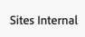

# 범용 편집기 액세스 및 탐색 {#navigating}

범용 편집기 액세스 및 탐색에 대한 기본 사항을 알아봅니다.

## 소개 {#introduction}

Universal Editor를 사용하면 모든 구현에서 콘텐츠의 모든 측면을 편집할 수 있기 때문에 뛰어난 경험을 제공하고, 콘텐츠 속도를 높이고, 최신 개발자 경험을 제공할 수 있습니다.

이를 위해 제공되는 Universal Editor는 콘텐츠 작성자가 최소한의 교육만 받으면 사용할 수 있어 바로 부담 없이 콘텐츠 편집을 시작할 수 있습니다. 이 문서에서는 범용 편집기를 탐색하는 방법을 설명합니다.

>[!TIP]
>
>* 유니버설 편집기를 사용하여 작성하는 방법에 대한 자세한 내용은 문서 [유니버설 편집기로 콘텐츠 작성](/help/sites-cloud/authoring/universal-editor/authoring.md)을 참조하십시오.
>* Universal Editor에 대한 자세한 소개는 [Universal Editor 소개](/help/implementing/universal-editor/introduction.md) 문서를 참조하십시오.

## 앱 준비 {#prepare-app}

Universal Editor로 앱의 콘텐츠를 작성하려면 개발자가 앱을 계측하여 편집기를 지원해야 합니다.

>[!TIP]
>
>Universal Editor와 함께 작동하도록 AEM 앱을 구성하는 방법에 대한 예는 [AEM에서 Universal Editor 시작](/help/implementing/universal-editor/getting-started.md)을 참조하십시오.

## 범용 편집기 액세스 {#accessing}

앱이 범용 편집기에서 작동하도록 계측되면 범용 편집기는 AEM as a Cloud Service 내에서 AEM에 액세스하지 않고 직접 액세스할 수 있습니다.

### AEM as a Cloud Service 내에서 액세스 {#accessing-aem}

1. AEM as a Cloud Service 제작 인스턴스에 로그인합니다.
1. 편집할 유니버설 편집기에 사용하기 위해 만든 페이지로 이동하려면 [**사이트** 콘솔](/help/sites-cloud/authoring/sites-console/introduction.md)을 사용합니다.
1. 페이지를 편집합니다.
1. 선택한 페이지를 편집할 수 있는 범용 편집기가 열립니다.

>[!NOTE]
>
>[**사이트** 콘솔에서 페이지를 편집할 때](/help/sites-cloud/authoring/sites-console/introduction.md) 콘솔에서는 페이지의 [템플릿:](/help/sites-cloud/authoring/page-editor/templates.md)에 적합한 편집기를 엽니다. 이 문서에 설명된 범용 편집기 또는 [페이지 편집기.](/help/sites-cloud/authoring/page-editor/introduction.md)

### 직접 액세스 {#accessing-directly}

1. 범용 편집기에 로그인합니다. 로그인하려면 Adobe ID이 필요하며 [유니버설 편집기에 액세스할 수 있습니다.](/help/implementing/universal-editor/getting-started.md#request-access)

1. 로그인한 후에 [위치 표시줄에 편집하려는 페이지의 URL을 입력하여](#location-bar)[텍스트 콘텐츠](#text-mode) 또는 [미디어 콘텐츠](#media-mode)와 같은 콘텐츠를 편집할 수 있습니다.

## UI 이해 {#ui}

UI는 이러한 기본 영역으로 나뉩니다.

* [Experience Cloud 헤더](#experience-cloud-header)
* [범용 편집기 도구 모음](#universal-editor-toolbar)
* [편집기](#editor)
* [속성 레일](#properties-rail)

### Experience Cloud 헤더 {#experience-cloud-header}

Experience Cloud 헤더는 항상 화면 상단에 있습니다. Experience Cloud 내의 위치를 알려 주고 다른 Experience Cloud 앱으로 이동할 수 있도록 도와주는 앵커입니다.

#### Experience Manager {#experience-manager}

헤더 왼쪽에 있는 Adobe Experience Cloud 링크를 선택해 Experience Manager 솔루션의 루트로 이동하여 [Cloud Manager,](/help/onboarding/cloud-manager-introduction.md) [Cloud Acceleration Manager,](/help/journey-migration/cloud-acceleration-manager/introduction/overview-cam.md) [Software Distribution](https://experienceleague.adobe.com/docs/experience-cloud/software-distribution/home.html) 등의 도구에 액세스합니다.

#### 조직 {#organization}

현재 로그인되어 있는 조직이 표시됩니다. Adobe ID이 여러 조직과 연결되어 있는 경우 다른 조직으로 전환하려면 선택합니다.

#### 솔루션 {#solutions}

솔루션 전환기를 탭하거나 클릭하면 다른 Experience Cloud 솔루션으로 빠르게 이동할 수 있습니다.

#### 도움말 {#help}

도움말 아이콘은 학습 및 지원 리소스에 대한 바로 가기를 제공합니다.

#### 알림 {#notifications}

이 아이콘에는 현재 할당된 불완전 [알림](/help/implementing/cloud-manager/notifications.md) 수가 배지로 지정됩니다.

#### 사용자 속성 {#user-properties}

사용자를 나타내는 아이콘을 선택하여 사용자 설정에 액세스합니다. 사용자 사진을 구성하지 않은 경우, 아이콘이 임의로 할당됩니다.

### 범용 편집기 도구 모음 {#universal-editor-toolbar}

범용 편집기 도구 모음은 항상 [Experience Cloud 헤더 바로 아래 화면 맨 위에 있습니다.](#experience-cloud-header) 현재 페이지를 게시하고 편집할 다른 페이지에 바로 갈 수 있습니다.

#### 홈 버튼 {#home-button}

홈 버튼을 누르면 유니버설 편집기의 시작 페이지로 돌아갑니다

시작 페이지에서 범용 편집기로 편집할 사이트의 URL을 입력할 수 있습니다.

>[!NOTE]
>
>유니버설 편집기로 편집할 모든 페이지는 [유니버설 편집기를 지원하도록 계측되어야 합니다.](/help/implementing/universal-editor/getting-started.md)

#### 위치 표시줄 {#location-bar}

위치 표시줄에 편집 중인 페이지의 주소가 표시됩니다. 편집할 다른 페이지의 주소를 입력하려면 선택하십시오.

>[!TIP]
>
>주소 표시줄을 열려면 핫키 `l`(문자 l)을(를) 사용하세요.

>[!NOTE]
>
>유니버설 편집기로 편집할 모든 페이지는 [유니버설 편집기를 지원하도록 계측되어야 합니다.](/help/implementing/universal-editor/getting-started.md)

#### 인증 헤더 설정 {#authentication-settings}

[로컬 개발을 위해 사용자 지정 인증 헤더를 설정해야 하는 경우 인증 헤더 설정 아이콘을 선택하십시오.](/help/implementing/universal-editor/developer-overview.md#auth-header)

#### 에뮬레이터 설정 {#emulator}

에뮬레이션 아이콘을 선택하여 범용 편집기에서 페이지를 렌더링하는 방법을 정의합니다.

에뮬레이션 아이콘을 탭하거나 클릭하면 옵션이 표시됩니다.

기본적으로 편집기는 브라우저에서 높이와 너비를 자동으로 정의하는 데스크탑 레이아웃으로 열립니다.

Universal Editor에서 모바일 디바이스를 에뮬레이션할 수도 있습니다.

* 방향 정의
* 폭과 높이 정의
* 방향 변경

#### 미리보기 모드 {#preview-mode}

미리보기 모드의 페이지는 게시된 서비스에 표시되는 것처럼 편집기에서 렌더링된 페이지입니다. 이렇게 하면 콘텐츠 작성자는 링크 등을 클릭하여 콘텐츠를 탐색할 수 있습니다.

>[!TIP]
>
>핫키 `p`을(를) 사용하여 미리 보기 모드로 전환하거나 미리 보기 모드에서 전환합니다.

#### 앱 미리보기 열기 {#open-app-preview}

앱 미리 보기 열기 아이콘을 선택하여 편집기에서 벗어난 자체 브라우저 탭에서 현재 편집 중인 페이지를 열고 콘텐츠를 미리 봅니다.

>[!TIP]
>
>핫키 `o`(문자 o)을(를) 사용하여 앱 미리 보기를 엽니다.

>[!TIP]
>
>[앱의 미리 보기 URL을 사용자 지정할 수 있습니다.](/help/implementing/universal-editor/customizing.md#custom-preview-urls)

#### 게시 {#publish}

독자가 사용할 수 있도록 콘텐츠 라이브에 변경 사항을 게시할 수 있도록 게시 버튼을 선택합니다.

>[!TIP]
>
>유니버설 편집기를 사용하여 게시하는 방법에 대한 자세한 내용은 [유니버설 편집기를 사용하여 콘텐츠 게시](publishing.md) 문서를 참조하십시오.

#### 생략 부호 {#ellipsis}

또한 줄임표 버튼을 사용하여 표준 옵션에 액세스할 수 있습니다.

예를 들어, 줄임표 버튼을 통해 페이지 게시를 취소(즉, [**Publish** 버튼](#publish)의 동작을 되돌림)하는 기능에 액세스할 수 있습니다.

#### 추가 단추 {#additional-toolbar-buttons}

유니버설 편집기는 맞춤화가 가능하고 확장 가능한 작성 환경을 제공합니다. 도구 모음에 추가 단추가 표시되면 유니버설 편집기가 확장된 것입니다.

* 확장 가능성에 대한 자세한 내용은 [범용 편집기 사용자 지정 및 확장을 참조하십시오.](/help/implementing/universal-editor/customizing.md)
* 개별 확장의 작동 방식에 대한 자세한 내용은 [Extension Manager 설명서를 참조하십시오.](https://developer.adobe.com/uix/docs/extension-manager/extension-developed-by-adobe/)

### 편집기 {#editor}

편집기는 창의 대부분을 차지하며 [위치 표시줄](#location-bar)에 지정된 페이지가 렌더링되는 곳입니다.

편집기가 [미리보기 모드](#preview-mode)에 있는 경우 콘텐츠를 탐색하고 링크를 따라갈 수 있지만, 콘텐츠를 편집할 수 없습니다.

### 속성 레일 {#properties-rail}

속성 레일은 항상 편집기의 오른쪽에 표시됩니다. 해당 모드에 따라 콘텐츠 또는 페이지 콘텐츠의 계층 구조에서 선택한 구성 요소에 대한 세부 정보를 표시할 수 있습니다.

#### 속성 모드 {#properties-mode}

속성 모드의 레일에 편집기에서 현재 선택한 구성 요소의 속성이 표시됩니다. 페이지가 로드될 때 속성 레일의 기본 모드입니다.

선택한 구성 요소 유형에 따라 속성 레일에 세부 정보가 표시될 수 있으며 여기에서 해당 세부 정보를 수정할 수 있습니다.

일부 구성 요소에 표시 및/또는 편집할 수 있는 세부 정보가 있는 것은 아닙니다.

>[!TIP]
>
>단축키 `d`를 사용하여 속성 모드로 전환합니다.

#### 콘텐츠 트리 모드 {#content-tree-mode}

콘텐츠 트리 모드의 경우 레일에 페이지 콘텐츠의 계층 구조가 표시됩니다.

콘텐츠 트리의 항목을 선택하면 편집기는 해당 콘텐츠를 스크롤하여 선택합니다.

>[!TIP]
>
>단축키 `f`를 사용하여 콘텐츠 트리 모드로 전환합니다.

##### CF 편집기에서 열기 {#edit}

편집할 때 선택한 구성 요소에 대한 옵션이 속성 레일에 나타나고 여기서 선택한 구성 요소를 편집할 수 있습니다. 선택한 구성 요소가 콘텐츠 조각인 경우 **CF 편집기에서 열기** 버튼을 선택할 수도 있습니다.

**CF 편집기에서 열기** 단추를 탭하거나 클릭하면 [콘텐츠 조각 편집기](/help/assets/content-fragments/content-fragments-managing.md#opening-the-fragment-editor)가 새 탭에서 열립니다. 이를 통해 콘텐츠 조각 편집기의 전체 기능에 액세스하여 관련 콘텐츠 조각을 편집할 수 있습니다.

워크플로우의 필요에 따라 범용 편집기에서 또는 콘텐츠 조각 편집기에서 직접 콘텐츠 조각을 편집할 수 있습니다.

>[!TIP]
>
>핫키 `e`을(를) 사용하여 콘텐츠 조각 편집기에서 선택한 콘텐츠 조각을 엽니다.

##### 추가 {#add}

콘텐츠 트리 또는 편집기에서 컨테이너 구성 요소를 선택하면 속성 레일에 추가 옵션이 표시됩니다.

추가 버튼을 탭하거나 클릭하면 [선택한 컨테이너에 추가](#adding-components)할 수 있는 구성 요소의 드롭다운 메뉴가 열립니다.

>[!TIP]
>
>단축키 `a`를 사용하여 선택한 컨테이너 구성 요소에 구성 요소를 추가합니다.

##### 삭제 {#delete}

콘텐츠 트리 또는 편집기에서 컨테이너 구성 요소 내의 구성 요소를 선택하면 속성 레일에 삭제 옵션이 표시됩니다.

삭제 버튼을 탭하거나 클릭하면 [구성 요소가 삭제됩니다.](#deleting-components)

>[!TIP]
>
>단축키 `Shift+Backspace`를 사용하여 컨테이너에서 선택한 구성 요소를 삭제합니다.

#### 추가 단추 {#additional-properties-rail-buttons}

유니버설 편집기는 맞춤화가 가능하고 확장 가능한 작성 환경을 제공합니다. 속성 레일에 추가 버튼이 표시되면 범용 편집기가 확장된 것입니다.

* 확장 가능성에 대한 자세한 내용은 [범용 편집기 사용자 지정 및 확장을 참조하십시오.](/help/implementing/universal-editor/customizing.md)
* 개별 확장의 작동 방식에 대한 자세한 내용은 [Extension Manager 설명서를 참조하십시오.](https://developer.adobe.com/uix/docs/extension-manager/extension-developed-by-adobe/)

## 다음 단계 {#next-steps}

이제 범용 편집기에 액세스하고 탐색하는 방법을 알았으므로 [이를 사용하여 콘텐츠를 작성할 준비가 되었습니다.](/help/sites-cloud/authoring/universal-editor/authoring.md)
