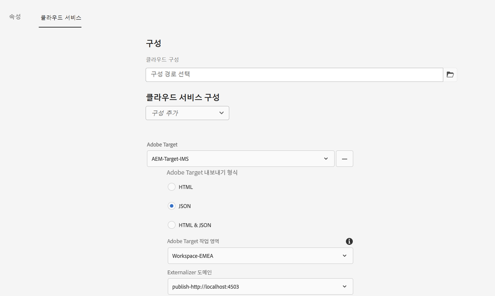
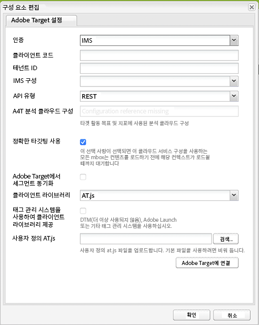
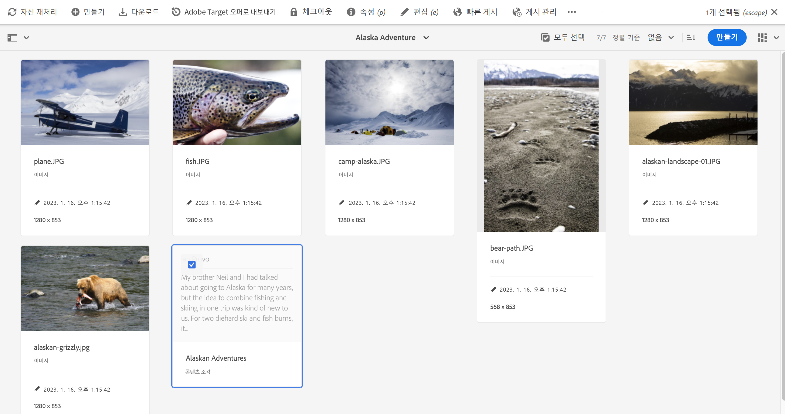
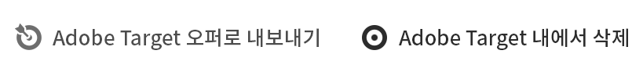

# Adobe Target으로 콘텐츠 조각 내보내기 {#exporting-content-fragments-to-adobe-target}

>[!CAUTION]
>
>* AEM 콘텐츠 조각은 Adobe Target의 기본 작업 영역으로 내보내집니다.
>* [Adobe Target과 통합](/help/sites-cloud/integrating/integrating-adobe-target.md)의 지침에 따라 Adobe Target과 AEM을 통합해야 합니다.

Adobe Experience Manager as a Cloud Service(AEM)에서 생성한 [콘텐츠 조각](/help/sites-cloud/authoring/fundamentals/content-fragments.md)을 Adobe Target(Target)으로 내보낼 수 있습니다. 그런 다음 Target 활동의 오퍼로 사용하여 경험을 대규모로 테스트하고 개인화할 수 있습니다.

콘텐츠 조각을 Adobe Target으로 내보낼 수 있습니다.

* JSON: Headless 콘텐츠 게재 지원

<!-- * GraphQL query ??? -->

AEM 콘텐츠 조각을 Adobe Target으로 내보내기 위한 인스턴스를 준비하려면 다음 작업을 수행해야 합니다.

* [Adobe Target과 통합](/help/sites-cloud/integrating/integrating-adobe-target.md)
* [클라우드 구성 추가](#add-the-cloud-configuration)
* [레거시 구성 추가](#add-the-legacy-configuration)

이렇게 하면 다음과 같은 작업을 수행할 수 있습니다.

* [Adobe Target으로 콘텐츠 조각 내보내기](#exporting-a-content-fragment-to-adobe-target)
* [Adobe Target에서 콘텐츠 조각 사용](#using-your-content-fragments-in-adobe-target)
* 및 [이미 Adobe Target으로 내보낸 콘텐츠 조각 삭제](#deleting-a-content-fragment-already-exported-to-adobe-target)

콘텐츠 조각을 Adobe Target의 기본 작업 영역 또는 Adobe Target의 사용자 정의 작업 영역으로 내보낼 수 있습니다.

>[!NOTE]
>
>Adobe Target 작업 영역은 Adobe Target 자체에 존재하지 않습니다. Adobe IMS(Identity Management System)에서 정의되고 관리된 다음 Adobe Developer Console을 사용하여 솔루션 전체에 걸쳐 사용하도록 선택됩니다.

>[!NOTE]
>
>Adobe Target 작업 영역을 사용하여 다른 사용자에게 액세스 권한을 제공하지 않고 조직(그룹)의 멤버가 해당 조직만을 위한 오퍼 및 활동을 만들고 관리하도록 할 수 있습니다. 예: 세계적으로 관심을 받는 국가별 조직

## 사전 요구 사항 {#prerequisites}

다음 작업이 필요합니다.

1. [AEM을 Adobe Target과 통합](/help/sites-cloud/integrating/integrating-adobe-target.md)해야 합니다.

<!-- link rewriter - targets in content-fragments-customizing do not exist yet

1. Content Fragments are exported from the AEM author instance, so you need to [Configure the AEM Link Externalizer](/help/implementing/developing/extending/content-fragments-customizing.md#configuring-the-aem-link-externalizer) on the author instance to ensure that any references within the Content Fragment are externalized for web delivery.

   >[!NOTE]
   >
   >For link rewriting not covered by the default, the [Content Fragment Link Rewriter Provider](/help/implementing/developing/extending/content-fragments-customizing.md#the-content-fragment-link-rewriter-provider-html) is available. With this, customized rules can be developed for your instance.
-->

## 클라우드 구성 추가 {#add-the-cloud-configuration}

조각을 내보내기 전에 **Adobe Target**&#x200B;용 **클라우드 구성**&#x200B;을 조각 또는 폴더에 추가해야 합니다. 이렇게 하면 다음과 같은 작업도 수행할 수 있습니다.

* 내보내기에 사용할 형식 옵션 지정
* Target 작업 영역을 대상으로 선택
* 콘텐츠 조각의 참조 재작성을 위한 외부화 도메인 선택(옵션)

필요한 옵션은 필요한 폴더나 조각 또는 둘 다의 **페이지 속성**&#x200B;에서 선택할 수 있습니다. 사양은 필요에 따라 상속됩니다.

1. **자산** 콘솔로 이동합니다.

1. 적절한 폴더 또는 조각에 대한 **페이지 속성**&#x200B;을 엽니다.

   >[!NOTE]
   >
   >클라우드 구성을 콘텐츠 조각 상위 폴더에 추가하면 해당 구성은 모든 하위 폴더에 상속됩니다.
   >
   >클라우드 구성을 콘텐츠 조각에 추가하면 해당 구성은 모든 변형에 상속됩니다.

1. **클라우드 서비스** 탭을 선택합니다.

1. **클라우드 서비스 구성** 아래의 드롭다운 목록에서 **Adobe Target**&#x200B;을 선택합니다.

   <!-- is this note appropriate? -->

   >[!NOTE]
   >
   >콘텐츠 조각 오퍼의 JSON 형식을 맞춤화할 수 있습니다. 이렇게 하려면 고객 콘텐츠 조각 구성 요소를 정의한 다음 구성 요소 Sling 모델에서 속성을 내보내는 방법에 대한 주석을 달아야 합니다.
   >
   >핵심 구성 요소: [핵심 구성 요소 - 콘텐츠 조각](https://experienceleague.adobe.com/docs/experience-manager-core-components/using/wcm-components/content-fragment-component.html)을 참조하십시오.

1. **Adobe Target**&#x200B;에서 다음을 선택합니다.

   * 적절한 구성
   * 필요한 형식 옵션
   * Adobe Target 작업 영역
   * 필요한 경우 - 외부화 도메인

   >[!CAUTION]
   >
   >외부화 도메인은 옵션입니다.
   >
   > 내보낸 콘텐츠가 특정 *게시* 도메인을 가리키도록 하면 AEM 외부화가 구성됩니다. 자세한 내용은 [AEM 링크 외부화 구성](/help/implementing/developing/extending/content-fragments-customizing.md#configuring-the-aem-link-externalizer)을 참조하십시오.
   >
   > 또한 외부화 도메인은 오퍼 콘텐츠 보기와 같은 메타데이터가 아닌 Target에 전송되는 콘텐츠 조각의 콘텐츠에만 관련이 있습니다.

   폴더의 경우 그 예는 다음과 같습니다.

   <!-- need a new screenshot -->

   

1. **저장 및 닫기**.

## 레거시 구성 추가 {#add-the-legacy-configuration}

<!-- This is effectively the Manually Integrating with Adobe Target {#manually-integrating-with-adobe-target} section from 6.5 -->

>[!IMPORTANT]
>
>새 레거시 구성 추가는 콘텐츠 조각 내보내기에만 지원되는 특수한 사례 시나리오입니다.

Adobe에서 제공하는 Launch를 사용하기 위해 [클라우드 구성을 추가](#add-the-cloud-configuration)한 다음 AEM을 Adobe Target과 처음 통합하려면 레거시 구성을 사용하여 Adobe Target과 수동으로 통합되어야 합니다.

### Target 클라우드 구성 만들기 {#creating-a-target-cloud-configuration}

Adobe Target과 상호 작용하도록 AEM을 활성화하려면 Target 클라우드 구성을 만들어야 합니다. 구성을 만들려면 Adobe Target 클라이언트 코드 및 사용자 자격 증명을 제공합니다.

Target 클라우드 구성은 여러 AEM 캠페인과 연결할 수 있으므로 한 번만 만들면 됩니다. Adobe Target 클라이언트 코드가 여러 개 있는 경우 각 클라이언트 코드에 대해 하나의 구성을 만드십시오.

Adobe Target의 세그먼트를 동기화하도록 클라우드 구성을 구성할 수 있습니다. 동기화를 활성화하면 클라우드 구성을 저장하는 즉시 백그라운드에서 세그먼트가 Target으로 가져와집니다.

다음 절차를 통해 AEM에서 Target 클라우드 구성을 만드십시오.

1. **AEM 로고** > **도구** > **클라우드 서비스** > **레거시 클라우드 서비스**&#x200B;를 통해 **레거시 클라우드 서비스**로 이동합니다.
예: ([http://localhost:4502/libs/cq/core/content/tools/cloudservices.html](http://localhost:4502/libs/cq/core/content/tools/cloudservices.html))

   **Adobe Experience Cloud** 개요 페이지가 열립니다.

1. **Adobe Target** 섹션에서 **지금 구성**&#x200B;을 클릭합니다.
1. **구성 만들기** 대화 상자에서

   1. 구성의 **제목**&#x200B;을 제공합니다.
   1. **Adobe Target 구성** 템플릿을 선택합니다.
   1. **만들기**&#x200B;를 클릭합니다.

이제 편집할 새 구성을 선택할 수 있습니다.

1. 편집 대화 상자가 열립니다.

   

   <!-- Can this still occur?

   >[!NOTE]
   >
   >When configuring A4T with AEM, you may see a Configuration reference missing entry. To be able to select the analytics framework, do the following:
   >
   >1. Navigate to **Tools** &gt; **General** &gt; **CRXDE Lite**.
   >1. Navigate to **/libs/cq/analytics/components/testandtargetpage/dialog/items/tabs/items/tab1_general/items/a4tAnalyticsConfig**
   >1. Set the property **disable** to **false**.
   >1. Select **Save All**.

   -->

1. **Adobe Target 설정** 대화 상자에서 다음 속성들의 값을 입력합니다.

   * **인증**: 기본값은 IMS입니다(사용자 자격 증명은 더 이상 사용되지 않음).

   * **클라이언트 코드**: Target 계정 클라이언트 코드입니다.

   * **테넌트 ID**: 테넌트 ID입니다.

   * **IMS 구성**: 드롭다운 목록에서 필요한 구성을 선택합니다.

   * **API 유형**: 기본값은 REST입니다(XML은 더 이상 사용되지 않음).

   * **A4T Analytics 클라우드 구성**: 타겟 활동 목표 및 지표에 사용되는 Analytics 클라우드 구성을 선택합니다. 이는 콘텐츠를 타겟팅할 때 보고 소스로서의 Adobe Analytics를 사용하는 경우 필요합니다.

     <!-- Is this needed?
     If you do not see your cloud configuration, see note in [Configuring A4T Analytics Cloud Configuration](#configuring-a-t-analytics-cloud-configuration).
     -->

   * **정확한 타겟팅 사용:** 기본적으로 이 확인란은 선택되어 있습니다. 이 확인란을 선택하면 클라우드 서비스 구성은 콘텐츠를 로드하기 전에 컨텍스트가 로드될 때까지 대기합니다. 다음 사항에 주의하십시오.

   * **Adobe Target의 세그먼트 동기화:** Target에서 정의한 세그먼트를 다운로드하여 AEM에서 사용하려면 이 옵션을 선택하십시오. API 유형 속성이 REST인 경우 인라인 세그먼트가 지원되지 않고 항상 Target의 세그먼트를 사용해야 하므로 이 옵션을 선택합니다. (AEM 용어인 &#39;segment&#39;는 Target &#39;audience&#39;와 동일합니다.)

   * **클라이언트 라이브러리:** 기본값은 AT.js입니다(mbox.js는 더 이상 사용되지 않음).

     >[!NOTE]
     >
     >Target 라이브러리 파일인 [AT.js](https://experienceleague.adobe.com/docs/target-dev/developer/client-side/at-js-implementation/at-js/how-atjs-works.html)는 일반적인 웹 구현과 단일 페이지 애플리케이션 모두에 맞게 디자인된 새로운 Adobe Target용 구현 라이브러리입니다.
     >
     >mbox.js는 더 이상 사용되지 않으며 이후 단계에서 제거될 예정입니다.
     >
     >mbox.js 대신 AT.js를 클라이언트 라이브러리로 사용하는 것이 좋습니다.
     >
     >AT.js는 mbox.js 라이브러리에 비해 몇 가지 개선점을 제공합니다.
     >
     >* 웹 구현에 대한 페이지 로드 시간 개선
     >* 보안 개선
     >* 단일 페이지 애플리케이션에 대한 구현 옵션 개선
     >* AT.js에는 target.js에 포함된 구성 요소도 포함되어 있으므로 더 이상 target.js를 호출할 필요가 없습니다.
     >
     >**클라이언트 라이브러리** 드롭다운 메뉴에서 AT.js 또는 mbox.js를 선택할 수 있습니다.

   * **태그 관리 시스템을 사용하여 클라이언트 라이브러리 전송** - Adobe Launch 또는 다른 태그 관리 시스템(또는 더 이상 사용되지 않는 DTM)의 클라이언트 라이브러리를 사용하려면 이 옵션을 선택하십시오.

   * **사용자 정의 AT.js**: 사용자 정의 AT.js를 찾아 업로드합니다. 기본 라이브러리를 사용하려면 비워 둡니다.

     >[!NOTE]
     >
     >Adobe Target 구성 마법사에 옵트인하면 정확한 타겟팅은 기본적으로 활성화되어 있습니다.
     >
     >정확한 타겟팅은 클라우드 서비스 구성이 콘텐츠를 로드하기 전에 컨텍스트가 로드될 때까지 대기함을 의미합니다. 결과적으로 성능 측면에서 정확한 타겟팅을 사용하면 콘텐츠를 로드하기 전에 몇 밀리초의 지연이 발생할 수 있습니다.
     >
     >작성자 인스턴스에서는 정확한 타겟팅이 항상 활성화되어 있습니다. 그러나 게시 인스턴스에서는 클라우드 서비스 구성에서 정확한 타겟팅 옆에 있는 확인 표시를 지움으로써 정확한 타겟팅을 전역적으로 끌 수도 있습니다(**http://localhost:4502/etc/cloudservices.html**). 또한 클라우드 서비스 구성의 설정에 관계없이 개별 구성 요소에 대해 정확한 타겟팅을 켜거나 끌 수 있습니다.
     >
     >타겟팅된 구성 요소를 ***이미*** 만든 다음 이 설정을 변경하는 경우, 해당 변경 내용은 이들 구성 요소에 영향을 미치지 않습니다. 이들 구성 요소는 직접 변경해야 합니다.

1. Target에 연결하려면 **Adobe Target에 연결**&#x200B;을 클릭하십시오. 정상적으로 연결되면 **연결 성공**&#x200B;이라는 메시지가 표시됩니다. 메시지에서 **확인**&#x200B;을 클릭한 다음 대화 상자에서 **확인**&#x200B;을 클릭합니다.

### Target 프레임워크 추가 {#adding-a-target-framework}

<!-- Is this section needed? -->

Target 클라우드 구성을 구성한 다음에는 Target 프레임워크를 추가할 수 있습니다. 프레임워크는 사용할 수 있는 [ContextHub](/help/implementing/developing/personalization/configuring-contexthub.md) 구성 요소에서 Adobe Target으로 전송되는 기본 매개변수를 식별합니다. Target은 매개변수를 사용하여 현재 컨텍스트에 적용되는 세그먼트를 결정합니다.

단일 Target 구성에 대해 여러 프레임워크를 만들 수 있습니다. 다중 프레임워크는 웹 사이트의 여러 섹션에 대해 서로 다른 매개변수 세트를 Target에 전송해야 할 때 유용합니다. 전송해야 하는 각각의 매개변수 세트에 대해 프레임워크를 만듭니다. 웹 사이트의 각 섹션을 적절한 프레임워크에 연결합니다. 웹 페이지는 한 번에 하나의 프레임워크만 사용할 수 있습니다.

1. Target 구성 페이지에서 사용할 수 있는 구성 옆에 있는 **+**(플러스 기호)를 클릭합니다.

1. 프레임워크 만들기 대화 상자에서 **제목**&#x200B;을 지정하고 **Adobe Target 프레임워크**&#x200B;를 선택한 다음 **만들기**&#x200B;를 클릭합니다.

   <!--  -->

   프레임워크 페이지가 열립니다. Sidekick은 매핑할 수 있는 [ContextHub](/help/implementing/developing/personalization/configuring-contexthub.md)의 정보를 나타내는 구성 요소를 제공합니다.

   <!--  -->

1. 매핑에 사용하고자 하는 데이터를 나타내는 클라이언트 컨텍스트 구성 요소를 드롭 대상에 드래그합니다. 또는 **ContextHub 스토어** 구성 요소를 프레임워크에 드래그합니다.

   >[!NOTE]
   >
   >매핑하면 매개변수는 간단한 문자열을 통해 mbox에 전달됩니다. ContextHub에서는 배열을 매핑할 수 없습니다.

   예를 들어 사이트 방문자에 대한 **프로필 데이터**&#x200B;를 사용하여 Target 캠페인을 관리하려면 **프로필 데이터** 구성 요소를 페이지에 드래그해야 합니다. Target 매개변수에 매핑할 수 있는 프로필 데이터 변수가 표시됩니다.

   <!--  -->

1. 적절한 열에서 **공유** 확인란을 선택하여 Adobe Target 시스템에 표시하고자 하는 변수를 선택합니다.

   <!--  -->

   >[!NOTE]
   >
   >매개변수 동기화는 AEM에서 Adobe Target으로만 할 수 있습니다.

프레임워크가 생성됩니다. 게시 인스턴스로 프레임워크를 복제하려면 sidekick에서 **프레임워크 활성화** 옵션을 사용하십시오.

<!--
### Associating Activities With the Target Cloud Configuration  {#associating-activities-with-the-target-cloud-configuration}

Associate your [AEM activities](/help/sites-cloud/authoring/personalization/activities.md) with your Target cloud configuration so that you can mirror the activities in [Adobe Target](https://experienceleague.adobe.com/docs/target/using/experiences/offers/manage-content.html).

>[!NOTE]
>
>What types of activities are available is determined by the following:
>
>* If the **xt_only** option is enabled on the Adobe Target tenant (clientcode) used on the AEM side to connect to Adobe Target, then you can create **only** XT activities in AEM.
>
>* If the **xt_only** options is **not** enabled on the Adobe Target tenant (clientcode), then you can create **both** XT and A/B activities in AEM.
>
>**Additional note:** **xt_only** options is a setting applied on a certain Target tenant (clientcode) and can only be modified directly in Adobe Target. You cannot enable or disable this option in AEM.
-->

<!--
### Associating the Target Framework With Your Site {#associating-the-target-framework-with-your-site}

After you create a Target framework in AEM, associate your web pages with the framework. The targeted components on the pages send the framework-defined data to Adobe Target for tracking. (See [Content Targeting](/help/sites-cloud/authoring/personalization/targeted-content.md).)

When you associate a page with the framework, the child pages inherit the association.

1. In the **Sites** console, navigate to the site that you want to configure.
1. Using either [quick actions](/help/sites-cloud/authoring/getting-started/basic-handling.md#quick-actions) or [selection mode](/help/sites-cloud/authoring/getting-started/basic-handling.md#selecting-resources), select **View Properties.**
1. Select the **Cloud Services** tab.
1. Select **Edit**.
1. Select **Add Configuration** under **Cloud Service Configurations** and select **Adobe Target**.

  

1. Select the framework you want under **Configuration Reference**.

   >[!NOTE]
   >
   >Make sure that you select the specific **framework** that you created and not the Target cloud configuration under which it was created.

1. Select **Done**.
1. Activate the root page of the website to replicate it to the publish server. (See [How To Publish Pages](/help/sites-cloud/authoring/fundamentals/publishing-pages.md).)

   >[!NOTE]
   >
   >If the framework you attached to the page was not activated yet, a wizard opens which lets you publish it as well.
-->

## Adobe Target으로 콘텐츠 조각 내보내기 {#exporting-a-content-fragment-to-adobe-target}

>[!CAUTION]
>
>이미지와 같은 미디어 자산의 경우 하나의 참조만 Target으로 가져올 수 있습니다. 자산 자체는 AEM Assets 내에 저장되며 AEM 게시 인스턴스에서 전달됩니다.
>
>이로 인해 Target으로 내보내기 전에 모든 관련 에셋과 함께 콘텐츠 조각을 게시해야 합니다.

AEM에서 Target으로 콘텐츠 조각을 내보내려면(클라우드 구성 지정 이후):

1. **자산** 콘솔에서 콘텐츠 조각으로 이동합니다.
1. Target으로 내보내고자 하는 콘텐츠 조각을 선택합니다.

1. 선택 **Adobe Target 오퍼로 내보내기**.

   

   <!-- this note does not seem to be accurate for CFs -->

   <!--
   
   >[!NOTE]
   >
   >If the Content Fragment has already been exported, select **Update in Adobe Target**.
   
   -->

1. 선택 **게시하지 않고 내보내기** 또는 **게시** 필요에 따라.

   >[!NOTE]
   >
   >표시되는 실제 작업은 조각 및 관련 자산의 상태에 따라 다릅니다.
   >
   >모든 항목이 이미 게시되었고 그 이후로 수정된 사항이 없으면 이 단계를 건너뜁니다.

   >[!NOTE]
   >
   >**게시**&#x200B;를 선택하면 콘텐츠 조각이 즉시 게시되며 Target에 전송됩니다.

1. 선택 **확인** 확인 대화 상자에서 확인할 수 있습니다.

   이제 콘텐츠 조각은 Target에 있게 됩니다.

   >[!NOTE]
   >
   >내보내기에 대한 [다양한 세부 정보](/help/sites-cloud/authoring/fundamentals/content-fragments.md#details-of-your-content-fragment)는 콘솔의 **목록 보기** 및 **속성**&#x200B;에서 볼 수 있습니다.

   >[!NOTE]
   >
   >Adobe Target에서 콘텐츠 조각을 볼 때 표시되는 *마지막 수정* 날짜는 조각을 Adobe Target으로 마지막으로 내보낸 날짜가 아닌 AEM에서 마지막으로 수정한 날짜입니다.

>[!NOTE]
>
>또는 [페이지 정보](/help/sites-cloud/authoring/fundamentals/environment-tools.md#page-information) 메뉴의 비슷한 명령을 사용하여 페이지 편집기에서 내보내기를 수행할 수 있습니다.

## Adobe Target에서 콘텐츠 조각 사용 {#using-your-content-fragments-in-adobe-target}

앞의 작업을 수행하면 콘텐츠 조각이 Target의 오퍼 페이지에 표시됩니다. 여기에서 수행할 수 있는 작업에 대해 알아보려면 [관련 Target 설명서](https://experienceleague.adobe.com/docs/target/using/integrate/aem/fragments/content-fragments-aem.html)를 참조하십시오.

>[!NOTE]
>
>Adobe Target에서 콘텐츠 조각을 볼 때 표시되는 *마지막 수정* 날짜는 조각을 Adobe Target으로 마지막으로 내보낸 날짜가 아닌 AEM에서 마지막으로 수정한 날짜입니다.

## 이미 Adobe Target으로 내보낸 콘텐츠 조각 삭제 {#deleting-a-content-fragment-already-exported-to-adobe-target}

내보내기와 마찬가지로 Adobe Target에서 콘텐츠 조각을 삭제하는 것도 조각을 선택한 후 **자산** 콘솔의 상단 도구 모음에서 선택할 수 있습니다.

이미 Target으로 내보낸 콘텐츠 조각을 삭제하면 Target의 오퍼에서 해당 조각을 사용 중인 경우 문제가 발생할 수 있습니다. AEM에서 조각 콘텐츠를 전달 중이므로 조각을 삭제하면 오퍼를 사용할 수 없습니다.

<!-- if the information about deleting-if-used correct, or is it not allowed at all? -->

이러한 상황을 방지하는 방법:

* 콘텐츠 조각이 현재 활동에서 사용되고 있지 않은 경우, 사용자는 AEM을 통해 경고 메시지 없이 조각을 삭제할 수 있습니다.
* 콘텐츠 조각이 현재 활동에서 사용되고 있는 경우, 조각 삭제가 활동에 미칠 수 있는 결과를 나타내는 경고 오류 메시지가 AEM 사용자에게 표시됩니다.

  AEM에 오류 메시지가 표시되어도 사용자는 콘텐츠 조각을 삭제할 수 있습니다. 콘텐츠 조각을 삭제하면 다음과 같은 결과가 발생합니다.

   * AEM 콘텐츠 조각 및 Target 오퍼가 원하지 않은 동작을 수행할 수 있습니다.

      * 콘텐츠 조각이 Target으로 푸시되었으므로 해당 오퍼는 여전히 렌더링될 수 있습니다.
      * AEM에서 참조된 자산을 삭제해도 콘텐츠 조각의 참조가 올바르게 작동하지 않을 수 있습니다.

   * 물론, AEM에 콘텐츠 조각이 더 이상 존재하지 않으므로 이후에 콘텐츠 조각을 수정할 수 없습니다.

## 추가 리소스 {#further-resources}

자세한 내용은 다음을 참조하십시오.

<!--
* [Creating a Target Cloud Configuration](/help/sites-cloud/integrating/integrating-adobe-target.md#create-configuration)
-->

* [핵심 구성 요소 - 콘텐츠 조각](https://experienceleague.adobe.com/docs/experience-manager-core-components/using/wcm-components/content-fragment-component.html)

* [Adobe Target 개발](https://developers.adobetarget.com/)

* [Adobe Target - 최적화 또는 개인화를 지원하기 위해 Target 활동에서 AEM 콘텐츠 조각 사용](https://experienceleague.adobe.com/docs/target/using/integrate/aem/fragments/content-fragments-aem.html)

* [Adobe Target - AEM 경험 조각 및 콘텐츠 조각 개요](https://experienceleague.adobe.com/docs/target/using/integrate/aem/fragments/aem-experience-and-content-fragments.html)
