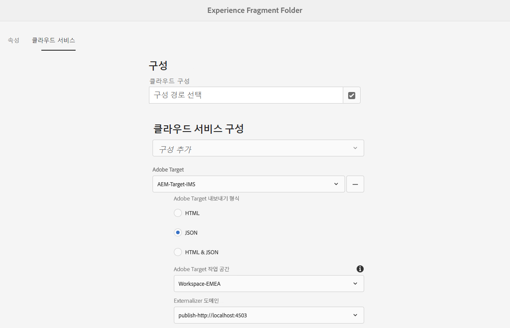

# Adobe Target으로 경험 조각 내보내기{#exporting-experience-fragments-to-adobe-target}

>[!CAUTION]
>
>* AEM 경험 구성 요소는 Adobe Target의 기본 작업 공간으로 내보내집니다.
>* AEM은 [Adobe Target과 통합](/help/sites-cloud/integrating/integrating-adobe-target.md).

내보낼 수 있습니다 [경험 조각](/help/sites-cloud/authoring/fundamentals/experience-fragments.md): Adobe Experience Manager as a Cloud Service(AEM)에서 만든 Adobe Target(Target)으로 이동합니다. 그런 다음 Target 활동에서 오퍼로 사용하여 경험을 규모에 맞게 테스트 및 개인화할 수 있습니다.

Adobe Target으로 경험 조각을 내보내는 데에는 세 가지 옵션을 사용할 수 있습니다.

* HTML(기본값): 웹 및 하이브리드 콘텐츠 전달 지원
* JSON: 헤드리스 컨텐츠 전달 지원
* HTML 및 JSON

AEM Experience Fragments를 Adobe Target으로 내보내기 위한 인스턴스를 준비하려면 다음을 수행해야 합니다.

* [Adobe Target과 통합합니다.](/help/sites-cloud/integrating/integrating-adobe-target.md)
* [클라우드 구성 추가](#add-the-cloud-configuration)
* [기존 구성 추가](#add-the-legacy-configuration)

그 후 다음을 수행할 수 있습니다.

* [Adobe Target으로 경험 조각 내보내기](#exporting-an-experience-fragment-to-adobe-target)
* [Adobe Target에서 경험 조각 사용](#using-your-experience-fragments-in-adobe-target)
* 그리고 [Adobe Target으로 이미 내보낸 경험 조각을 삭제합니다](#deleting-an-experience-fragment-already-exported-to-adobe-target)

경험 조각을 Adobe Target의 기본 작업 공간으로 내보내거나 Adobe Target의 사용자 정의 작업 공간으로 내보낼 수 있습니다.

>[!NOTE]
>
>Adobe Target 작업 공간은 Adobe Target 자체에 없습니다. Adobe IMS(Identity Management 시스템)에서 정의 및 관리된 다음 Adobe 개발자 콘솔을 사용하여 솔루션 간에 사용할 수 있도록 선택됩니다.

>[!NOTE]
>
>Adobe Target 작업 공간을 사용하여 조직(그룹) 구성원이 이 조직에 대한 오퍼와 활동만 만들고 관리할 수 있습니다. 다른 사용자에게 액세스 권한을 제공하지 않습니다. 예를 들어, 글로벌 관심사 내의 국가별 조직을 예로 들 수 있습니다.

>[!NOTE]
>
>자세한 내용은 다음을 참조하십시오.
>
>* [Adobe Target 개발](http://developers.adobetarget.com/)
>* [핵심 구성 요소 - 경험 조각](https://experienceleague.adobe.com/docs/experience-manager-core-components/using/introduction.html?lang=ko)
>* [Adobe Target - Adobe Experience Manager(AEM) 경험 조각을 사용하려면 어떻게 해야 합니까?](https://experienceleague.adobe.com/docs/target/using/experiences/offers/aem-experience-fragments.html?lang=en)
>* [AEM 6.5 - Adobe Target과 수동으로 통합 구성 - Target 클라우드 구성 만들기](https://experienceleague.adobe.com/docs/experience-manager-65/administering/integration/target-configuring.html#creating-a-target-cloud-configuration)

## 전제 조건 {#prerequisites}

다양한 작업이 필요합니다.

1. 당신은 [Adobe Target과 AEM 통합](/help/sites-cloud/integrating/integrating-adobe-target.md).

1. 경험 조각은 AEM 작성자 인스턴스에서 내보내지므로 다음 작업을 수행해야 합니다 [AEM Link Externalizer 구성](/help/implementing/developing/extending/experience-fragments.md#configuring-the-aem-link-externalizer) 작성 인스턴스에서 경험 조각 내의 모든 참조가 웹 게재에 대해 외부화되었는지 확인합니다.

   >[!NOTE]
   >
   >기본적으로 적용되지 않은 링크 재작성의 경우, [경험 조각 링크 재작성기 공급자](/help/implementing/developing/extending/experience-fragments.md#the-experience-fragment-link-rewriter-provider-html) 사용할 수 있습니다. 이를 통해 사용자 지정 규칙을 사용자 인스턴스에 대해 개발할 수 있습니다.

## 클라우드 구성 추가 {#add-the-cloud-configuration}

조각을 내보내기 전에 조각을 추가해야 합니다 **클라우드 구성** 대상 **Adobe Target** 조각 또는 폴더로 이동합니다. 이 경우 다음을 수행할 수도 있습니다.

* 내보내기에 사용할 형식 옵션을 지정합니다
* Target 작업 영역을 대상으로 선택
* 경험 조각에서 참조를 재작성하기 위한 외부 도우미 도메인을 선택합니다(선택 사항).

에서 필요한 옵션을 선택할 수 있습니다. **페이지 속성** 필요한 폴더 및/또는 조각의 유형 사양은 필요에 따라 상속됩니다.

1. 로 이동합니다 **경험 조각** 콘솔.

1. 열기 **페이지 속성** 해당 폴더 또는 조각에 사용할 수 있습니다.

   >[!NOTE]
   >
   >경험 조각 상위 폴더에 클라우드 구성을 추가하는 경우 구성이 모든 하위 폴더에 의해 상속됩니다.
   >
   >경험 조각 자체에 클라우드 구성을 추가하는 경우, 구성은 모든 변형에서 상속됩니다.

1. 을(를) 선택합니다 **Cloud Services** 탭.

1. 아래 **Cloud Service 구성**, 선택 **Adobe Target** 드롭다운 목록에서 을 선택합니다.

   >[!NOTE]
   >
   >경험 조각 오퍼의 JSON 형식을 사용자 지정할 수 있습니다. 이렇게 하려면 고객 경험 조각 구성 요소를 정의한 다음 구성 요소 Sling 모델에서 해당 속성을 내보내는 방법에 주석을 답니다.
   >
   >핵심 구성 요소를 참조하십시오. [핵심 구성 요소 - 경험 조각](https://experienceleague.adobe.com/docs/experience-manager-core-components/using/components/experience-fragment.html)

1. 아래 **Adobe Target** 선택:

   * 적절한 구성
   * 필요한 형식 옵션
   * Adobe Target 작업 공간
   * 필요한 경우 - externalizer 도메인

   >[!CAUTION]
   >
   >외부 도우미 도메인은 선택 사항입니다.
   >
   > 내보낸 컨텐츠가 특정 컨텐츠를 가리키도록 하려면 AEM 외부화제를 구성합니다 *게시* 도메인. 자세한 내용은 [AEM Link Externalizer 구성](/help/implementing/developing/extending/experience-fragments.md#configuring-the-aem-link-externalizer).
   >
   > 또한 외부자 도메인은 Target으로 전송되는 경험 조각의 컨텐츠와만 관련되며 오퍼 컨텐츠 보기와 같은 메타데이터는 연관되지 않습니다.

   예를 들어, 폴더의 경우:

   

1. **저장 및 닫기**.

## 기존 구성 추가 {#add-the-legacy-configuration}

<!-- This is effectively the Manually Integrating with Adobe Target {#manually-integrating-with-adobe-target} section from 6.5 -->

>[!IMPORTANT]
>
>새 기존 구성을 추가하는 것은 경험 조각 내보내기에만 지원되는 특수 사례 시나리오와 동일합니다.

후 [클라우드 구성 추가](#add-the-cloud-configuration) Launch by Adobe을 사용하려면 처음에 AEM을 Adobe Target과 통합하려면 기존 구성을 사용하여 Adobe Target과 수동으로 통합해야 합니다.

### Target 클라우드 구성 만들기 {#creating-a-target-cloud-configuration}

AEM이 Adobe Target과 상호 작용할 수 있도록 하려면, Target 클라우드 구성을 만드십시오. 구성을 만들려면 Adobe Target 클라이언트 코드 및 사용자 자격 증명을 제공합니다.

구성을 여러 AEM 캠페인과 연결할 수 있으므로 Target 클라우드 구성을 한 번만 만듭니다. 여러 개의 Adobe Target 클라이언트 코드가 있는 경우 각 클라이언트 코드에 대해 하나의 구성을 만드십시오.

Adobe Target에서 세그먼트를 동기화하도록 클라우드 구성을 구성할 수 있습니다. 동기화를 활성화하면 클라우드 구성이 저장되자마자 백그라운드의 Target에서 세그먼트를 가져옵니다.

AEM에서 Target 클라우드 구성을 만들려면 다음 절차를 따르십시오.

1. 다음으로 이동 **기존 Cloud Services** 사용 **AEM 로고** > **도구** > **Cloud Services** > **기존 Cloud Services**.
예: ([http://localhost:4502/libs/cq/core/content/tools/cloudservices.html](http://localhost:4502/libs/cq/core/content/tools/cloudservices.html))

   다음 **Adobe Experience Cloud** 개요 페이지가 열립니다.

1. 에서 **Adobe Target** 섹션을 클릭합니다. **지금 구성**.
1. 에서 **구성 만들기** 대화 상자:

   1. 구성에 **제목**.
   1. 을(를) 선택합니다 **Adobe Target 구성** 템플릿.
   1. **만들기**&#x200B;를 클릭합니다.

이제 편집할 새 구성을 선택할 수 있습니다.

1. 편집 대화 상자가 열립니다.

   

   <!-- Can this still occur?

   >[!NOTE]
   >
   >When configuring A4T with AEM, you may see a Configuration reference missing entry. To be able to select the analytics framework, do the following:
   >
   >1. Navigate to **Tools** &gt; **General** &gt; **CRXDE Lite**.
   >1. Navigate to **/libs/cq/analytics/components/testandtargetpage/dialog/items/tabs/items/tab1_general/items/a4tAnalyticsConfig**
   >1. Set the property **disable** to **false**.
   >1. Tap or click **Save All**.

   -->

1. 에서 **Adobe Target 설정** 대화 상자에서 이러한 속성에 대한 값을 제공합니다.

   * **인증**: 기본값은 IMS입니다. 사용자 자격 증명은 사용되지 않습니다.

   * **클라이언트 코드**: Target 계정 클라이언트 코드

   * **테넌트 ID**: 테넌트 ID

   * **IMS 구성**: 드롭다운 목록에서 필요한 구성을 선택합니다

   * **API 유형**: 기본값은 REST입니다(XML은 더 이상 사용되지 않음).

   * **A4T Analytics Cloud 구성**: Target 활동 목표 및 지표에 사용되는 Analytics 클라우드 구성을 선택합니다. 컨텐츠를 타깃팅할 때 Adobe Analytics을 보고 소스로 사용하는 경우 이 작업이 필요합니다.

      <!-- Is this needed?
     If you do not see your cloud configuration, see note in [Configuring A4T Analytics Cloud Configuration](#configuring-a-t-analytics-cloud-configuration).
     -->

   * **정확한 타겟 지정 사용:** 기본적으로 이 확인란은 선택되어 있습니다. 이 옵션을 선택하면 클라우드 서비스 구성이 컨텍스트를 로드한 후 컨텐츠를 로드합니다. 다음을 참조하십시오.

   * **Adobe Target에서 세그먼트 동기화:** AEM에서 사용할 Target에 정의된 세그먼트를 다운로드하려면 이 옵션을 선택합니다. 인라인 세그먼트는 지원되지 않으며 항상 Target의 세그먼트를 사용해야 하므로 API 유형 속성이 REST일 때 이 옵션을 선택해야 합니다. (&#39;세그먼트&#39;의 AEM 용어는 &#39;대상&#39; Target과 같습니다.)

   * **클라이언트 라이브러리:** 기본값은 AT.js입니다(mbox.js는 더 이상 사용되지 않음)

      >[!NOTE]
      >
      >Target 라이브러리 파일, [AT.JS](https://experienceleague.adobe.com/docs/target/using/implement-target/client-side/implement-target-for-client-side-web.html)는 일반적인 웹 구현과 단일 페이지 애플리케이션 둘 다에 맞게 디자인된 새로운 Adobe Target용 구현 라이브러리입니다.
      >
      >mbox.js는 더 이상 사용되지 않으며 이후 단계에서 제거됩니다.
      >
      >Adobe은 mbox.js 대신 AT.js를 클라이언트 라이브러리로 사용하는 것을 권장합니다.
      >
      >AT.js는 mbox.js 라이브러리에 비해 다음과 같은 몇 가지 개선 사항을 제공합니다.
      >
      >* 웹 구현에 대한 페이지 로드 시간이 개선되었습니다
      >* 향상된 보안
      >* 단일 페이지 애플리케이션에 대한 향상된 구현 옵션
      >* AT.js에는 target.js에 포함된 구성 요소가 포함되어 있으므로 더 이상 target.js 호출이 없습니다

      >
      >에서 AT.js 또는 mbox.js를 선택할 수 있습니다 **클라이언트 라이브러리** 드롭다운 메뉴

   * **Tag Management System을 사용하여 클라이언트 라이브러리를 제공합니다** - Launch 또는 다른 태그 관리 시스템(또는 더 이상 사용되지 않음)에서 클라이언트 라이브러리를 사용하려면 이 옵션을 선택합니다.

   * **사용자 지정 AT.js**: 사용자 지정 AT.js를 탐색하여 업로드합니다. 기본 라이브러리를 사용하려면 비워 둡니다.

      >[!NOTE]
      >
      >기본적으로 Adobe Target 구성 마법사를 선택하면 정확한 타겟 지정이 활성화됩니다.
      >
      >정확한 타겟 지정은 클라우드 서비스 구성이 컨텐츠를 로드하기 전에 컨텍스트가 로드될 때까지 대기함을 의미합니다. 따라서 성능 측면에서 정확한 타겟 지정이 콘텐츠를 로드하기 전에 몇 밀리초 지연을 만들 수 있습니다.
      >
      >작성자 인스턴스에서 항상 정확한 타겟 지정이 활성화되어 있습니다. 그러나 게시 인스턴스에서 클라우드 서비스 구성에서 정확한 타겟 지정 옆에 있는 확인 표시를 지워 전체 정확한 타겟 지정을 해제할 수 있습니다(**http://localhost:4502/etc/cloudservices.html**). 클라우드 서비스 구성에서 설정에 관계없이 개별 구성 요소에 대해 정확한 타겟 지정을 설정 및 해제할 수도 있습니다.
      >
      >만약 ***이미*** 타깃팅된 구성 요소를 만들고 이 설정을 변경하면 변경 사항이 해당 구성 요소에 영향을 주지 않습니다. 해당 구성 요소를 직접 변경해야 합니다.

1. 클릭 **Adobe Target에 연결** 를 입력하여 Target으로 연결을 초기화합니다. 연결에 성공하면 메시지가 나타납니다 **연결 성공** 이 표시됩니다. 클릭 **확인** 메시지를 보낸 다음 **확인** 클릭합니다.

   Target에 연결할 수 없는 경우 [문제 해결](#troubleshooting-target-connection-problems) 섹션을 참조하십시오.

### Target 프레임워크 추가 {#adding-a-target-framework}

<!-- Is this section needed? -->

Target 클라우드 구성을 구성한 후 Target 프레임워크을 추가합니다. 프레임워크는 사용 가능한 페이지에서 Adobe Target으로 전송되는 기본 매개 변수를 식별합니다 [ContextHub](/help/implementing/developing/personalization/configuring-contexthub.md) 구성 요소. Target은 매개 변수를 사용하여 현재 컨텍스트에 적용되는 세그먼트를 결정합니다.

단일 Target 구성에 대한 여러 프레임워크를 만들 수 있습니다. 여러 프레임워크는 웹 사이트의 다른 섹션에 대해 다른 매개 변수 세트를 Target에 보내야 하는 경우 유용합니다. 전송해야 하는 각 매개 변수 세트에 대한 프레임워크를 만듭니다. 웹 사이트의 각 섹션을 적절한 프레임워크와 연결합니다. 웹 페이지는 한 번에 하나의 프레임워크만 사용할 수 있습니다.

1. Target 구성 페이지에서 **+** 사용 가능한 구성 옆에 (더하기 기호)가 있습니다.

1. 프레임워크 생성 대화 상자에서 **제목**&#x200B;에서 을(를) 선택합니다. **Adobe Target 프레임워크**&#x200B;를 클릭하고 **만들기**.

   <!--  -->

   프레임워크 페이지가 열립니다. 사이드 킥은 의 정보를 나타내는 구성 요소를 제공합니다 [ContextHub](/help/implementing/developing/personalization/configuring-contexthub.md) 매핑할 수 있습니다.

   <!--  -->

1. 드롭 대상에 매핑하는 데 사용할 데이터를 나타내는 Client Context 구성 요소를 드래그합니다. 또는 **ContextHub 저장소** 구성 요소를 프레임워크에 추가합니다.

   >[!NOTE]
   >
   >매핑 시 매개 변수는 간단한 문자열을 통해 mbox에 전달됩니다. ContextHub에서 배열을 매핑할 수 없습니다.

   예를 들어 **프로필 데이터** 사이트 방문자가 Target 캠페인을 제어하도록 하려면 를 **프로필 데이터** 구성 요소를 생성하지 않습니다. Target 매개 변수에 매핑하기 위해 사용할 수 있는 프로필 데이터 변수가 표시됩니다.

   <!--  -->

1. Adobe Target 시스템에 표시할 변수를 선택합니다 **공유** 확인란을 선택합니다.

   <!--  -->

   >[!NOTE]
   >
   >매개 변수를 동기화하는 것은 AEM에서 Adobe Target으로 가는 한 가지 방법일 뿐입니다.

프레임워크가 만들어집니다. 프레임워크를 게시 인스턴스에 복제하려면 **프레임워크 활성화** 사이드 킥의 옵션.

<!--
### Associating Activities With the Target Cloud Configuration  {#associating-activities-with-the-target-cloud-configuration}

Associate your [AEM activities](/help/sites-cloud/authoring/personalization/activities.md) with your Target cloud configuration so that you can mirror the activities in [Adobe Target](https://experienceleague.adobe.com/docs/target/using/experiences/offers/manage-content.html).

>[!NOTE]
>
>What types of activities are available is determined by the following:
>
>* If the **xt_only** option is enabled on the Adobe Target tenant (clientcode) used on the AEM side to connect to Adobe Target, then you can create **only** XT activities in AEM.
>
>* If the **xt_only** options is **not** enabled on the Adobe Target tenant (clientcode), then you can create **both** XT and A/B activities in AEM.
>
>**Additional note:** **xt_only** options is a setting applied on a certain Target tenant (clientcode) and can only be modified directly in Adobe Target. You cannot enable or disable this option in AEM.
-->

<!--
### Associating the Target Framework With Your Site {#associating-the-target-framework-with-your-site}

After you create a Target framework in AEM, associate your web pages with the framework. The targeted components on the pages send the framework-defined data to Adobe Target for tracking. (See [Content Targeting](/help/sites-cloud/authoring/personalization/targeted-content.md).)

When you associate a page with the framework, the child pages inherit the association.

1. In the **Sites** console, navigate to the site that you want to configure.
1. Using either [quick actions](/help/sites-cloud/authoring/getting-started/basic-handling.md#quick-actions) or [selection mode](/help/sites-cloud/authoring/getting-started/basic-handling.md#selecting-resources), select **View Properties.**
1. Select the **Cloud Services** tab.
1. Tap/click **Edit**.
1. Tap/click **Add Configuration** under **Cloud Service Configurations** and select **Adobe Target**.

  

1. Select the framework you want under **Configuration Reference**.

   >[!NOTE]
   >
   >Make sure that you select the specific **framework** that you created and not the Target cloud configuration under which it was created.

1. Tap/click **Done**.
1. Activate the root page of the website to replicate it to the publish server. (See [How To Publish Pages](/help/sites-cloud/authoring/fundamentals/publishing-pages.md).)

   >[!NOTE]
   >
   >If the framework you attached to the page was not activated yet, a wizard opens which allows you to publish it as well.
-->

<!--
### Troubleshooting Target Connection Problems {#troubleshooting-target-connection-problems}

Perform the following tasks to troubleshoot problems that occur when connecting to Target:

* Make sure that the user credentials that you provide are correct.
* Make sure that the AEM instance can connect to the Target server. For example, make sure that firewall rules are not blocking outbound AEM connections, or that AEM is configured to use necessary proxies.
* Look for helpful messages in the AEM error log. The error.log file is located in the **crx-quickstart/logs** directory where AEM is installed.
* When editing the activity in Adobe Target, the URL is pointing to localhost. Work around this by setting the AEM externalizer to the correct URL.
-->

## Adobe Target으로 경험 조각 내보내기 {#exporting-an-experience-fragment-to-adobe-target}

>[!CAUTION]
>
>이미지와 같은 미디어 자산의 경우 참조만 Target에 내보내집니다. 자산 자체는 AEM Assets에 저장된 상태로 유지되며 AEM 게시 인스턴스에서 전달됩니다.
>
>이로 인해 Target으로 내보내기 전에 모든 관련 자산이 있는 경험 조각을 게시해야 합니다.

AEM에서 Target으로 경험 조각을 내보내려면(클라우드 구성을 지정한 후):

1. 경험 조각 콘솔로 이동합니다.
1. target으로 내보낼 경험 조각을 선택합니다.

   >[!NOTE]
   >
   >경험 조각 웹 변형이어야 합니다.

1. 탭/클릭 **Adobe Target으로 내보내기**.

   >[!NOTE]
   >
   >경험 조각을 이미 내보낸 경우 을(를) 선택합니다. **Adobe Target에서 업데이트**.

1. 탭/클릭 **게시하지 않고 내보내기** 또는 **게시** 필요한 경우.

   >[!NOTE]
   >
   >선택 **게시** 경험 조각을 즉시 게시하여 Target에 전송합니다.

1. 탭/클릭 **확인** 확인 대화 상자에서 확인할 수 있습니다.

   이제 경험 조각이 Target에 있어야 합니다.

   >[!NOTE]
   >
   >[다양한 세부 사항](/help/sites-cloud/authoring/fundamentals/experience-fragments.md#details-of-your-experience-fragment) 내보낼 때 **목록 보기** 콘솔 및 **속성**.

   >[!NOTE]
   >
   >Adobe Target에서 경험 조각을 볼 때는 *마지막 수정 날짜* 보이는 날짜는 조각이 Adobe Target에 마지막으로 내보낸 날짜가 아니라 AEM에서 마지막으로 조각을 수정한 날짜입니다.

>[!NOTE]
>
>또는 페이지의 [페이지 정보](/help/sites-cloud/authoring/fundamentals/environment-tools.md#page-information) 메뉴 아래의 제품에서 사용할 수 있습니다.

## Adobe Target에서 경험 조각 사용 {#using-your-experience-fragments-in-adobe-target}

이전 작업을 수행하면 경험 조각이 Target의 오퍼 페이지에 표시됩니다. 여기 좀 보세요 [특정 Target 설명서](https://experiencecloud.adobe.com/resources/help/en_US/target/target/aem-experience-fragments.html) 당신이 거기서 무엇을 이룰 수 있는지 배우기 위해.

>[!NOTE]
>
>Adobe Target에서 경험 조각을 볼 때는 *마지막 수정 날짜* 보이는 날짜는 조각이 Adobe Target에 마지막으로 내보낸 날짜가 아니라 AEM에서 마지막으로 조각을 수정한 날짜입니다.

## 이미 Adobe Target으로 내보낸 경험 구성요소 삭제 {#deleting-an-experience-fragment-already-exported-to-adobe-target}

이미 Target으로 내보낸 경험 조각을 삭제하면 Target의 오퍼에서 조각을 이미 사용하고 있는 경우 문제가 발생할 수 있습니다. 조각을 삭제하면 조각 컨텐츠가 AEM에 의해 전달될 때 오퍼를 사용할 수 없게 됩니다.

이러한 상황을 피하려면

* 경험 조각이 현재 활동에서 사용되지 않는 경우 AEM에서는 경고 메시지 없이 조각을 삭제할 수 있습니다.
* 경험 조각이 현재 Target의 활동에서 사용 중인 경우 오류 메시지는 AEM 사용자에게 조각을 삭제하면 활동에 발생할 수 있는 결과에 대해 경고합니다.

   AEM의 오류 메시지에는 사용자가 경험 조각을 삭제할 수 없습니다(강제). 경험 조각이 삭제되는 경우:

   * AEM 경험 조각을 사용한 Target 오퍼에 원치 않는 동작이 표시될 수 있습니다

      * 경험 조각 HTML이 Target에 푸시되었으므로 오퍼가 여전히 렌더링될 수 있습니다
      * 참조된 자산을 AEM에서도 삭제한 경우 경험 조각의 모든 참조가 제대로 작동하지 않을 수 있습니다.
   * 물론 경험 조각이 AEM에 더 이상 존재하지 않으므로 경험 구성요소를 추가로 수정할 수는 없습니다.
