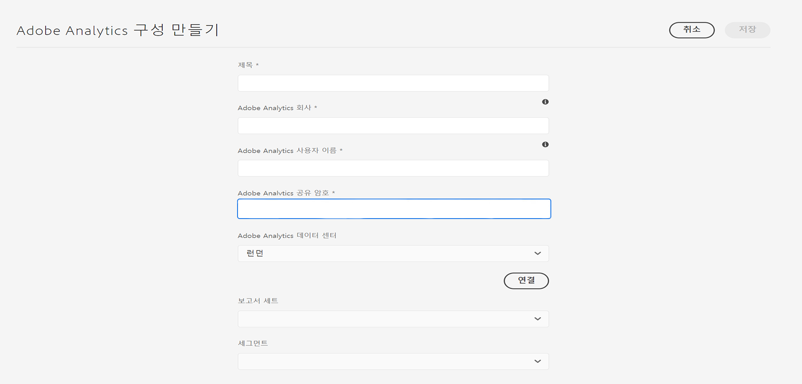

# Adobe Analytics와 통합{#integrating-with-adobe-analytics}

Adobe Analytics과 AEM을 Cloud Service으로 통합하면 웹 페이지 활동을 추적할 수 있습니다. 통합에는 다음이 필요합니다.

* 터치 UI를 사용하여 AEM에서 Cloud Service으로 분석 구성을 만듭니다.
* adobe Launch의 확장으로 Adobe Analytics 추가 및 [구성](#analytics-launch). Adobe 실행에 대한 자세한 내용은 [이 페이지를 참조하십시오](https://docs.adobe.com/content/help/en/launch/using/intro/get-started/quick-start.html).

AEM의 이전 버전과 비교하여 프레임워크 지원이 AEM의 분석 구성에서 Cloud Service으로 제공되지 않습니다. 대신, 이제 Analytics 기능(JS 라이브러리)을 사용하여 AEM 사이트를 구현하기 위한 사실상의 도구인 Adobe 론치를 통해 수행됩니다. Adobe 론치에서 Adobe Analytics 확장을 구성하고 데이터를 Adobe Analytics으로 보내기 위한 규칙을 만드는 속성이 만들어집니다. Adobe 실행이 sitecatalyst에서 제공하는 분석 작업을 대체했습니다.

>[!NOTE]
>
>Adobe Experience Manager은 기존 Analytics 계정이 없는 Cloud Service 고객으로 Experience Cloud용 Analytics Foundation Pack에 대한 액세스를 요청할 수 있습니다. 이 Foundation Pack은 Analytics의 볼륨 사용을 제한합니다.

## Adobe Analytics 구성 만들기 {#analytics-configuration}

1. 도구 **→** Cloud Services으로 **이동합니다**.
2. Adobe Analytics을 **선택합니다**.
   
3. 만들기 **단추를** 선택합니다.
4. 세부 사항을 채우고(아래 참조) **Connect를 클릭합니다**.

### 구성 매개 변수 {#configuration-parameters}

Adobe Analytics 구성 창에 있는 구성 필드는 다음과 같습니다.

| 속성 | 설명 |
|---|---|
| 회사 | Adobe Analytics 로그인 회사 |
| 사용자 이름 | Adobe Analytics API 사용자 |
| 암호 | 인증에 사용되는 Adobe Analytics 암호 |
| 데이터 센터 | 계정이 연결된 Adobe Analytics 데이터 센터(예: San Jose, London) |
| 세그먼트 | 현재 보고 세트에 정의된 Analytics 세그먼트를 사용하는 옵션입니다. Analytics 보고서는 세그먼트를 기반으로 필터링됩니다. 자세한 내용은 [이 페이지를](https://docs.adobe.com/content/help/en/analytics/components/segmentation/seg-overview.html) 참조하십시오. |
| 보고서 세트 | 데이터를 보내고 보고서를 가져오는 저장소. 보고서 세트는 선택한 웹 사이트, 웹 사이트 집합 또는 웹 사이트 페이지의 하위 집합에 대한 전체적이고 독립적인 보고를 정의합니다. 단일 보고서 세트에서 가져온 보고서를 볼 수 있으며 사용자의 요구 사항에 따라 언제든지 이 필드를 구성으로 편집할 수 있습니다. |

### 사이트에 구성 추가 {#add-configuration}

사이트에 터치 UI 구성을 적용하려면 다음으로 이동하십시오. **사이트** 사이트 페이지 **를** 선택합니다. 속성 **을** 선택합니다. 고급 **→구성** **** 을 선택합니다. 구성 테넌트를 선택합니다.

## Adobe 론치를 사용하여 AEM 사이트에서 Adobe Analytics 통합 {#analytics-launch}

론치 속성에서 확장자로 Adobe Analytics을 추가할 수 있습니다. 규칙을 정의하여 Adobe Analytics에 대한 매핑을 수행하고 사후 호출을 수행할 수 있습니다.

* 이 비디오 [를](https://docs.adobe.com/content/help/en/analytics-learn/tutorials/implementation/via-adobe-launch/basic-configuration-of-the-analytics-launch-extension.html) 통해 Launch에서 기본 사이트에 대한 Analytics 확장 기능을 구성하는 방법을 알아보십시오.

* 규칙을 만들고 데이터를 Adobe Analytics으로 보내는 방법에 대한 자세한 내용은 [이 페이지를](https://docs.adobe.com/content/help/en/core-services-learn/implementing-in-websites-with-launch/implement-solutions/analytics.html) 참조하십시오.

>[!NOTE]
>
>기존(기존) 프레임워크는 여전히 작동하지만 터치 UI에서는 구성할 수 없습니다. Launch에서 변수 매핑 구성을 다시 구성하는 것이 좋습니다.

>[!NOTE]
>
>Launch에 대한 IMS 구성(기술 계정)은 AEM에서 Cloud Service으로 미리 구성되어 있습니다. 사용자는 이 구성을 만들 필요가 없습니다.
