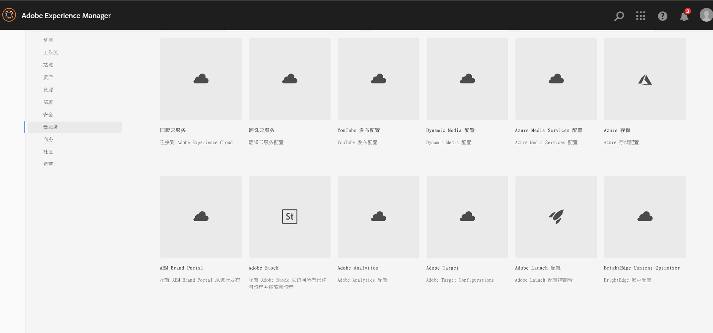
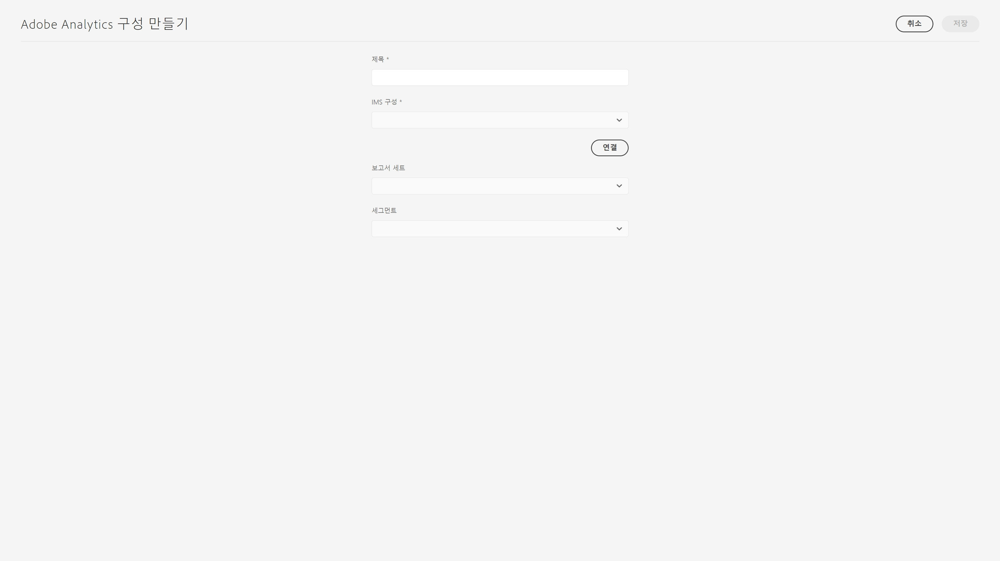

# Adobe Analytics와 통합{#integrating-with-adobe-analytics}

Adobe Analytics과 AEMas a Cloud Service 를 통합하여 웹 페이지 활동을 추적할 수 있습니다. 통합하려면 다음 작업을 수행해야 합니다.

* Touch UI를 사용하여 AEM as a Cloud Service에 Analytics 구성을 만듭니다. Adobe Analytics를 AEM as a Cloud Service와 통합하려면 IMS 인증이 필요합니다.
* Adobe Analytics를 [Adobe Launch](#analytics-launch)에 확장 프로그램으로 추가하고 구성합니다. Adobe Launch에 대한 자세한 내용은 [이 페이지](https://experienceleague.adobe.com/docs/experience-platform/tags/get-started/quick-start.html)를 참조하십시오.

이전 버전의 AEM과 달리 프레임워크 지원은 AEM as a Cloud Service의 Analytics 구성에서 제공되지 않습니다. 대신 이제 Analytics 기능(JS 라이브러리)을 갖춘 AEM 사이트를 측정하기 위한 실질적인 도구인 Adobe에서 제공하는 Launch가 이를 수행합니다. Adobe Launch에서는 Adobe Analytics 확장 기능을 구성할 수 있는 속성이 생성되며 Adobe Analytics로 데이터를 전송하기 위한 규칙이 생성됩니다. Adobe Launch에서는 SiteCatalyst에서 제공하는 분석 작업이 대체되었습니다.

>[!NOTE]
>
>기존 Analytics 계정이 없는 Adobe Experience Manager as a Cloud Service 고객은 Experience Cloud의 Analytics Foundation Pack에 대한 액세스 권한을 요청할 수 있습니다. 이 Foundation Pack은 제한된 볼륨의 Analytics를 사용할 수 있도록 제공합니다.

## Adobe Analytics 구성 만들기 {#analytics-configuration}

1. **도구** → **클라우드 서비스**&#x200B;로 이동합니다.
2. **Adobe Analytics**를 선택합니다.
   
3. **만들기** 버튼을 선택합니다.
4. 아래의 세부 정보를 입력한 다음 **연결**&#x200B;을 클릭합니다.

### 구성 매개변수 {#configuration-parameters}

구성 창에 있는 필드는 다음과 같습니다.

| 속성 | 설명 |
|---|---|
| 제목 | 구성 이름 |
| IMS 구성 | IMS 구성 선택(아래 챕터 참조) |
| 세그먼트 | 현재 보고서 세트에 정의된 Analytics 세그먼트를 사용하는 옵션입니다. Analytics 보고서는 세그먼트를 기반으로 필터링됩니다. 자세한 내용은 [이 페이지](https://experienceleague.adobe.com/docs/analytics/components/segmentation/seg-overview.html)를 참조하십시오. |
| 보고서 세트 | 데이터를 보내고 보고서를 가져오는 저장소입니다. 보고서 세트는 선택한 웹 사이트, 웹 사이트 집합 또는 웹 사이트 페이지의 하위 세트에 대한 전체적이고 독립적인 보고를 정의합니다. 단일 보고서 세트에서 가져온 보고서를 확인하고 요구 사항에 따라 언제든지 구성에서 이 필드를 편집할 수 있습니다. |

### IMS 인증을 사용하는 Adobe Analytics {#configuration-parameters-ims}

Adobe Analytics를 AEM as a Cloud Service와 제대로 통합하기 위해 IMS 구성이 필요합니다. 이 구성은 필수로 만들어야 하므로 해당 [페이지](/help/sites-cloud/integrating/integration-adobe-analytics-ims.md)를 참조하여 Analytics IMS 구성을 만드는 방법에 대해 알아보십시오.

### 사이트에 구성 추가 {#add-configuration}

사이트에 Touch UI 구성을 적용하려면 **Sites**&#x200B;로 이동하여 **원하는 사이트 페이지를 선택**&#x200B;한 다음 **속성** → **고급** → **구성**&#x200B;으로 이동하여 구성 테넌트를 선택합니다.

## Adobe Launch를 사용하여 AEM 사이트에서 Adobe Analytics 통합 {#analytics-launch}

Adobe Analytics를 Launch 속성에 확장 프로그램으로 추가할 수 있습니다. 매핑을 수행하고 Adobe Analytics에 대한 POST 호출을 만드는 규칙을 정의할 수 있습니다.

* Launch의 Analytics 확장 프로그램을 기본 사이트로 빠르게 구성하는 방법에 대해 알아보려면 [이 비디오](https://experienceleague.adobe.com/docs/analytics-learn/tutorials/implementation/via-adobe-launch/basic-configuration-of-the-analytics-launch-extension.html)를 시청하십시오.

* 규칙을 만들고 Adobe Analytics에 데이터를 보내는 방법에 대한 자세한 내용은 [이 페이지](https://experienceleague.adobe.com/docs/core-services-learn/implementing-in-websites-with-launch/implement-solutions/analytics.html)를 참조하십시오.

>[!NOTE]
>
>Launch용 IMS 구성(기술 계정)은 AEM as a Cloud Service에 사전 구성되어 있습니다. 사용자는 이 구성을 만들 필요가 없습니다.

>[!NOTE]
>
>기존(레거시) 프레임워크는 여전히 작동하지만 이를 Touch UI에서 구성할 수는 없습니다. Launch에 변수 매핑 구성을 다시 빌드하는 것이 좋습니다.
