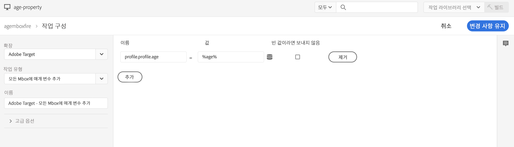

# Adobe Target과 통합{#integrating-with-adobe-target}

Adobe Target은 Adobe Marketing Cloud의 일부로서 모든 채널에서 타깃팅과 측정을 통해 컨텐츠 관련성을 높일 수 있습니다. Adobe Target과 AEM as a Cloud Service을 통합하려면 다음을 수행해야 합니다.

* touch UI를 사용하여 AEM as a Cloud Service(IMS 구성 필요)에서 Target 구성을 만듭니다.
* [Adobe Launch](https://experienceleague.adobe.com/docs/experience-platform/tags/get-started/quick-start.html)에서 Adobe Target을 확장으로 추가하고 구성하는 중입니다.

Launch는 AEM 페이지(JS 라이브러리/태그)에서 Analytics와 Target 모두에 대한 클라이언트측 속성을 관리하는 데 필요합니다. 즉, 경험 타깃팅을 위해 Launch와의 통합이 필요합니다. Target으로 경험 조각 내보내기의 경우 Adobe Target 구성 및 IMS만 있으면 됩니다.

>[!NOTE]
>
>기존 Target 계정이 없는 Adobe Experience Manager as a Cloud Service 고객은 Experience Cloud을 위한 Target 기초 팩에 대한 액세스를 요청할 수 있습니다. Foundation Pack에서는 볼륨을 제한하여 Target을 사용합니다.

## Adobe Target 구성 만들기 {#create-configuration}

1. **도구** → **Cloud Services**로 이동합니다.
   
2. **Adobe Target**&#x200B;을 선택합니다.
3. **만들기** 단추를 선택합니다.
   
4. 세부 사항을 입력하고(아래 참조) **연결**을 선택합니다.
   

### IMS 구성 {#ims-configuration}

Target을 AEM 및 Launch와 제대로 통합하려면 Launch 및 Target 둘 다에 대한 IMS 구성이 필요합니다. Launch에 대한 IMS 구성은 AEM as a Cloud Service에서 미리 구성되어 있지만 Target IMS 구성을 만들어야 합니다(Target이 프로비저닝된 후). Target IMS 구성을 만드는 방법에 대해 알아보려면 [이 비디오](https://helpx.adobe.com/kr/experience-manager/kt/sites/using/aem-sites-target-standard-technical-video-understand.html) 및 [이 페이지](https://experienceleague.adobe.com/docs/experience-manager-65/administering/integration/integration-ims-adobe-io.html)를 참조하십시오.

### Adobe Target 테넌트 ID 및 Adobe Target 클라이언트 코드 {#tenant-client}

Adobe Target 테넌트 ID 및 Adobe Target 클라이언트 코드 필드를 구성할 때는 다음 사항에 유의하십시오.

1. 대부분의 고객의 경우 테넌트 ID와 클라이언트 코드는 동일합니다. 즉, 두 필드 모두 동일한 정보를 포함하고 있으며 동일합니다. 두 필드에 테넌트 ID를 입력해야 합니다.
2. 기존 목적으로 테넌트 ID 및 클라이언트 코드 필드에 다른 값을 입력할 수도 있습니다.

두 경우 모두 다음 사항에 유의하십시오.

* 기본적으로 클라이언트 코드(처음 추가되는 경우)도 자동으로 테넌트 ID 필드에 복사됩니다.
* 기본 테넌트 ID 세트를 변경할 수 있는 옵션이 있습니다.
* 따라서 Target에 대한 백엔드 호출은 테넌트 ID를 기반으로 하며, Target에 대한 클라이언트측 호출은 클라이언트 코드를 기반으로 합니다.

앞에서 설명한 바와 같이, 첫 번째 케이스는 AEM as a Cloud Service에서 가장 일반적인 케이스입니다. 어느 쪽이든, **모두** 필드에 요구 사항에 따라 올바른 정보가 포함되어 있는지 확인하십시오.

>[!NOTE]
>
> 기존 Target 구성을 변경하려면:
>
> 1. 테넌트 ID를 다시 입력합니다.
> 2. Target에 다시 연결합니다.
> 3. 구성을 저장합니다.

### Target 구성 편집 {#edit-target-configuration}

Target 구성을 편집하려면 다음 단계를 수행합니다.

1. 기존 구성을 선택하고 **속성**&#x200B;을 클릭합니다.
2. 속성을 편집합니다.
3. **Adobe Target에 다시 연결**&#x200B;을 선택합니다.
4. **저장 후 닫기**&#x200B;를 선택합니다.

### 사이트에 구성 추가 {#add-configuration}

사이트에 Touch UI 구성을 적용하려면 다음 위치로 이동하십시오. **사이트** → **사이트 페이지 선택** → **속성** → **고급** → **구성** → 구성 테넌트를 선택합니다.

## Launch를 사용하여 AEM 사이트에서 Adobe Target 통합 {#integrate-target-launch}

AEM에서는 Experience Platform Launch과 즉시 통합할 수 있습니다. Adobe Target 확장을 Experience Platform Launch에 추가하여 AEM 웹 페이지에서 Adobe Target의 기능을 사용할 수 있습니다. Target 라이브러리는 Launch를 사용해야만 렌더링됩니다.

>[!NOTE]
>
>기존(기존) 프레임워크는 여전히 작동하지만 Touch UI에서는 구성할 수 없습니다. Launch에서 변수 매핑 구성을 다시 빌드하는 것이 좋습니다.

일반적인 개요로서 통합 단계는 다음과 같습니다.

1. Launch 속성 만들기
2. 필요한 확장 추가
3. 컨텍스트 허브 매개 변수를 캡처하기 위한 데이터 요소 만들기
4. 페이지 규칙 만들기
5. 작성 및 게시

### Launch 속성 만들기 {#create-property}

속성은 확장, 규칙, 데이터 요소로 채워진 컨테이너입니다.

1. **새 속성** 단추를 선택합니다.
2. 속성의 이름을 입력합니다.
3. 도메인으로 launch 라이브러리를 로드할 IP/호스트를 입력합니다.
4. **저장** 단추를 선택합니다.
   

### 필요한 확장 추가 {#add-extension}

**** 확장은 코어 라이브러리 설정을 관리하는 컨테이너를 확장합니다. Adobe Target 확장은 최신 웹, at.js에 Target JavaScript SDK를 사용하여 클라이언트측 구현을 지원합니다. **Adobe Target** 및 **Adobe ContextHub** 확장을 모두 추가해야 합니다.

1. 확장 카탈로그 옵션을 선택하고 필터에서 Target을 검색합니다.
2. **Adobe Target** at.js를 선택하고 설치 옵션을 클릭합니다.
   
3. **구성** 단추를 선택합니다. 가져온 Target 계정 자격 증명과 이 확장에 대한 at.js 버전이 있는 구성 창을 확인합니다.
4. **저장**&#x200B;을 선택하여 Target 확장을 Launch 속성에 추가합니다. **설치된 확장** 목록 아래에 나열된 Target 확장을 볼 수 있습니다.
   
5. 위의 단계를 반복하여 **Adobe ContextHub** 확장을 검색하고 설치합니다(이것은 타깃팅이 수행될 contexthub 매개 변수와 통합에 필요합니다.).

### 데이터 요소 만들기 {#data-element}

**데이터** 요소는 Context Hub 매개 변수를 매핑할 수 있는 자리 표시자입니다.

1. **데이터 요소**&#x200B;를 선택합니다.
2. **데이터 요소 추가**&#x200B;를 선택합니다.
3. 데이터 요소의 이름을 제공하고 컨텍스트 허브 매개 변수에 매핑합니다.
4. **저장**을 선택합니다.
   

### 페이지 규칙 만들기 {#page-rule}

**규칙**&#x200B;에서는 타깃팅을 위해 사이트에서 실행되는 일련의 작업을 정의하고 순서를 지정합니다.

1. 스크린샷에 예시된 일련의 작업을 추가합니다.
   
2. Add Params to All Mbox에서 이전에 구성된 데이터 요소(위의 데이터 요소 참조)를 mbox 호출에서 전송할 매개 변수에 추가합니다.
   

### 작성 및 게시 {#build-publish}

빌드 및 게시 방법에 대한 자세한 내용은 이 [page](https://experienceleague.adobe.com/docs/experience-manager-learn/aem-target-tutorial/aem-target-implementation/using-launch-adobe-io.html)을 참조하십시오.

## 클래식 UI 구성과 Touch UI 구성 간의 컨텐츠 구조 변경 {#changes-content-structure}

| **변경** | **클래식 UI 구성** | **Touch UI 구성** | **결과** |
|---|---|---|---|
| Target 구성의 위치입니다. | /etc/cloudservices/testandtarget/ | /conf/tenant/settings/cloudservices/target | 이전 여러 구성이 /etc/cloudservices/testandtarget 아래에 있지만 이제 단일 구성이 임차인 아래에 있습니다. |

>[!NOTE]
>
>기존 구성은 여전히 기존 고객에 대해 지원됩니다(새 구성을 편집하거나 만들 수 있는 옵션 없음). 이전 구성은 VSTS를 사용하여 고객이 업로드한 컨텐츠 패키지에 포함됩니다.
