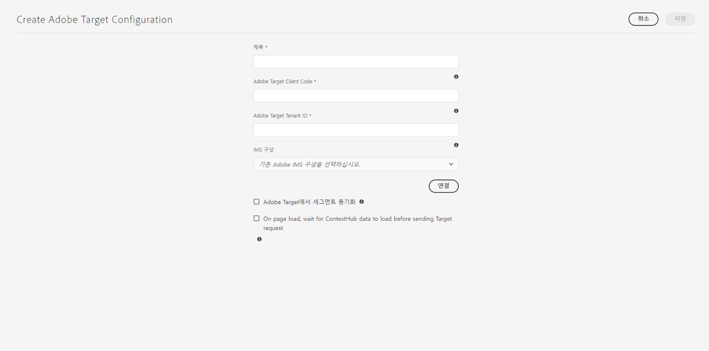

# Adobe Target과 통합{#integrating-with-adobe-target}

Adobe Experience Cloud의 일부인 Adobe Target을 사용하여 모든 채널에 걸친 타겟팅 및 측정을 통해 콘텐츠 관련성을 높일 수 있습니다. Adobe Target과 AEM as a Cloud Service를 통합하려면 다음 작업을 수행하십시오.

* Touch UI를 사용하여 AEM as a Cloud Service에 Target 구성을 만듭니다(IMS 구성 필요).
* Adobe Target을 [Adobe Launch](https://experienceleague.adobe.com/docs/experience-platform/tags/get-started/quick-start.html)에 확장 기능으로 추가하고 구성합니다.

Adobe Launch는 AEM 페이지(JS 라이브러리/태그)의 Analytics 및 Target에 대한 클라이언트측 속성을 관리하는 데 필요합니다. 즉, “경험 타겟팅”을 위해서는 Launch와의 통합이 필요합니다.

경험 조각 및/또는 콘텐츠 조각을 Target으로 내보내려면 [Adobe Target 구성과 IMS](/help/sites-cloud/integrating/integration-adobe-target-ims.md)만 있으면 됩니다.

>[!NOTE]
>
>기존 Target 계정이 없는 고객은 Experience Cloud의 Target Foundation Pack에 대한 액세스 권한을 요청할 수 있습니다. Foundation Pack은 제한된 볼륨의 Target을 사용할 수 있도록 제공합니다.

## Adobe Target 구성 만들기 {#create-configuration}

1. **도구** → **클라우드 서비스**로 이동합니다.
   
2. **Adobe Target**&#x200B;을 선택합니다.
3. **만들기** 버튼을 선택합니다.
   
4. 아래의 세부 정보를 입력한 다음 **연결**을 선택합니다.
   

### IMS 구성 {#ims-configuration}

Launch 및 Target에 대한 IMS 구성은 Target과 AEM 및 Launch를 올바르게 통합하는 데 필요합니다. Launch에 대한 IMS 구성은 AEM as a Cloud Service에 사전 구성되어 있는 반면 Target IMS 구성은 Target을 프로비저닝한 다음 직접 만들어야 합니다. Target IMS 구성을 만드는 방법을 알아보려면 [Adobe Target과 통합할 때 사용할 IMS 구성](/help/sites-cloud/integrating/integration-adobe-target-ims.md) 및 [Experience Platform Launch 및 AEM 통합](https://experienceleague.adobe.com/docs/experience-manager-learn/sites/integrations/experience-platform-data-collection-tags/overview.html) 비디오를 참조하십시오.

### Adobe Target 테넌트 ID 및 Adobe Target 클라이언트 코드 {#tenant-client}

Adobe Target 테넌트 ID 및 Adobe Target 클라이언트 코드 필드를 구성할 때에는 다음을 고려해야 합니다.

1. 대부분의 고객은 테넌트 ID와 클라이언트 코드가 같습니다. 즉, 두 필드에는 동일한 정보가 포함되어 있으며 이 두 필드는 동일합니다. 두 필드 모두에 테넌트 ID를 입력하십시오.
2. 또한 레거시 목적으로 테넌트 ID와 클라이언트 코드 필드에 서로 다른 값을 입력할 수도 있습니다.

두 경우 모두:

* 기본적으로 클라이언트 코드(먼저 추가된 경우)도 테넌트 ID 필드에 자동으로 복사됩니다.
* 필요한 경우, 기본 테넌트 ID 설정을 변경할 수 있습니다.
* Target에 대한 백엔드 호출은 테넌트 ID를 기반으로 하고, Target에 대한 클라이언트측 호출은 클라이언트 코드를 기반으로 하게 됩니다.

앞서 설명된 바와 같이 AEM as a Cloud Service에서는 첫 번째 경우가 가장 일반적입니다. 어느 경우든 두 가지 필드 **모두**&#x200B;에 요구 사항에 따라 올바른 정보가 포함되어 있는지 확인하십시오.

>[!NOTE]
>
> 기존 Target 구성을 변경하고자 하는 경우:
>
> 1. 테넌트 ID를 다시 입력합니다.
> 2. Target에 다시 연결합니다.
> 3. 구성을 저장합니다.

### Target 구성 편집 {#edit-target-configuration}

Target 구성을 편집하려면 다음 단계를 따르십시오.

1. 기존 구성을 선택한 다음 **속성**&#x200B;을 클릭합니다.
2. 속성을 편집합니다.
3. **Adobe Target에 다시 연결**&#x200B;을 선택합니다.
4. **저장 후 닫기**&#x200B;를 선택합니다.

### 사이트에 구성 추가 {#add-configuration}

사이트에 Touch UI 구성을 적용하려면 **Sites**&#x200B;로 이동하여 **원하는 사이트 페이지를 선택**&#x200B;한 다음 **속성** > **고급** > **구성**&#x200B;으로 이동하여 구성 테넌트를 선택합니다.

## Adobe Launch를 사용하여 AEM 사이트에서 Adobe Target 통합 {#integrate-target-launch}

AEM은 Experience Platform Launch와의 획기적인 통합 기능을 제공합니다. Experience Platform Launch에 Adobe Target 확장 기능을 추가하여 AEM 웹 페이지에서 Adobe Target의 기능을 사용할 수 있습니다. Launch를 사용하면 Target 라이브러리를 렌더링하는 것 이외의 작업을 수행할 수 없습니다.

>[!NOTE]
>
>기존(레거시) 프레임워크는 여전히 작동하지만 이를 Touch UI에서 구성할 수는 없습니다. Adobe는 Launch에 변수 매핑 구성을 다시 빌드할 것을 권장합니다.

일반적인 개요로서 통합 단계는 다음과 같습니다.

1. Launch 속성 만들기
2. 필요한 확장 기능 추가
3. ContextHub 매개변수를 캡처할 데이터 요소 만들기
4. 페이지 규칙 만들기
5. 빌드 및 게시

### Launch 속성 만들기 {#create-property}

속성은 확장 기능, 규칙, 데이터 요소로 채워진 컨테이너입니다.

1. **새 속성** 버튼을 선택합니다.
2. 속성의 이름을 입력합니다.
3. 도메인과 같이 Launch 라이브러리를 로드할 IP/호스트를 입력합니다.
4. **저장** 버튼을 선택합니다.
   

### 필요한 확장 기능 추가 {#add-extension}

**확장 기능**&#x200B;은 핵심 라이브러리 설정을 관리하는 컨테이너입니다. Adobe Target 확장 기능은 최신 웹인 at.js를 위한 Target JavaScript SDK를 사용하여 클라이언트측 구현을 지원합니다. **Adobe Target** 및 **Adobe ContextHub** 확장 기능을 모두 추가합니다.

1. 확장 기능 카탈로그 옵션을 선택한 다음 필터에서 Target을 검색합니다.
2. **Adobe Target** at.js를 선택한 다음 설치 옵션을 클릭합니다.
   
3. **구성** 버튼을 선택합니다. 가져온 Target 계정 자격 증명이 포함된 구성 창 및 이 확장 기능에 대한 at.js 버전이 표시됩니다.
4. **저장**&#x200B;을 선택하여 Launch 속성에 Target 확장 기능을 추가합니다. **설치된 확장 기능** 목록에 나열된 Target 확장 기능을 확인할 수 있습니다.
   
5. 위의 단계를 반복하여 **Adobe ContextHub** 확장 기능을 검색하고 설치하십시오. 이 확장 기능은 타겟팅이 수행될 ContextHub 매개변수와의 통합에 필요합니다.

### 데이터 요소 만들기 {#data-element}

**데이터 요소**&#x200B;는 ContextHub 매개변수를 매핑할 수 있는 플레이스홀더입니다.

1. **데이터 요소**&#x200B;를 선택합니다.
2. **데이터 요소 추가**&#x200B;를 선택합니다.
3. 데이터 요소의 이름을 입력한 다음 ContextHub 매개변수로 매핑합니다.
4. **저장**을 선택합니다.
   

### 페이지 규칙 만들기 {#page-rule}

**규칙**&#x200B;에서는 사이트에서 실행되는 액션의 시퀀스를 정의하고 정렬하여 타겟팅을 수행합니다.

1. 스크린샷의 예시처럼 액션 세트를 추가합니다.
   
2. [모든 mbox에 매개변수 추가]에서 이전에 구성한 데이터 요소(위 데이터 요소 참조)를 mbox 호출에서 전송될 매개변수에 추가합니다.
   

### 빌드 및 게시 {#build-publish}

빌드 및 게시 방법에 대해 알아보려면 [페이지](https://experienceleague.adobe.com/docs/experience-manager-learn/aem-target-tutorial/aem-target-implementation/using-launch-adobe-io.html)를 참조하십시오.

## 클래식 및 Touch UI 구성 간 콘텐츠 구조 변경 내용 {#changes-content-structure}

<table style="table-layout:auto">
  <tr>
    <th>변경</th>
    <th>클래식 UI 구성</th>
    <th>Touch UI 구성</th>
    <th>결과</th>
  </tr>
  <tr>
    <td>Target 구성 위치</td>
    <td>/etc/cloudservices/testandtarget/</td>
    <td>/conf/tenant/settings/cloudconfigs/target/</td>
    <td> 이전에 여러 구성은 /etc/cloudservices/testandtarget 아래에 표시되었지만 이제 단일 구성은 테넌트 아래에 표시됩니다.</td>
  </tr>
</table>

>[!NOTE]
>
>레거시 구성은 기존 고객에 대해 여전히 지원됩니다. 편집하거나 만드는 옵션은 포함되지 않습니다. 레거시 구성은 VSTS를 사용하는 고객이 업로드한 콘텐츠 패키지의 일부입니다.
