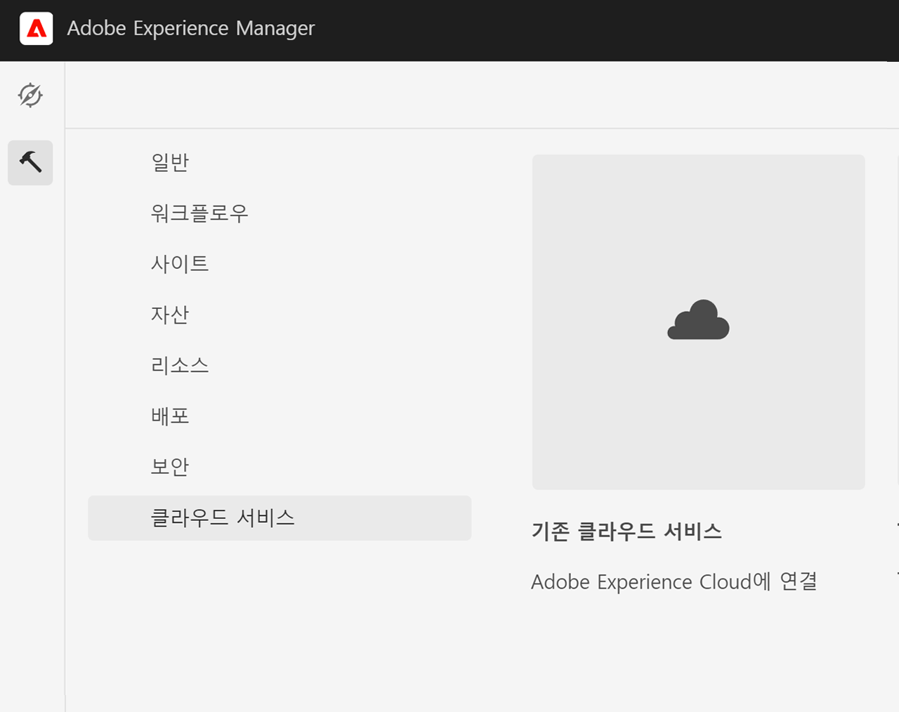
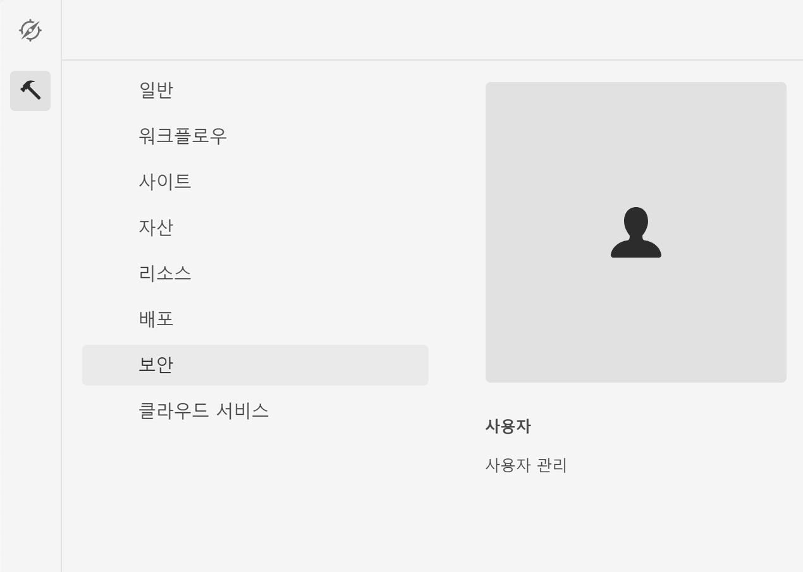

# Adobe Campaign Classic과 통합 {#integrating-campaign-classic}

Adobe Campaign과 통합하면 AEM as a Cloud Service에서 직접 이메일 게재, 콘텐츠 및 양식을 관리할 수 있습니다. 솔루션 간에 양방향 통신을 활성화하려면 Adobe Campaign Classic과 AEM as a Cloud Service 모두에서 구성 단계가 필요합니다.

AEM as a Cloud Service 및 Adobe Campaign Classic도 독립적으로 사용할 수 있습니다. 예를 들어 마케터는 캠페인을 만들고 Adobe Campaign에서 타깃팅을 사용할 수 있지만 컨텐츠 작성자는 AEM as a Cloud Service에서 디자인에서 작업할 수 있습니다.

## 통합 워크플로우 {#integration-workflow}

다음 장에서는 솔루션을 통합하는 방법을 자세히 설명합니다. 이렇게 하려면 Adobe Campaign Classic과 AEM as a Cloud Service의 구성 단계가 필요합니다. 따라서 다음을 배울 수 있습니다.

* [운영자 사용자 만들기](#create-operator)
* [통합을 위해 AEM as a Cloud Service 구성](#aem-configuration)
* [Campaign 원격 사용자 구성](#configure-user)
* [Adobe Campaign Classic 외부 계정 설정](#acc-setup)

### 사전 요구 사항 {#prerequisites}

**Adobe Campaign Classic**

통합을 수행하려면 데이터베이스를 포함한 작업 Adobe Campaign Classic 인스턴스가 필요합니다. Adobe Campaign Classic 설정 및 구성 방법에 대한 추가 세부 사항이 필요한 경우 공식 문서를 참조하십시오 [Adobe Campaign Classic 설명서](https://experienceleague.adobe.com/docs/campaign-classic/using/campaign-classic-home.html) 특히 설치 및 구성 안내서를 참조하십시오. 아래 표시된 작업을 수행하려면 관리자 역할도 있어야 합니다.

**AEM as a Cloud Service**

다음을 수행해야 합니다. [AEM as a Cloud Service](https://experienceleague.adobe.com/docs/experience-manager-cloud-service/content/overview/introduction.html) 솔루션.

### Adobe Campaign Classic에서 운영자 사용자 만들기 {#create-operator}

시작 메뉴에서 Adobe Campaign Classic 클라이언트 콘솔을 열고 로그인합니다. 홈 페이지가 표시됩니다.

1. 클릭 **탐색기** 탐색기 보기를 엽니다.
   
1. 왼쪽의 트리 보기에서 다음 위치로 이동합니다. **관리->액세스 관리->운영자**.
1. 을(를) 두 번 클릭합니다. `aemserver` 오른쪽에 있는 연산자 목록에 있는 항목을 입력합니다.
1. 로 전환 **편집** 탭. aemserver의 암호를 설정합니다.
   
1. 을(를) 클릭합니다. **액세스 권한** 탭을 클릭하고 **액세스 매개 변수 편집** 링크를 클릭합니다.
1. 암호화에서 공용 네트워크를 인증된 연결 영역으로 선택합니다. **확인**을 클릭합니다.
   
1. **저장**&#x200B;을 클릭합니다.
1. 로그아웃합니다.
1. 예를 들어, Adobe Campaign Classic v7 설치 위치로 이동합니다 `C:\Program Files\Adobe\Adobe Campaign Classic v7\conf` 그리고 `serverConf.xml` 관리자로.
   * 검색 대상 **보안 영역**.
   * 다음 매개 변수를 설정합니다 `allowHTTP="true"` `sessionTokenOnly="true"` `allowUserPassword="true"`.
   * 파일을 저장합니다.
1. 의 각 설정에 의해 보안 영역을 덮어쓰지 않는지 확인합니다. `config-<server name>.xml` 파일(C:\Program Files\Adobe\Adobe Campaign Classic v7\conf\config_acc-test.xml).
   * 구성 파일에 별도의 보안 영역 설정이 포함되어 있으면 `allowUserPassword` true로 설정합니다.
1. Adobe Campaign Classic 서버 포트를 변경하려면 8080을 원하는 포트(예: 80).

>[!NOTE]
>
>기본적으로 연산자에 대해 구성된 보안 영역이 없습니다. AEM as a Cloud Service으로 Adobe Campaign에 연결하려면 하나를 선택해야 합니다(위의 단계 참조). 보안 문제를 방지하기 위해 AEM 전용 보안 영역을 만드는 것이 좋습니다.

### AEM as a Cloud Service 구성 {#aem-configuration}

1. cloud manager에 로그인하고 AEM as a Cloud Service 작성자 인스턴스를 시작합니다.
1. 이동 **도구→Cloud Service→이전 Cloud Service**.
   
1. Adobe Campaign으로 스크롤한 다음 **지금 구성** 링크를 클릭합니다.
   * 제목을 입력합니다.
   * 이름을 입력합니다.
   * **만들기**&#x200B;를 클릭합니다.
1. 구성 요소 편집 화면에서
   * 사용자 이름을 입력합니다. [운영자 사용자 만들기](#create-operator).
   * 암호를 입력합니다.
   * Adobe Campaign Classic 서버 API 종료 지점(예: `http://3.22625.51:80`).
   * 클릭 **Adobe Campaign에 연결**.
   * **확인**&#x200B;을 클릭합니다.

   >[!NOTE]
   >
   >AEM as a Cloud Service이 개인 네트워크에 연결할 수 없으므로 인터넷에서 Adobe Campaign 서버에 연결할 수 있는지 확인하십시오.
1. Link Externalizer 구성에서 게시 인스턴스를 확인하십시오.
에서 OSGi 서비스의 상태 덤프를 확인하여 이 구성을 볼 수 있습니다 [개발자 콘솔](https://experienceleague.adobe.com/docs/experience-manager-learn/cloud-service/debugging/debugging-aem-as-a-cloud-service/developer-console.html#osgi-services).
올바르지 않은 경우 해당 인스턴스 git 리포지토리에서 변경 작업을 수행한 다음, 다음을 사용하여 구성을 배포합니다 [cloud manager](https://experienceleague.adobe.com/docs/experience-manager-cloud-service/content/implementing/using-cloud-manager/deploy-code.html).

```
Service 3310 - [com.day.cq.commons.Externalizer] (pid: com.day.cq.commons.impl.ExternalizerImpl)",
"  from Bundle 420 - Day Communique 5 Commons Library (com.day.cq.cq-commons), version 5.12.16",
"    component.id: 2149",
"    component.name: com.day.cq.commons.impl.ExternalizerImpl",
"    externalizer.contextpath: ",
"    externalizer.domains: [local https://author-p17558-e33255-cmstg.adobeaemcloud.com, author https://author-p17558-e33255-cmstg.adobeaemcloud.com,
     publish https://publish-p17558-e33255-cmstg.adobeaemcloud.com]",
"    externalizer.encodedpath: false",
"    externalizer.host: ",
"    feature-origins: [com.day.cq:cq-quickstart:slingosgifeature:cq-platform-model_quickstart_author:6.6.0-V23085]",
"    service.bundleid: 420",
"    service.description: Creates absolute URLs",
"    service.scope: bundle",
"    service.vendor: Adobe Systems Incorporated",
```

>[!NOTE]
>
>Adobe Campaign 서버에서도 게시 인스턴스에 연결할 수 있어야 합니다.

### Adobe Campaign 원격 사용자 구성 {#configure-user}

campaign-remote 사용자에 대한 암호를 설정해야 합니다. Adobe Campaign Classic과 AEM as a Cloud Service를 연결하려면 필요합니다.

1. 이동 **AEM→Tools→Security→Users**.
   
1. 을 검색합니다. `campaign-remote` 사용자를 클릭한 다음 클릭합니다.
1. 암호 변경을 클릭합니다.
   * 새 암호를 두 번 입력합니다.
   * AEM 암호를 입력합니다.
   * **저장**&#x200B;을 클릭합니다.

### Adobe Campaign Classic 외부 계정 구성 {#acc-setup}

Adobe Campaign Classic을 AEM as a Cloud Service 인스턴스와 연결하려면 외부 계정을 구성해야 합니다.

1. 클라이언트 콘솔을 사용하여 Adobe Campaign Classic 서버에 로그인합니다.
1. 탐색기 보기로 이동합니다.
1. 왼쪽의 트리 보기에서 **관리→Platform→외부 계정**.
1. 오른쪽 상단의 목록 보기에서 AEM 인스턴스를 클릭합니다.
1. AEM 인스턴스 구성에서
   * 예를 들어 AEM as a Cloud Service 작성자 IP/FAQ를 입력합니다 `https://author-p17558-e33255-cmstg.adobeaemcloud.com`.
   * 사용자 및 계정을 입력합니다.
   * AEM as a Cloud Service 인스턴스에서 설정한 campaign-remote 사용자의 암호를 입력합니다(위의 절차 참조).
   * 을(를) 선택합니다 **활성화됨** 확인란을 선택합니다.
   * **저장**&#x200B;을 클릭합니다.

   >[!NOTE]
   >
   >Adobe Campaign Classic 서버 인스턴스에서 AEM 작성자 서버 IP/FAQ에 연결할 수 있어야 합니다. 또한 AEM 작성자 서버 IP/FAQ에 백슬래시 문자를 추가하지 마십시오.

Adobe Campaign Classic과 AEM as a Cloud Service을 모두 구성했으므로 이제 통합이 완료됩니다. 또한, Adobe Experience Manager Newsletter를 작성하는 방법을 읽기 위해 [이 페이지](/help/sites-cloud/integrating/creating-newsletter.md).
