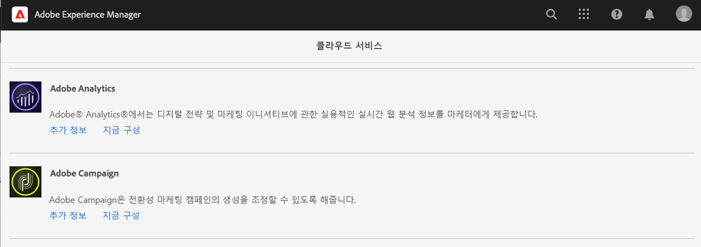
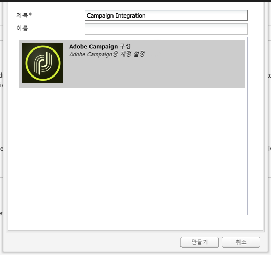
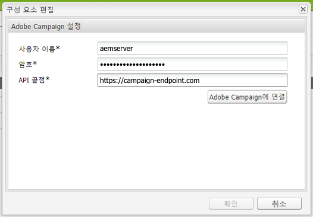
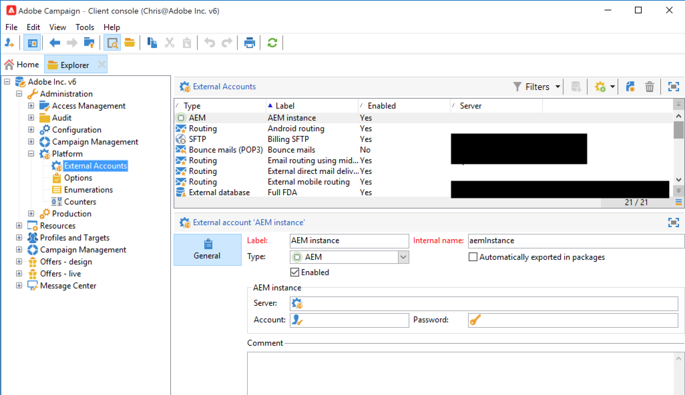

# Adobe Campaign Classic과 통합 {#integrating-campaign-classic}

AEM as a Cloud Service를 Adobe Campaign과 통합하면 AEM as a Cloud Service에서 이메일 게재, 콘텐츠 및 양식을 직접 관리할 수 있습니다. 솔루션 간 양방향 통신이 가능하려면 Adobe Campaign Classic과 AEM as a Cloud Service 모두에서 구성 단계를 수행해야 합니다.

이러한 통합 하에 AEM as a Cloud Service와 Adobe Campaign Classic을 독립적으로 사용할 수 있습니다. 마케터는 Adobe Campaign에서 캠페인을 생성하고 타겟팅을 활용할 수 있으며, 동시에 콘텐츠 크리에이터는 AEM as a Cloud Service에서 콘텐츠 디자인 작업을 수행할 수 있습니다. 이러한 통합 시, AEM에서의 콘텐츠 및 디자인을 Campaign에서 타겟팅 및 게재할 수 있습니다.

## 통합 단계 {#integration-steps}

AEM과 Campaign 간 통합을 위해서는 두 솔루션 모두에서 몇 가지 단계를 수행해야 합니다.

1. [Campaign에서 AEM 통합 패키지 설치](#install-package)
1. [Campaign에서 AEM에 대한 연산자 생성](#create-operator)
1. [AEM에서 Campaign 통합 구성](#campaign-integration)
1. [AEM 외부화 구성](#externalizer)
1. [AEM에서 캠페인 원격 사용자 구성](#configure-user)
1. [Campaign에서 AEM 외부 계정 구성](#acc-setup)

이 문서는 이러한 각 단계를 자세히 안내합니다.

## 사전 요구 사항 {#prerequisites}

* Adobe Campaign Classic에 대한 관리자 액세스
   * 통합을 수행하려면 구성된 데이터베이스를 포함하는 작동 중인 Adobe Campaign Classic 인스턴스가 필요합니다.
   * Adobe Campaign Classic 설정 및 구성 방법에 관한 자세한 정보가 필요한 경우 [Adobe Campaign Classic 문서](https://experienceleague.adobe.com/docs/campaign-classic/using/campaign-classic-home.html)를 참조하시고 특히 설치 및 구성 안내서를 참조하십시오.

* AEM as a Cloud Service에 대한 관리자 액세스

## Campaign에서 AEM 통합 패키지 설치 {#install-package}

Adobe Campaign의 **AEM 통합** 패키지는 AEM에 연결하는 데 필요한 다양한 표준 구성을 포함하고 있습니다.

1. 관리자 자격으로 클라이언트 콘솔을 사용해 Adobe Campaign 인스턴트에 로그인합니다.

1. **도구** > **고급** > **패키지 가져오기...**&#x200B;를 선택합니다.

   

1. Click **표준 패키지 설치**&#x200B;를 클릭한 뒤 **다음**&#x200B;을 클릭합니다.

1. **AEM 통합** 패키지에 체크 표시합니다.

   

1. **다음**&#x200B;을 클릭한 뒤 **시작**&#x200B;을 클릭하여 설치를 시작합니다.

   

1. 설치가 완료되면 **닫기**&#x200B;를 클릭합니다.

통합 패키지 설치가 완료되었습니다.

## Campaign에서 AEM에 대한 연산자 생성 {#create-operator}

통합 패키지는 AEM이 Adobe Campaign에 연결할 때 사용하는 `aemserver` 연산자를 자동으로 생성합니다. 이 연산자에 대한 보안 영역을 정의하고 그 암호를 설정해야 합니다.

1. 클라이언트 콘솔을 사용해 관리자 자격으로 Adobe Campaign에 로그인합니다.

1. 메뉴 표시줄에서 **도구** -> **탐색기**&#x200B;를 선택합니다.

1. 탐색기에서 **관리** > **액세스 관리** > **연산자** 노드로 이동합니다.

1. `aemserver` 연산자를 선택합니다.

1. 연산자의 **편집** 탭에서 **액세스 권한** 하위 탭을 선택하고 **액세스 매개변수 편집...** 링크를 클릭합니다.

   

1. 적절한 보안 영역을 선택하고 필요에 따라 신뢰할 수 있는 IP 마스크를 정의합니다.

1. **저장**&#x200B;을 클릭합니다.

1. Adobe Campaign 클라이언트에서 로그아웃합니다.

1. Adobe Campaign 서버의 파일 시스템에서 Campaign 설치 위치로 이동하여 관리자 자격으로 `serverConf.xml` 파일을 편집합니다. 이 파일의 위치는 보통 다음과 같습니다.
   * Windows의 `C:\Program Files\Adobe\Adobe Campaign Classic v7\conf`.
   * Linux에서 `/usr/local/neolane/nl6/conf/eng`.

1. `securityZone` 을 검색한 뒤 AEM 연산자의 보안 영역에 대해 다음 매개변수가 설정되었는지 확인합니다.

   * `allowHTTP="true"`
   * `sessionTokenOnly="true"`
   * `allowUserPassword="true"`.

1. 파일을 저장합니다.

1. `config-<server name>.xml` 파일의 해당 설정이 보안 영역을 덮어쓰지 않도록 합니다.

   * 구성 파일에 별개의 보안 영역 설정이 포함되어 있는 경우 `allowUserPassword` 속성을 `true`로 바꿉니다.

1. Adobe Campaign Classic 서버 포트를 바꾸려면 `8080`을 원하는 포트로 바꿉니다.

>[!CAUTION]
>
>기본적으로, 연산자에 대해 보안 영역이 구성되어 있지 않습니다. AEM이 Adobe Campaign에 연결되려면 앞의 단계들에서 자세히 설명한 대로 영역을 반드시 선택해야 합니다.
>
>Adobe는 잠재적인 보안 문제를 예방할 수 있도록 AEM 전용 보안 영역을 생성할 것을 적극 권장합니다. 이 주제에 관한 자세한 내용은 [Adobe Campaign Classic 문서](https://experienceleague.adobe.com/docs/campaign-classic/using/installing-campaign-classic/additional-configurations/security-zones.html)를 참조하십시오.

1. Campaign 클라이언트에서 `aemserver` 연산자로 돌아간 뒤 **일반** 탭을 선택합니다.

1. **암호 재설정** 링크를 클릭합니다.

1. 암호를 지정하고, 나중에 사용할 수 있도록 안전한 위치에 저장합니다.

1. **확인**&#x200B;을 클릭해 `aemserver` 연산자에 대한 암호를 저장합니다.

## AEM에서 Campaign 통합 구성 {#campaign-integration}

AEM은 [Campaign에서 사용자가 이미 설정해 둔 연산자](#create-operator)를 사용하여 Campaign과 통신합니다.

1. 관리자 자격으로 AEM 제작 인스턴스에 로그인합니다.

1. 전역 탐색 측면 레일에서 **Tools** > **Cloud Services** > **레거시 Cloud Services** > **Adobe Campaign**&#x200B;을 선택한 뒤 **지금 구성**&#x200B;을 클릭합니다.

   

1. 대화 상자에서 **제목**&#x200B;을 입력하여 Campaign 서비스 구성을 생성하고 **생성**&#x200B;을 클릭합니다.

   

1. 구성 편집을 위한 새 창과 대화 상자가 열립니다. 필요한 정보를 입력합니다.

   * **사용자 이름** - 이전 단계에서 생성한 [Adobe Campaign AEM 통합 패키지 연산자입니다.](#create-operator) 이는 기본적으로 `aemserver`입니다.
   * **암호** - [이전 단계에서 생성한 Adobe Campaign AEM 통합 패키지 연산자의 암호입니다.](#create-operator)
   * **API 끝점** - Adobe Campaign 인스턴스 URL입니다.

   

1. **Adobe Campaign에 연결**&#x200B;을 선택하여 연결을 확인한 뒤 **확인**&#x200B;을 클릭합니다.

이제 AEM에서 Adobe Campaign과 통신할 수 있습니다.

>[!NOTE]
>
>Adobe Campaign 서버가 인터넷을 통해 접근 가능해야 합니다. AEM as a Cloud Service는 비공개 네트워크에 액세스할 수 없습니다.

## AEM 외부화 구성 {#externalizer}

외부화는 AEM의 OSGi 서비스로, 리소스 경로를 외부 및 절대 URL로 변환합니다. 이는 Campaign에서 사용 가능한 콘텐츠를 AEM이 제공하는 데 필요합니다.

1. 관리자 자격으로 AEM 제작 인스턴스에 로그인합니다.
1. [개발자 콘솔](https://experienceleague.adobe.com/docs/experience-manager-learn/cloud-service/debugging/debugging-aem-as-a-cloud-service/developer-console.html#osgi-services)에서 OSGi 서비스 상태 덤프를 확인하여 외부화 구성에서 게시 인스턴스를 확인합니다.
1. 내용이 올바르지 않은 경우, 해당 인스턴스 git 저장소에서 필요한 사항을 변경한 뒤 [클라우드 관리자를 사용해 구성을 배포합니다.](/help/implementing/cloud-manager/deploy-code.md)

```text
Service 3310 - [com.day.cq.commons.externalizer] (pid: com.day.cq.commons.impl.externalizerImpl)",
"  from Bundle 420 - Day Communique 5 Commons Library (com.day.cq.cq-commons), version 5.12.16",
"    component.id: 2149",
"    component.name: com.day.cq.commons.impl.externalizerImpl",
"    externalizer.contextpath: ",
"    externalizer.domains: [local https://author-p17558-e33255-cmstg.adobeaemcloud.com, author https://author-p17558-e33255-cmstg.adobeaemcloud.com,
     publish https://publish-p17558-e33255-cmstg.adobeaemcloud.com]",
"    externalizer.encodedpath: false",
"    externalizer.host: ",
"    feature-origins: [com.day.cq:cq-quickstart:slingosgifeature:cq-platform-model_quickstart_author:6.6.0-V23085]",
"    service.bundleid: 420",
"    service.description: Creates absolute URLs",
"    service.scope: bundle",
"    service.vendor: Adobe Systems Incorporated",
```

>[!NOTE]
>
>게시 인스턴스는 Adobe Campaign 서버에서 접근 가능해야 합니다.

## AEM에서 캠페인 원격 사용자 구성 {#configure-user}

Campaign에서 AEM과 통신하려면 AEM에서 `campaign-remote` 사용자에 대한 암호를 설정해야 합니다.

1. 관리자로 AEM에 로그인합니다.
1. 메인 탐색 콘솔에서 왼쪽 레일의 **도구**&#x200B;를 클릭합니다.
1. 그리고 **보안** -> **사용자**&#x200B;를 클릭하여 사용자 관리 콘솔을 엽니다.
1. `campaign-remote` 사용자를 찾습니다.
1. `campaign-remote` 사용자를 선택한 뒤 **속성**&#x200B;을 클릭하여 사용자를 편집합니다.
1. **사용자 설정 편집** 창에서 **암호 변경**&#x200B;을 클릭합니다.
1. 사용자에 대한 새 암호를 제공하고, 나중에 사용할 수 있도록 안전한 위치에 기록해 둡니다.
1. **저장**&#x200B;을 클릭하여 암호 변경사항을 저장합니다.
1. **저장 및 닫기**&#x200B;를 클릭하여 `campaign-remote` 사용자에 대한 변경사항을 저장합니다.

## Campaign에서 AEM 외부 계정 구성 {#acc-setup}

[**AEM 통합** 패키지를 Campaign에 설치할 때,](#install-package) AEM에 대한 외부 계정이 생성됩니다. 이 외부 계정을 구성함으로써 Adobe Campaign이 AEM as a Cloud Service에 연결할 수 있게 되며 이를 통해 솔루션 간 양방향 통신이 가능해집니다.

1. 클라이언트 콘솔을 사용해 관리자 자격으로 Adobe Campaign에 로그인합니다.

1. 메뉴 표시줄에서 **도구** -> **탐색기**&#x200B;를 선택합니다.

1. 탐색기에서 **관리** > **플랫폼** > **외부 계정** 노드로 이동합니다.

   

1. 외부 AEM 계정을 찾습니다. 기본적으로 그 값은 다음과 같습니다.

   * **유형** - AEM
   * **레이블** - AEM 인스턴스
   * **내부 이름** - aemInstance

1. [캠페인 원격 사용자 비밀번호 설정](#set-campaign-remote-password) 단계 수행 시 정의한 사용자 정보를 이 계정의 **일반** 탭에 입력합니다.

   * **서버** - AEM 제작자 서버 주소
      * AEM 제작자 서버는 Adobe Campaign Classic 서버 인스턴스에서 접근 가능해야 합니다.
      * 서버 주소가 뒤쪽 슬래시로 끝나지 **않아야** 합니다.
   * **계정** - 기본적으로, [캠페인 원격 사용자 암호 설정](#set-campaign-remote-password) 단계 수행 시 AEM에서 설정한 `campaign-remote` 사용자입니다.
   * **암호** - 이 암호는 [캠페인 원격 사용자 암호 설정](#set-campaign-remote-password) 단계 수행 시 AEM에서 설정한 `campaign-remote` 사용자와 동일합니다.

1. **활성화** 확인란을 선택합니다.

1. **저장**&#x200B;을 클릭합니다.

이제 Adobe Campaign이 AEM과 통신할 수 있습니다.

## 다음 단계 {#next-steps}

Adobe Campaign Classic과 AEM as a Cloud Service를 모두 구성하면 통합이 완료된 것입니다.

이번에는 [이 문서](/help/sites-cloud/authoring/campaign/creating-newsletters.md)를 계속 읽으며 Adobe Experience Manager에서 뉴스레터를 생성하는 방법에 대해 알아볼 수 있습니다.
