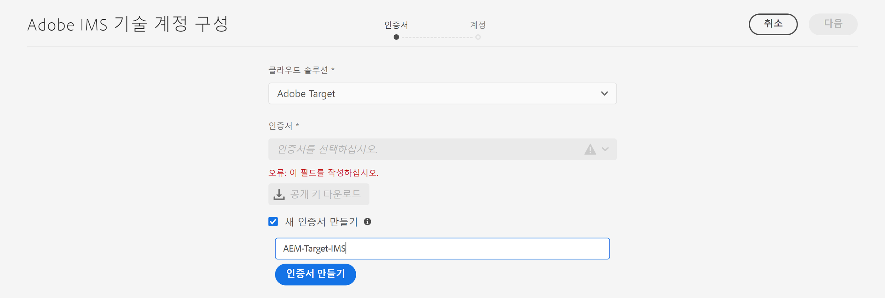
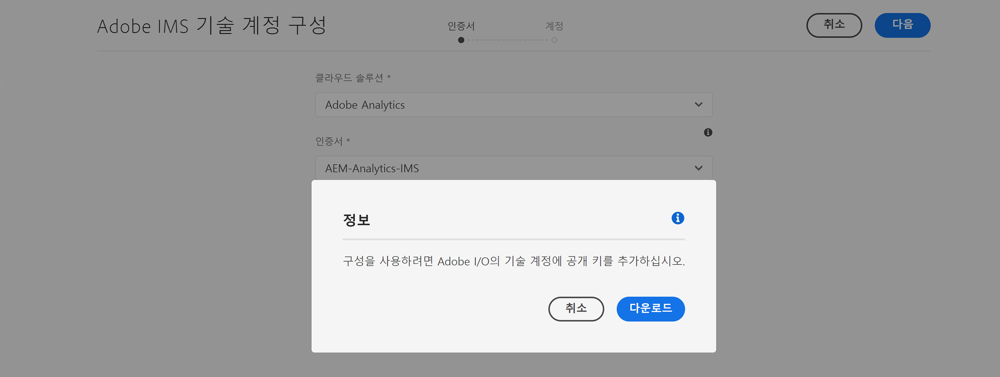
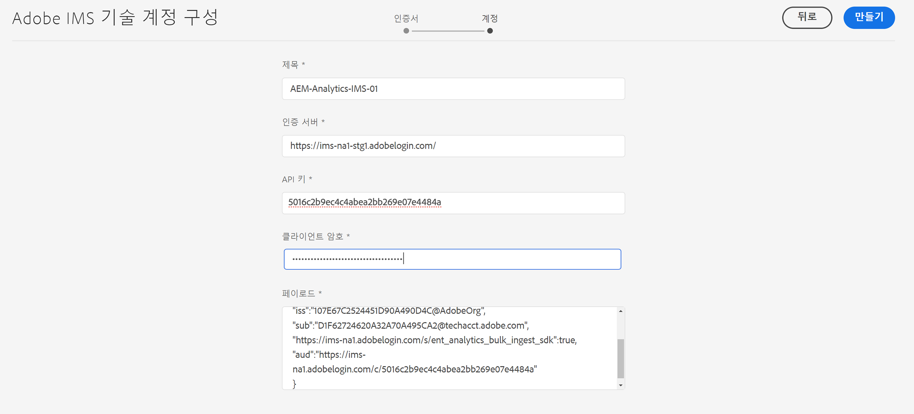
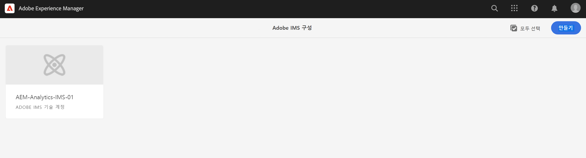
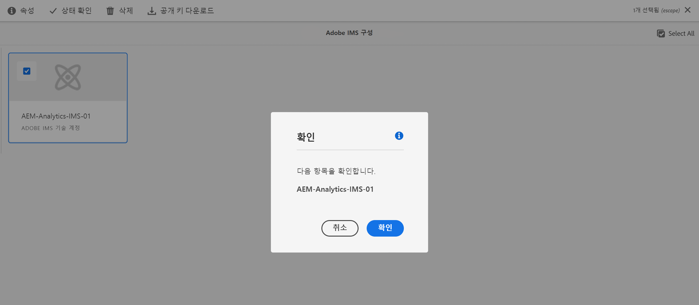

# Adobe Analytics와 통합할 때 사용되는 IMS 구성 {#ims-configuration-for-integration-with-adobe-analytics}

Analytics Standard API를 통해 Adobe Experience Manager as a Cloud Service(AEMaaCS)와 Adobe Analytics를 통합하려면 Adobe IMS(ID 관리 시스템) 구성이 필요합니다. 이 구성은 Adobe Developer Console을 통해 실현됩니다.

>[!NOTE]
>
>Adobe Analytics Standard API 2.0 지원은 AEMaaCS 2022.2.0의 새로운 기능입니다. 이 API 버전은 IMS 인증을 지원합니다.
>
>API 선택은 AEM/Analytics 통합에 사용되는 인증 방법에 따라 결정됩니다.
>
>자세한 내용은 [2.0 API로 마이그레이션](https://developer.adobe.com/analytics-apis/docs/2.0/guides/migration/)에서도 찾을 수 있습니다.

## 사전 요구 사항 {#prerequisites}

이 절차를 시작하기 전에:

* [Adobe 지원 팀](https://helpx.adobe.com/kr/contact/enterprise-support.ec.html)은 다음에 대한 계정을 프로비저닝해야 합니다.

   * Adobe Console
   * Adobe Developer Console
   * Adobe Analytics 및
   * Adobe IMS(ID 관리 시스템)

* 귀사의 시스템 관리자는 Admin Console을 사용하여 필요한 개발자를 관련 제품 프로필에 추가해야 합니다.

   * 이렇게 하면 관련 개발자에게 Adobe Developer Console을 사용하여 통합을 활성화할 수 있는 권한이 제공됩니다.
   * 자세한 내용은 [개발자 관리](https://helpx.adobe.com/kr/enterprise/admin-guide.html/enterprise/using/manage-developers.ug.html)를 참조하십시오.

## IMS 구성 - 공개 키 생성 {#configuring-ims-generating-a-public-key}

구성의 첫 단계는 AEM에서 IMS 구성을 만들고 공개 키를 생성하는 것입니다.

1. AEM에서 **도구** 메뉴를 엽니다.
1. **보안** 섹션에서 **Adobe IMS 구성**&#x200B;을 선택합니다.
1. **만들기**&#x200B;를 선택하여 **Adobe IMS 기술 계정 구성**&#x200B;을 엽니다.
1. **클라우드 구성** 아래의 드롭다운을 사용하여 **Adobe Analytics**&#x200B;를 선택합니다.
1. **새 인증서 만들기**&#x200B;를 활성화한 다음 새 별칭을 입력합니다.
1. **인증서 만들기**&#x200B;를 사용하여 확인합니다.

   

1. **다운로드**(또는 **공개 키 다운로드**)를 선택하여 [AEM과의 Adobe Analytics 통합에 대해 IMS를 구성](#configuring-ims-adobe-analytics-integration-with-aem)할 때 사용할 수 있도록 파일을 로컬 드라이브에 다운로드합니다.

   >[!CAUTION]
   >
   >[AEM에서 IMS 구성을 완료](#completing-the-ims-configuration-in-aem)할 때 다시 필요하므로 이 구성을 열어 두십시오.

   

## AEM과의 Adobe Analytics 통합에 대해 IMS 구성 {#configuring-ims-adobe-analytics-integration-with-aem}

Adobe Developer Console을 사용하여 AEM이 사용할 Adobe Analytics로 프로젝트(통합)을 만든 다음 필요한 권한을 할당해야 합니다.

### 프로젝트 만들기 {#creating-the-project}

Adobe Developer Console을 열고 AEM이 사용할 Adobe Analytics를 사용하여 프로젝트를 만듭니다.

>[!CAUTION]
>
>현재로서는 Adobe Developer Console의 **서비스 계정(JWT)** 자격 증명 유형만 지원됩니다.
>
>**OAuth 서버 간** 자격 증명 유형은 향후 지원될 예정이니 사용하지 마십시오.

1. 프로젝트용 Adobe Developer Console을 엽니다.

   [https://developer.adobe.com/console/projects](https://developer.adobe.com/console/projects)

1. 보유 중인 모든 프로젝트가 표시됩니다. **새 프로젝트 만들기**&#x200B;를 선택합니다. 위치 및 사용량은 다음에 따라 달라집니다.

   * 보유 중인 프로젝트가 없는 경우, **새 프로젝트 만들기**는 중앙 하단에 표시됩니다.
     
   * 기존 프로젝트가 있는 경우, 이 프로젝트가 나열되며 **새 프로젝트 만들기**는 오른쪽 상단에 표시됩니다.
     

1. **프로젝트에 추가**&#x200B;를 선택한 다음 **API**&#x200B;를 선택합니다.

   

1. **Adobe Analytics**&#x200B;를 선택하고 **다음**&#x200B;을 선택합니다.

   >[!NOTE]
   >
   >Adobe Analytics를 구독하지만 나열되지 않는 경우 [사전 요구 사항](#prerequisites)을 확인해야 합니다.

   

1. 인증 유형으로 **서비스 계정(JWT)**&#x200B;을 선택하고 **다음**&#x200B;을 사용하여 계속합니다.

   

1. **공개 키를 업로드**&#x200B;한 다음 완료되면 **다음**&#x200B;을 사용하여 계속합니다.

   

1. 자격 증명을 검토하고 **다음**&#x200B;을 사용하여 계속합니다.

   

1. 필요한 제품 프로필을 선택한 다음 **구성된 API 저장**&#x200B;을 사용하여 계속합니다.

   

1. 구성이 확인됩니다.

### 통합에 권한 할당 {#assigning-privileges-to-the-integration}

이제 필요한 권한을 통합에 할당해야 합니다.

1. Adobe **Admin Console**&#x200B;을 엽니다.

   * [https://adminconsole.adobe.com](https://adminconsole.adobe.com/)

1. **제품**&#x200B;으로 이동한 다음(상단 도구 모음) 왼쪽 패널에서 **Adobe Analytics - &lt;*테넌트 ID*>**&#x200B;을(를) 선택합니다.
1. **제품 프로필**&#x200B;을 선택한 다음 표시되는 목록에서 필요한 작업 영역을 선택합니다. (예: 기본 작업 영역)
1. **API 자격 증명**&#x200B;을 선택한 다음 필요한 통합 구성을 선택합니다.
1. **제품 역할**&#x200B;을 **관찰자**&#x200B;가 아닌 **편집자**&#x200B;로 선택합니다.

## 저장된 Adobe Developer Console 통합 프로젝트 세부 정보 {#details-stored-for-the-ims-integration-project}

[Adobe Developer Console - 프로젝트]에서 모든 통합 프로젝트 목록을 볼 수 있습니다.

* [https://developer.adobe.com/console/projects](https://developer.adobe.com/console/projects)

구성에 대한 세부 정보를 표시하려면 특정 프로젝트 항목을 선택합니다. 여기에는 다음이 포함됩니다.

* 프로젝트 개요
* 인사이트
* 자격 증명
   * 서비스 계정(JWT)
      * 자격 증명 세부 정보
      * JWT 생성
* API
   * (예: Adobe Analytics)

이 중 일부는 AEM에서 IMS를 기반으로 Adobe Analytics 통합을 완료해야 합니다.

## AEM에서 IMS 구성 완료 {#completing-the-ims-configuration-in-aem}

AEM으로 돌아가 Analytics용 IMS 통합에서 필요한 값을 추가하여 IMS 구성을 완료할 수 있습니다.

1. [AEM에서 열려 있는 IMS 구성](#configuring-ims-generating-a-public-key)으로 돌아갑니다.
1. **다음**&#x200B;을 선택합니다.

1. 여기에서 [Adobe Developer Console의 프로젝트 구성에서 세부 정보](#details-stored-for-the-ims-integration-project)를 사용할 수 있습니다.

   * **제목**: 텍스트를 입력하십시오.
   * **인증 서버**: 아래 `aud`페이로드&#x200B;**섹션의** 줄에서 이 인증 서버를 복사하여 붙여넣습니다(아래 예에서 `https://ims-na1.adobelogin.com`).
   * **API 키**: [프로젝트 개요](#details-stored-for-the-ims-integration-project)의 **자격 증명** 섹션에서 이 API 키를 복사합니다.
   * **클라이언트 보안**: [서비스 계정(JWT) 섹션의 클라이언트 보안 탭](#details-stored-for-the-ims-integration-project)에서 이 클라이언트 보안을 생성한 다음 복사합니다.
   * **페이로드**: [서비스 계정(JWT) 섹션의 JWT 생성 탭](#details-stored-for-the-ims-integration-project)에서 이 페이로드를 복사합니다.

   

1. **만들기**&#x200B;를 사용하여 확인합니다.

1. AEM 콘솔에 Adobe Analytics 구성이 표시됩니다.

   

## IMS 구성 확인 {#confirming-the-ims-configuration}

구성이 예상대로 작동하는지 확인하려면 다음 작업을 수행하십시오.

1. 열기:

   * `https://localhost<port>/libs/cq/adobeims-configuration/content/configurations.html`

   예:

   * `https://localhost:4502/libs/cq/adobeims-configuration/content/configurations.html`

1. 구성을 선택합니다.
1. 도구 모음에서 **상태 확인**&#x200B;을 선택한 다음 **확인**&#x200B;을 선택합니다.

   

1. 성공하면 확인 메시지가 표시됩니다.

## Adobe Analytics와의 통합 완료 {#complete-the-integration-with-adobe-analytics}

이제 이 IMS 구성을 사용하여 [Adobe Analytics와의 통합](/help/sites-cloud/integrating/integrating-adobe-analytics.md)을 완료할 수 있습니다.

<!--
## Configuring the Adobe Analytics Cloud Service {#configuring-the-adobe-analytics-cloud-service}

The configuration can now be referenced for a Cloud Service to use the Analytics Standard API:

1. Open the **Tools** menu. Then, within the **Cloud Services** section, select **Legacy Cloud Services**.
1. Scroll down to **Adobe Analytics** and select **Configure now**.

   The **Create Configuration** dialog will open.

1. Enter a **Title** and, if you want, a **Name** (if left blank, it is generated from the title).

   You can also select the required template (if more than one is available).

1. Confirm with **Create**.

   The **Edit Component** dialog will open.

1. Enter the details in the **Analytics Settings** tab:

    * **Authentication**: IMS

    * **IMS Configuration**: select the name of the IMS Configuration

1. Click **Connect to Analytics** to initialize the connection with Adobe Analytics.

   If the connection is successful, the message **Connection successful** is displayed.

1. Select **OK** on the message.

1. Complete other parameters as required, followed by **OK** on the dialog to confirm the configuration.

1. You can now proceed to [Adding an Analytics Framework](/help/sites-administering/adobeanalytics-connect.md) to configure parameters that are sent to Adobe Analytics. 
-->
