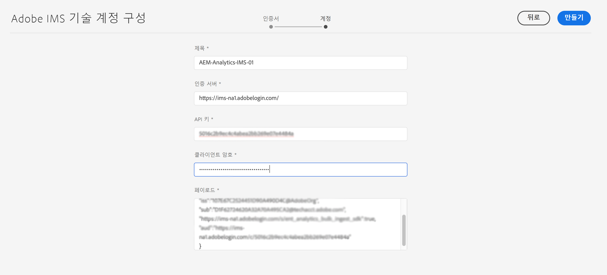

# Adobe Analytics와 통합할 때 사용되는 IMS 구성 {#ims-configuration-for-integration-with-adobe-analytics}

Analytics Standard API를 통해 Adobe Analytics과 Adobe Experience Manager as a Cloud Service(AEMaaCS)를 통합하려면 Adobe IMS(Identity Management 시스템)를 구성해야 합니다. Adobe Developer 콘솔으로 구성이 구현되었습니다.

>[!NOTE]
>
>Adobe Analytics Standard API 2.0에 대한 지원은 AEMaaCS 2022.2.0의 새로운 기능입니다. 이 API 버전은 IMS 인증을 지원합니다.
>
>API 선택은 AEM/Analytics 통합에 사용되는 인증 방법에 의해 결정됩니다.
>
>자세한 내용은 [2.0 API로 마이그레이션](https://developer.adobe.com/analytics-apis/docs/2.0/guides/migration/).

## 전제 조건 {#prerequisites}

이 절차를 시작하기 전에:

* [Adobe 지원](https://helpx.adobe.com/kr/contact/enterprise-support.ec.html) 다음에 대한 계정을 프로비저닝해야 합니다.

   * Adobe 콘솔
   * Adobe Developer Console
   * Adobe Analytics 및
   * Adobe IMS(Identity Management 시스템)

* 조직의 시스템 관리자는 Admin Console을 사용하여 조직의 필수 개발자를 관련 제품 프로필에 추가해야 합니다.

   * 이렇게 하면 특정 개발자에게 Adobe Developer 콘솔을 사용하여 통합을 활성화할 수 있는 권한이 제공됩니다.
   * 자세한 내용은 [개발자 관리](https://helpx.adobe.com/enterprise/admin-guide.html/enterprise/using/manage-developers.ug.html).

## IMS 구성 구성 - 공개 키 생성 {#configuring-ims-generating-a-public-key}

구성의 첫 번째 단계는 AEM에서 IMS 구성을 만들고 공개 키를 생성하는 것입니다.

1. AEM에서 **도구** 메뉴 아래의 제품에서 사용할 수 있습니다.
1. 에서 **보안** 섹션 선택 **Adobe IMS 구성**.
1. 선택 **만들기** 열다 **Adobe IMS 기술 계정 구성**.
1. 아래의 드롭다운을 사용합니다. **클라우드 구성**, 선택 **Adobe Analytics**.
1. 활성화 **새 인증서 만들기** 새 별칭을 입력합니다.
1. 다음으로 확인 **인증서 만들기**.

   

1. 선택 **다운로드** 또는 **공개 키 다운로드**)를 클릭하여 파일을 로컬 드라이브에 다운로드하므로 [AEM과 Adobe Analytics 통합을 위한 IMS 구성](#configuring-ims-adobe-analytics-integration-with-aem).

   >[!CAUTION]
   >
   >이 구성을 열어 두면 [AEM에서 IMS 구성 완료](#completing-the-ims-configuration-in-aem).

   

## AEM과 Adobe Analytics 통합을 위한 IMS 구성 {#configuring-ims-adobe-analytics-integration-with-aem}

Adobe 개발자 콘솔을 사용하여 Adobe Analytics(AEM에서 사용)와 프로젝트(통합)를 생성한 다음 필요한 권한을 지정해야 합니다.

### 프로젝트 만들기 {#creating-the-project}

Adobe Developer 콘솔을 열어 AEM에서 사용할 Adobe Analytics으로 프로젝트를 만듭니다.

1. 프로젝트용 Adobe 개발자 콘솔을 엽니다.

   [https://developer.adobe.com/console/projects](https://developer.adobe.com/console/projects)

1. 보유한 모든 프로젝트가 표시됩니다. 선택 **새 프로젝트 만들기** - 위치 및 사용법은 다음과 같이 달라집니다.

   * 아직 프로젝트가 없다면 **새 프로젝트 만들기** 중심입니다, 아래쪽입니다.
      
   * 이미 기존 프로젝트가 있는 경우 이러한 프로젝트가 나열되고 **새 프로젝트 만들기** 오른쪽 위에 있습니다.
      

1. 선택 **프로젝트에 추가** 후 **API**:

   

1. 선택 **Adobe Analytics**, 그런 다음 **다음**:

   >[!NOTE]
   >
   >Adobe Analytics을 구독했지만 목록에 표시되지 않으면 [전제 조건](#prerequisites).

   

1. 선택 **서비스 계정(JWT)** 인증 유형의 유형으로 다음을 계속합니다 **다음**:

   

1. **공개 키 업로드**, 그리고 완료되면 **다음**:

   

1. 자격 증명을 검토하고 계속 **다음**:

   

1. 필요한 제품 프로필을 선택하고 계속 **구성된 API 저장**:

   

1. 구성이 확인됩니다.

### 통합에 권한 지정 {#assigning-privileges-to-the-integration}

이제 통합에 필요한 권한을 할당해야 합니다.

1. Adobe 열기 **Admin Console**:

   * [https://adminconsole.adobe.com](https://adminconsole.adobe.com/)

1. 다음으로 이동 **제품** (위쪽 도구 모음)를 선택한 다음 **Adobe Analytics - &lt;*your-tenant-id*>** (왼쪽 패널에서)
1. 선택 **제품 프로필**&#x200B;그런 다음 제공된 목록에서 필요한 작업 공간을 만듭니다. 예를 들어, 기본 작업 영역입니다.
1. 선택 **API 자격 증명**, 그런 다음 필요한 통합 구성을 선택합니다.
1. 선택 **편집자** 로서의 **제품 역할**; 대신 **관찰자**.

## Adobe 개발자 콘솔 통합 프로젝트에 대해 저장된 세부 사항 {#details-stored-for-the-ims-integration-project}

Adobe Developer 콘솔에서 - 프로젝트에서 모든 통합 프로젝트 목록을 볼 수 있습니다.

* [https://developer.adobe.com/console/projects](https://developer.adobe.com/console/projects)

구성에 대한 세부 정보를 표시하려면 특정 프로젝트 항목을 선택합니다. 여기에는 다음이 포함됩니다.

* 프로젝트 개요
* 인사이트
* 자격 증명
   * 서비스 계정(JWT)
      * 자격 증명 세부 사항
      * JWT 생성
* API
   * 예: Adobe Analytics

이러한 중 일부는 IMS를 기반으로 AEM에서 Adobe Analytics 통합을 완료해야 합니다.

## AEM에서 IMS 구성 완료 {#completing-the-ims-configuration-in-aem}

AEM으로 돌아가면 Analytics에 대한 IMS 통합에서 필수 값을 추가하여 IMS 구성을 완료할 수 있습니다.

1. 로 돌아갑니다. [AEM에서 열린 IMS 구성](#configuring-ims-generating-a-public-key).
1. **다음**&#x200B;을 선택합니다.

1. 여기에서 을 사용할 수 있습니다 [개발자 콘솔의 프로젝트 구성 세부 사항](#details-stored-for-the-ims-integration-project):

   * **제목**: 텍스트.
   * **인증 서버**: 에서 이 복사/붙여넣기 `aud` 라인 **페이로드** 섹션을 참조하십시오. `https://ims-na1.adobelogin.com` 아래 예에서
   * **API 키**: 다음에서 이 복사 **자격 증명** 섹션 [프로젝트 개요](#details-stored-for-the-ims-integration-project)
   * **클라이언트 암호**: 에서 이 필드를 생성합니다. [서비스 계정(JWT) 섹션의 클라이언트 암호 탭](#details-stored-for-the-ims-integration-project), 및 복사
   * **페이로드**: 다음에서 이 복사 [서비스 계정(JWT) 섹션의 JWT 탭 생성](#details-stored-for-the-ims-integration-project)

   

1. **만들기**&#x200B;를 사용하여 확인합니다.

1. Adobe Analytics 구성이 AEM 콘솔에 표시됩니다.

   

## IMS 구성 확인 {#confirming-the-ims-configuration}

구성이 예상대로 작동하는지 확인하려면:

1. 열기:

   * `https://localhost<port>/libs/cq/adobeims-configuration/content/configurations.html`

   예:

   * `https://localhost:4502/libs/cq/adobeims-configuration/content/configurations.html`

1. 구성을 선택합니다.
1. 선택 **상태 확인** 도구 모음에서 를 차례로 클릭합니다. **확인**.

   

1. 성공하면 확인 메시지가 표시됩니다.

## Adobe Analytics과 통합 완료 {#complete-the-integration-with-adobe-analytics}

이제 이 IMS 구성을 사용하여 다음을 완료할 수 있습니다 [Adobe Analytics과 통합](/help/sites-cloud/integrating/integrating-adobe-analytics.md).

<!--
## Configuring the Adobe Analytics Cloud Service {#configuring-the-adobe-analytics-cloud-service}

The configuration can now be referenced for a Cloud Service to use the Analytics Standard API:

1. Open the **Tools** menu. Then, within the **Cloud Services** section, select **Legacy Cloud Services**.
1. Scroll down to **Adobe Analytics** and select **Configure now**.

   The **Create Configuration** dialog will open.

1. Enter a **Title** and, if you want, a **Name** (if left blank this will be generated from the title).

   You can also select the required template (if more than one is available).

1. Confirm with **Create**.

   The **Edit Component** dialog will open.

1. Enter the details in the **Analytics Settings** tab:

    * **Authentication**: IMS

    * **IMS Configuration**: select the name of the IMS Configuration

1. Click **Connect to Analytics** to initialize the connection with Adobe Analytics.

   If the connection is successful, the message **Connection successful** is displayed.

1. Select **OK** on the message.

1. Complete other parameters as required, followed by **OK** on the dialog to confirm the configuration.

1. You can now proceed to [Adding an Analytics Framework](/help/sites-administering/adobeanalytics-connect.md) to configure parameters that will be sent to Adobe Analytics. 
-->
