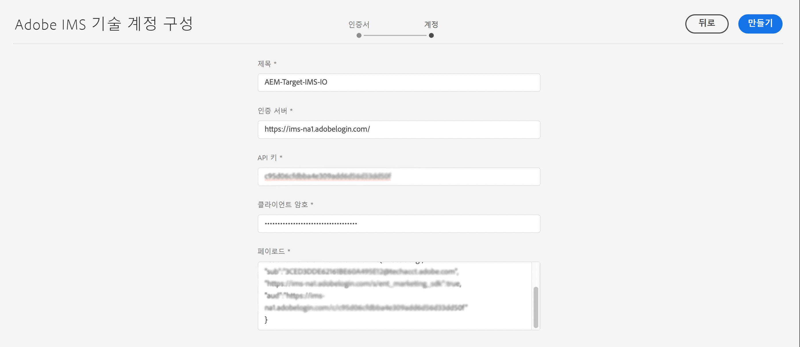

# Adobe Target과 통합할 때 사용되는 IMS 구성{#ims-configuration-for-integration-with-adobe-target}

Target Standard API를 통해 AEM과 Adobe Target을 통합하려면 Adobe IMS(ID 관리 시스템) 구성이 필요합니다. 이 구성은 Adobe Developer Console을 통해 실현됩니다.

>[!NOTE]
>
>Adobe Target Standard API 지원은 AEMaaCS의 새로운 기능입니다. Target Standard API는 IMS 인증을 사용합니다.
>
>API 선택은 AEM/Target 통합에 사용되는 인증 방법에 따라 결정됩니다.

## 사전 요구 사항 {#prerequisites}

이 절차를 시작하기 전에:

* [Adobe 지원 팀](https://helpx.adobe.com/contact/enterprise-support.ec.html)은 다음에 대한 계정을 프로비저닝해야 합니다.

   * Adobe Console
   * Adobe Developer Console
   * Adobe Target 및
   * Adobe IMS(ID 관리 시스템)

* 귀사의 시스템 관리자는 Admin Console을 사용하여 필요한 개발자를 관련 제품 프로필에 추가해야 합니다.

   * 이렇게 하면 관련 개발자에게 Adobe Developer Console을 사용하여 통합을 활성화할 수 있는 권한이 제공됩니다.
   * 자세한 내용은 [개발자 관리](https://helpx.adobe.com/enterprise/admin-guide.html/enterprise/using/manage-developers.ug.html)를 참조하십시오.

## IMS 구성 - 공개 키 생성 {#configuring-an-ims-configuration-generating-a-public-key}

구성의 첫 단계는 AEM에서 IMS 구성을 만들고 공개 키를 생성하는 것입니다.

1. AEM에서 **도구** 메뉴를 엽니다.
1. **보안** 섹션에서 **Adobe IMS 구성**&#x200B;을 선택합니다.
1. **만들기**&#x200B;를 선택하여 **Adobe IMS 기술 계정 구성**&#x200B;을 엽니다.
1. **클라우드 구성** 아래의 드롭다운을 사용하여 **Adobe Target**&#x200B;을 선택합니다.
1. **새 인증서 만들기**&#x200B;를 활성화한 다음 새 별칭을 입력합니다.
1. **인증서 만들기**&#x200B;를 사용하여 확인합니다.

   

1. **다운로드**(또는 **공개 키 다운로드**)를 선택하여 [AEM과의 Adobe Target 통합에 대해 IMS를 구성](#configuring-ims-adobe-target-integration-with-aem)할 때 사용할 수 있도록 파일을 로컬 드라이브에 다운로드합니다.

   >[!CAUTION]
   >
   >[AEM에서 IMS 구성을 완료](#completing-the-ims-configuration-in-aem)할 때 다시 필요하므로 이 구성을 열어 두십시오.

   

## AEM과의 Adobe Target 통합에 대해 IMS 구성 {#configuring-ims-adobe-target-integration-with-aem}

AEM이 사용할 Adobe Target을 사용하여 Adobe Developer Console 프로젝트(통합)을 만든 다음 필요한 권한을 할당합니다.

### 프로젝트 만들기 {#creating-the-project}

Adobe Developer Console을 열고 AEM이 사용할 Adobe Target을 사용하여 프로젝트를 만듭니다.

1. 프로젝트용 Adobe Developer Console을 엽니다.

   [https://developer.adobe.com/console/projects](https://developer.adobe.com/console/projects)

1. 보유 중인 모든 프로젝트가 표시됩니다. **새 프로젝트 만들기**&#x200B;를 선택합니다. 위치 및 사용량은 다음에 따라 달라집니다.

   * 보유 중인 프로젝트가 없는 경우, **새 프로젝트 만들기**는 중앙 하단에 표시됩니다.
     
   * 기존 프로젝트가 있는 경우, 이 프로젝트가 나열되며 **새 프로젝트 만들기**는 오른쪽 상단에 표시됩니다.
     

1. **프로젝트에 추가**&#x200B;를 선택한 다음 **API**&#x200B;를 선택합니다.

   

1. **Adobe Target**&#x200B;을 선택하고 **다음**&#x200B;을 선택합니다.

   >[!NOTE]
   >
   >Adobe Target을 구독하지만 나열되지 않는 경우 [사전 요구 사항](#prerequisites)을 확인해야 합니다.

   

1. **공개 키를 업로드**&#x200B;한 다음 완료되면 **다음**&#x200B;을 사용하여 계속합니다.

   

1. 자격 증명을 검토하고 **다음**&#x200B;을 사용하여 계속합니다.

   

1. 필요한 제품 프로필을 선택한 다음 **구성된 API 저장**&#x200B;을 사용하여 계속합니다.

   >[!NOTE]
   >
   >표시되는 제품 프로필은 다음을 보유하고 있는지 여부에 따라 달라집니다.
   >
   >* Adobe Target Standard - **기본 작업 영역**&#x200B;만 사용할 수 있습니다.
   >* Adobe Target Premium - 아래와 같이 사용할 수 있는 모든 작업 영역이 나열됩니다.

   

1. 생성이 확인됩니다.

<!--
1. The creation is confirmed, you can now **Continue to integration details**; these are needed for [Completing the IMS Configuration in AEM](#completing-the-ims-configuration-in-aem).

   
-->

<!-- could not verify - only saw Adobe Target Classic -->

### 통합에 권한 할당 {#assigning-privileges-to-the-integration}

이제 필요한 권한을 통합에 할당해야 합니다.

1. Adobe **Admin Console**&#x200B;을 엽니다.

   * [https://adminconsole.adobe.com](https://adminconsole.adobe.com/)

1. **제품**&#x200B;으로 이동한 다음(상단 도구 모음) 왼쪽 패널에서 **Adobe Target - &lt;*테넌트 ID*>**&#x200B;을(를) 선택합니다.
1. **제품 프로필**&#x200B;을 선택한 다음 표시되는 목록에서 필요한 작업 영역을 선택합니다. (예: 기본 작업 영역)
1. **API 자격 증명**&#x200B;을 선택한 다음 필요한 통합 구성을 선택합니다.
1. **제품 역할**&#x200B;을 **관찰자**&#x200B;가 아닌 **편집자**&#x200B;로 선택합니다.

## 저장된 Adobe Developer Console 통합 프로젝트 세부 정보 {#details-stored-for-the-ims-integration-project}

Adobe Developer Console 프로젝트 콘솔에서 모든 통합 프로젝트 목록을 볼 수 있습니다.

* [https://developer.adobe.com/console/projects](https://developer.adobe.com/console/projects)

구성에 대한 세부 정보를 표시하려면 **보기**&#x200B;를 선택합니다(특정 프로젝트 항목 오른쪽). 여기에는 다음이 포함됩니다.

* 프로젝트 개요
* 인사이트
* 자격 증명
   * 서비스 계정(JWT)
      * 자격 증명 세부 정보
      * JWT 생성
* API
   * (예: Adobe Target)

이 중 일부는 AEM에서 IMS를 기반으로 Adobe Target 통합을 완료해야 합니다.

## AEM에서 IMS 구성 완료 {#completing-the-ims-configuration-in-aem}

AEM으로 돌아가 Target용 IMS 통합에서 필요한 값을 추가하여 IMS 구성을 완료할 수 있습니다.

1. [AEM에서 열려 있는 IMS 구성](#configuring-an-ims-configuration-generating-a-public-key)으로 돌아갑니다.
1. **다음**&#x200B;을 선택합니다.

1. 여기에서 [Adobe Developer Console의 프로젝트 구성에서 세부 정보](#details-stored-for-the-ims-integration-project)를 사용할 수 있습니다.

   * **제목**: 텍스트를 입력하십시오.
   * **인증 서버**: 아래 `aud`페이로드&#x200B;**섹션의** 줄에서 이 인증 서버를 복사하여 붙여넣습니다(아래 예에서 `https://ims-na1.adobelogin.com`).
   * **API 키**: 프로젝트 [개요](#details-stored-for-the-ims-integration-project) 섹션에서 이 API 키를 복사합니다.
   * **클라이언트 보안**: 프로젝트 [개요](#details-stored-for-the-ims-integration-project) 섹션에서 이 클라이언트 보안을 생성한 다음 복사합니다.
   * **페이로드**: [JWT 생성](#details-stored-for-the-ims-integration-project) 섹션에서 이 페이로드를 복사합니다.

   

1. **만들기**&#x200B;를 사용하여 확인합니다.

1. AEM 콘솔에 Adobe Target 구성이 표시됩니다.

   

## IMS 구성 확인 {#confirming-the-ims-configuration}

구성이 예상대로 작동하는지 확인하려면 다음 작업을 수행하십시오.

1. 열기:

   * `https://localhost<port>/libs/cq/adobeims-configuration/content/configurations.html`

   예:

   * `https://localhost:4502/libs/cq/adobeims-configuration/content/configurations.html`

1. 구성을 선택합니다.
1. 도구 모음에서 **상태 확인**&#x200B;을 선택한 다음 **확인**&#x200B;을 선택합니다.

   

1. 성공하면 확인 메시지가 표시됩니다.

## Adobe Target과의 통합 완료 {#complete-the-integration-with-adobe-target}

이제 이 IMS 구성을 사용하여 [Adobe Target과의 통합](/help/sites-cloud/integrating/integrating-adobe-target.md)을 완료할 수 있습니다.

<!--

## Configuring the Adobe Target Cloud Service {#configuring-the-adobe-target-cloud-service}

The configuration can now be referenced for a Cloud Service to use the Target Standard API:

1. Open the **Tools** menu. Then, within the **Cloud Services** section, select **Legacy Cloud Services**.
1. Scroll down to **Adobe Target** and select **Configure now**.

   The **Create Configuration** dialog will open.

1. Enter a **Title** and, if you want, a **Name** (if left blank it is generated from the title).

   You can also select the required template (if more than one is available).

1. Confirm with **Create**.

   The **Edit Component** dialog will open.

1. Enter the details in the **Adobe Target Settings** tab:

    * **Authentication**: IMS

    * **Client Code**: See the [Tenant ID and Client Code](#tenant-client) section.

    * **Tenant ID**: the Adobe IMS Tenant ID. See also the [Tenant ID and Client Code](#tenant-client) section.

      >[!NOTE]
      >
      >For IMS this value needs to be taken from Target itself. You can log into Target and extract the Tenant ID from the URL.
      >
      >For example, if the URL is:
      >
      >`https://experience.adobe.com/#/@yourtenantid/target/activities`
      >
      >Then you would use `yourtenantid`.

    * **IMS Configuration**: select the name of the IMS Configuration

    * **API Type**: REST

    * **A4T Analytics Cloud Configuration**: Select the Analytics cloud configuration that is used for target activity goals and metrics. You need this if you are using Adobe Analytics as the reporting source when targeting content.   

      <!--
      If you do not see your cloud configuration, see note in [Configuring A4T Analytics Cloud Configuration](/help/sites-administering/target-configuring.md#configuring-a-t-analytics-cloud-configuration).
      -- >

    * **Use accurate targeting**: By default this check box is selected. If selected, the cloud service configuration will wait for the context to load before loading content. See note that follows.

    * **Synchronize segments from Adobe Target**: Select this option to download segments that are defined in Target to use them in AEM. You must select this option when the API Type property is REST, because inline segments are not supported and you always need to use segments from Target. (Note that the AEM term of 'segment' is equivalent to the Target 'audience'.)

    * **Client library**: Select whether you want the AT.js client library, or mbox.js (deprecated).

    * **Use Tag Management System to deliver client library**: Use DTM (deprecated), Adobe Launch or any other tag management system.

    * **Custom AT.js**: Leave blank if you checked the Tag Management box or to use the default AT.js. Alternatively upload your custom AT.js. Only appears if you have selected AT.js.

   <!--
   >[!NOTE]
   >
   >[Configuration of a Cloud Service to use the Target Classic API](/help/sites-administering/target-configuring.md#manually-integrating-with-adobe-target) has been deprecated (uses the Adobe Recommendations Settings tab).
   -- >

1. Click **Connect to Adobe Target** to initialize the connection with Adobe Target.

   If the connection is successful, the message **Connection successful** is displayed.

1. Select **OK** on the message, followed by **OK** on the dialog to confirm the configuration.

1. You can now proceed to [Adding a Target Framework](/help/sites-administering/target-configuring.md#adding-a-target-framework) to configure ContextHub or ClientContext parameters that are sent to Target. Note this may not be required for exporting AEM Experience Fragments to Target.

### Tenant ID and Client Code {#tenant-client}

With [Adobe Experience Manager as a Cloud Service](/help/release-notes/release-notes-cloud/release-notes-current.md), the Client Code field had been added to the Target configuration window.

When configuring the Tenant ID and Client Code fields, be aware of that for most customers, the **Tenant ID** and the **Client Code** are the same. This means that both fields contain the same information and are identical. Make sure you enter the Tenant ID in both fields.

>[!NOTE]
>
>For legacy purposes, you can also enter different values in the Tenant ID and the Client Code fields.

In both cases, be aware that:

* By default, the Client Code (if added first) will also be automatically copied into the Tenant ID field.
* You have the option to change the default Tenant ID set.
* Accordingly, the backend calls to Target are based on the **Tenant ID** and the client side calls to Target are based on the **Client Code**.

As stated previously, the default case is the most common for AEM as a Cloud Service. Either way, make sure **both** fields contain the correct information depending on your requirements.

>[!NOTE]
>
> If you want to change an existing Target Configuration:
>
> 1. Re-enter the Tenant ID.
> 2. Re-connect to Target.
> 3. Save the configuration.
-->
