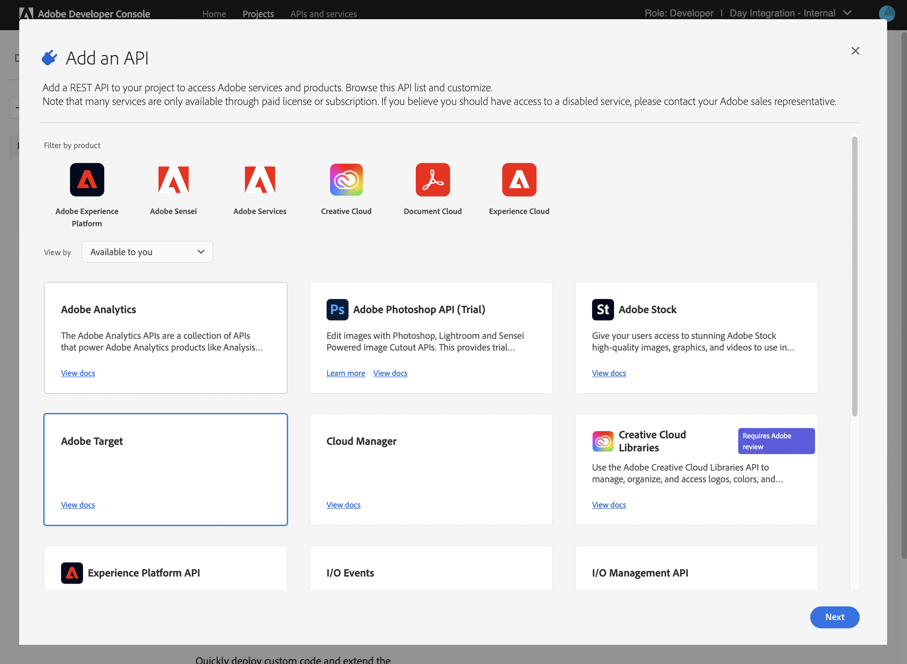

# Adobe Target과 통합할 때 사용할 IMS 구성{#ims-configuration-for-integration-with-adobe-target}

Target Standard API를 통해 AEM과 Adobe Target을 통합하려면 Adobe IMS(Identity Management 시스템)를 구성해야 합니다. 구성은 Adobe 개발자 콘솔로 실현됩니다.

>[!NOTE]
>
>Adobe Target Standard API에 대한 지원은 AEMaaCS의 새로운 기능입니다. Target Standard API는 IMS 인증을 사용합니다.
>
>API 선택은 AEM/Target 통합에 사용되는 인증 방법에 의해 수행됩니다.

## 전제 조건 {#prerequisites}

이 절차를 시작하기 전에:

* [Adobe 지원](https://helpx.adobe.com/kr/contact/enterprise-support.ec.html) 다음에 대한 계정을 프로비저닝해야 합니다.

   * Adobe 콘솔
   * Adobe Developer Console
   * Adobe Target 및
   * Adobe IMS(Identity Management 시스템)

* 조직의 시스템 관리자는 Admin Console을 사용하여 조직의 필수 개발자를 관련 제품 프로필에 추가해야 합니다.

   * 이렇게 하면 특정 개발자에게 Adobe 개발자 콘솔을 사용하여 통합을 활성화할 수 있는 권한이 제공됩니다.
   * 자세한 내용은 [개발자 관리](https://helpx.adobe.com/enterprise/admin-guide.html/enterprise/using/manage-developers.ug.html).

## IMS 구성 구성 - 공개 키 생성 {#configuring-an-ims-configuration-generating-a-public-key}

구성의 첫 번째 단계는 AEM에서 IMS 구성을 만들고 공개 키를 생성하는 것입니다.

1. AEM에서 **도구** 메뉴 아래의 제품에서 사용할 수 있습니다.
1. 에서 **보안** 섹션 선택 **Adobe IMS 구성**.
1. 선택 **만들기** 열다 **Adobe IMS 기술 계정 구성**.
1. 아래의 드롭다운을 사용합니다. **클라우드 구성**, 선택 **Adobe Target**.
1. 활성화 **새 인증서 만들기** 새 별칭을 입력합니다.
1. 다음으로 확인 **인증서 만들기**.

   

1. 선택 **다운로드** 또는 **공개 키 다운로드**)를 클릭하여 파일을 로컬 드라이브에 다운로드하므로 [AEM과 Adobe Target 통합을 위한 IMS 구성](#configuring-ims-adobe-target-integration-with-aem).

   >[!CAUTION]
   >
   >이 구성을 열어 두면 [AEM에서 IMS 구성 완료](#completing-the-ims-configuration-in-aem).

   

## AEM과 Adobe Target 통합을 위한 IMS 구성 {#configuring-ims-adobe-target-integration-with-aem}

AEM에서 사용할 Adobe Target과 Developer Console 프로젝트(통합)를 구성한 다음 필요한 권한을 지정합니다.

### 프로젝트 만들기 {#creating-the-project}

AEM에서 사용할 Adobe Target으로 프로젝트를 만들려면 Adobe 개발자 콘솔을 엽니다.

1. 프로젝트용 Adobe 개발자 콘솔을 엽니다.

   [https://developer.adobe.com/console/projects](https://developer.adobe.com/console/projects)

1. 보유한 모든 프로젝트가 표시됩니다. 선택 **새 프로젝트 만들기** - 위치 및 사용법은 다음과 같이 달라집니다.

   * 아직 프로젝트가 없다면 **새 프로젝트 만들기** 중심입니다, 아래쪽입니다.
      
   * 이미 기존 프로젝트가 있는 경우 이러한 프로젝트가 나열되고 **새 프로젝트 만들기** 오른쪽 위에 있습니다.
      

1. 선택 **프로젝트에 추가** 후 **API**:

   

1. 선택 **Adobe Target**, 그런 다음 **다음**:

   >[!NOTE]
   >
   >Adobe Target을 구독했지만 목록에 표시되지 않으면 [전제 조건](#prerequisites).

   

1. **공개 키 업로드**, 그리고 완료되면 **다음**:

   

1. 자격 증명을 검토하고 계속 **다음**:

   

1. 필요한 제품 프로필을 선택하고 계속 **구성된 API 저장**:

   >[!NOTE]
   >
   >와 함께 표시되는 제품 프로필은 다음 조건을 충족하는지에 따라 다릅니다.
   >
   >* Adobe Target Standard - 전용 **기본 작업 공간** 사용 가능
   >* Adobe Target Premium - 사용 가능한 모든 작업 공간이 아래와 같이 나열됩니다

   

1. 그 창조는 확인될 것이다.

<!--
1. The creation will be confirmed, you can now **Continue to integration details**; these are needed for [Completing the IMS Configuration in AEM](#completing-the-ims-configuration-in-aem).

   
-->

<!-- could not verify - only saw Adobe Target Classic -->

### 통합에 권한 지정 {#assigning-privileges-to-the-integration}

이제 통합에 필요한 권한을 할당해야 합니다.

1. Adobe 열기 **Admin Console**:

   * [https://adminconsole.adobe.com](https://adminconsole.adobe.com/)

1. 다음으로 이동 **제품** (위쪽 도구 모음)를 선택한 다음 **Adobe Target - &lt;*your-tenant-id*>** (왼쪽 패널에서)
1. 선택 **제품 프로필**&#x200B;그런 다음 제공된 목록에서 필요한 작업 공간을 만듭니다. 예를 들어, 기본 작업 영역입니다.
1. 선택 **API 자격 증명**, 그런 다음 필요한 통합 구성을 선택합니다.
1. 선택 **편집자** 로서의 **제품 역할**; 대신 **관찰자**.

## Adobe 개발자 콘솔 통합 프로젝트에 대해 저장된 세부 사항 {#details-stored-for-the-ims-integration-project}

Adobe 개발자 콘솔 프로젝트 콘솔에서 모든 통합 프로젝트 목록을 볼 수 있습니다.

* [https://developer.adobe.com/console/projects](https://developer.adobe.com/console/projects)

선택 **보기** (특정 프로젝트 항목 오른쪽에 있음)를 클릭하여 구성에 대한 세부 정보를 표시합니다. 여기에는 다음이 포함됩니다.

* 프로젝트 개요
* 인사이트
* 자격 증명
   * 서비스 계정(JWT)
      * 자격 증명 세부 사항
      * JWT 생성
* API
   * 예: Adobe Target

이러한 중 일부는 IMS를 기반으로 AEM에서 Adobe Target 통합을 완료해야 합니다.

## AEM에서 IMS 구성 완료 {#completing-the-ims-configuration-in-aem}

AEM으로 돌아가면 Target에 대한 IMS 통합에서 필수 값을 추가하여 IMS 구성을 완료할 수 있습니다.

1. 로 돌아갑니다. [AEM에서 열린 IMS 구성](#configuring-an-ims-configuration-generating-a-public-key).
1. **다음**&#x200B;을 선택합니다.

1. 여기에서 을 사용할 수 있습니다 [개발자 콘솔의 프로젝트 구성 세부 사항](#details-stored-for-the-ims-integration-project):

   * **제목**: 텍스트.
   * **인증 서버**: 에서 이 복사/붙여넣기 `aud` 라인 **페이로드** 섹션을 참조하십시오. `https://ims-na1.adobelogin.com` 아래 예에서
   * **API 키**: 프로젝트에서 이 복사 [개요](#details-stored-for-the-ims-integration-project) 섹션
   * **클라이언트 암호**: 프로젝트에서 생성 [개요](#details-stored-for-the-ims-integration-project) 섹션 및 복사
   * **페이로드**: 다음에서 이 복사 [JWT 생성](#details-stored-for-the-ims-integration-project) 섹션

   

1. **만들기**&#x200B;를 사용하여 확인합니다.

1. Adobe Target 구성이 AEM 콘솔에 표시됩니다.

   

## IMS 구성 확인 {#confirming-the-ims-configuration}

구성이 예상대로 작동하는지 확인하려면:

1. 열기:

   * `https://localhost<port>/libs/cq/adobeims-configuration/content/configurations.html`

   예:

   * `https://localhost:4502/libs/cq/adobeims-configuration/content/configurations.html`

1. 구성을 선택합니다.
1. 선택 **상태 확인** 도구 모음에서 를 차례로 클릭합니다. **확인**.

   

1. 성공하면 확인 메시지가 표시됩니다.

## Adobe Target과 통합 완료 {#complete-the-integration-with-adobe-target}

이제 이 IMS 구성을 사용하여 다음을 완료할 수 있습니다 [Adobe Target과 통합](/help/sites-cloud/integrating/integrating-adobe-target.md).

<!--

## Configuring the Adobe Target Cloud Service {#configuring-the-adobe-target-cloud-service}

The configuration can now be referenced for a Cloud Service to use the Target Standard API:

1. Open the **Tools** menu. Then, within the **Cloud Services** section, select **Legacy Cloud Services**.
1. Scroll down to **Adobe Target** and select **Configure now**.

   The **Create Configuration** dialog will open.

1. Enter a **Title** and, if you want, a **Name** (if left blank this will be generated from the title).

   You can also select the required template (if more than one is available).

1. Confirm with **Create**.

   The **Edit Component** dialog will open.

1. Enter the details in the **Adobe Target Settings** tab:

    * **Authentication**: IMS

    * **Client Code**: See the [Tenant ID and Client Code](#tenant-client) section.

    * **Tenant ID**: the Adobe IMS Tenant ID. See also the [Tenant ID and Client Code](#tenant-client) section.

      >[!NOTE]
      >
      >For IMS this value needs to be taken from Target itself. You can log into Target and extract the Tenant ID from the URL.
      >
      >For example, if the URL is:
      >
      >`https://experience.adobe.com/#/@yourtenantid/target/activities`
      >
      >Then you would use `yourtenantid`.

    * **IMS Configuration**: select the name of the IMS Configuration

    * **API Type**: REST

    * **A4T Analytics Cloud Configuration**: Select the Analytics cloud configuration that is used for target activity goals and metrics. You need this if you are using Adobe Analytics as the reporting source when targeting content.   

      <!--
      If you do not see your cloud configuration, see note in [Configuring A4T Analytics Cloud Configuration](/help/sites-administering/target-configuring.md#configuring-a-t-analytics-cloud-configuration).
      -- >

    * **Use accurate targeting**: By default this check box is selected. If selected, the cloud service configuration will wait for the context to load before loading content. See note that follows.

    * **Synchronize segments from Adobe Target**: Select this option to download segments that are defined in Target to use them in AEM. You must select this option when the API Type property is REST, because inline segments are not supported and you always need to use segments from Target. (Note that the AEM term of 'segment' is equivalent to the Target 'audience'.)

    * **Client library**: Select whether you want the AT.js client library, or mbox.js (deprecated).

    * **Use Tag Management System to deliver client library**: Use DTM (deprecated), Adobe Launch or any other tag management system.

    * **Custom AT.js**: Leave blank if you checked the Tag Management box or to use the default AT.js. Alternatively upload your custom AT.js. Only appears if you have selected AT.js.

   <!--
   >[!NOTE]
   >
   >[Configuration of a Cloud Service to use the Target Classic API](/help/sites-administering/target-configuring.md#manually-integrating-with-adobe-target) has been deprecated (uses the Adobe Recommendations Settings tab).
   -- >

1. Click **Connect to Adobe Target** to initialize the connection with Adobe Target.

   If the connection is successful, the message **Connection successful** is displayed.

1. Select **OK** on the message, followed by **OK** on the dialog to confirm the configuration.

1. You can now proceed to [Adding a Target Framework](/help/sites-administering/target-configuring.md#adding-a-target-framework) to configure ContextHub or ClientContext parameters that will be sent to Target. Note this may not be required for exporting AEM Experience Fragments to Target.

### Tenant ID and Client Code {#tenant-client}

With [Adobe Experience Manager as a Cloud Service](/help/release-notes/release-notes-cloud/release-notes-current.md), the Client Code field had been added to the Target configuration window.

When configuring the Tenant ID and Client Code fields, please be aware of that for most customers, the **Tenant ID** and the **Client Code** are the same. This means that both fields contain the same information and are identical. Make sure you enter the Tenant ID in both fields.

>[!NOTE]
>
>For legacy purposes, you can also enter different values in the Tenant ID and the Client Code fields.

In both cases, be aware that:

* By default, the Client Code (if added first) will also be automatically copied into the Tenant ID field.
* You have the option to change the default Tenant ID set.
* Accordingly, the backend calls to Target will be based on the **Tenant ID** and the client side calls to Target will be based on the **Client Code**.

As stated previously, the default case is the most common for AEM as a Cloud Service. Either way, make sure **both** fields contain the correct information depending on your requirements.

>[!NOTE]
>
> If you want to change an existing Target Configuration:
>
> 1. Re-enter the Tenant ID.
> 2. Re-connect to Target.
> 3. Save the configuration.
-->
