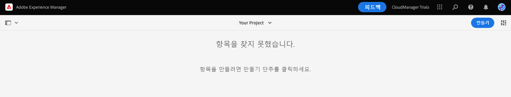
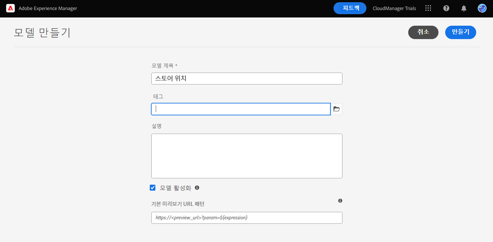
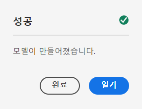
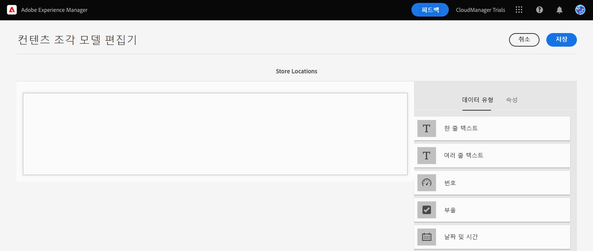
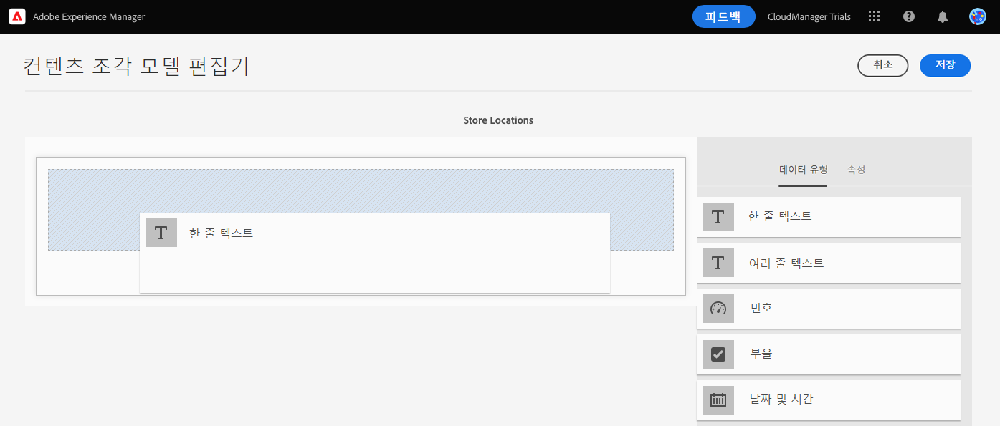
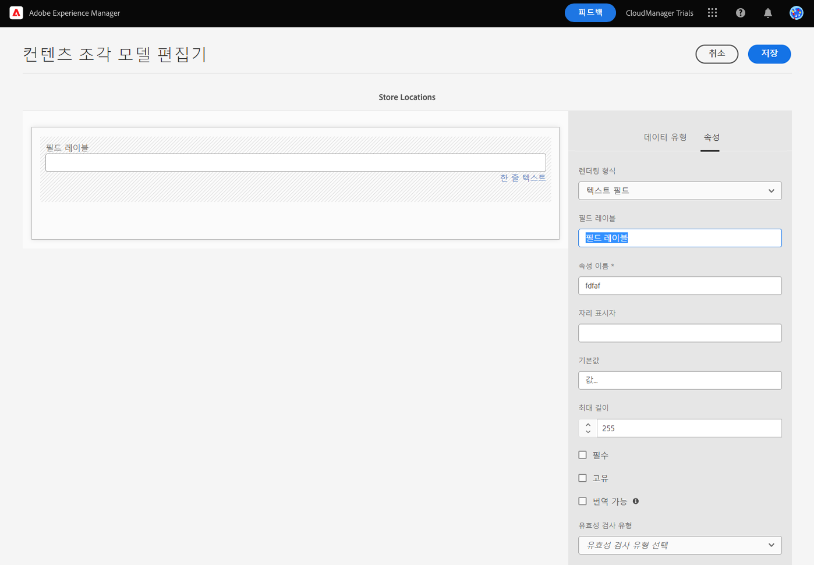
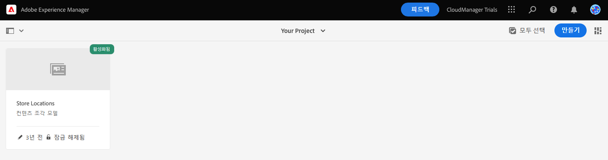
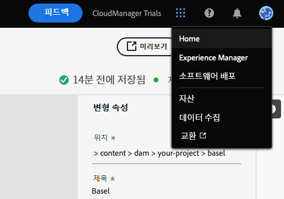

# 앱의 콘텐츠 구조 만들기 {#content-structure}

콘텐츠 조각을 사용하여 페이지 독립적인 콘텐츠를 디자인하고 만들고 선별하고 게시할 수 있습니다. 이를 사용하여 headless 게재에 적합한 여러 위치 및 여러 채널에서 사용할 준비가 된 콘텐츠를 준비할 수 있습니다. 콘텐츠 조각 모델을 사용하여 콘텐츠 구조를 정의할 수 있으며, 이는 headless 콘텐츠를 관리하기 위해 가장 먼저 만들어야 하는 모델입니다.

이 AEM 체험판 모듈은 이러한 작업의 수행 방법을 이해할 수 있도록 먼저 모델을 만든 다음 해당 구조를 추가하는 빠른 대화형 둘러보기를 통해 프로세스를 안내합니다. 이 문서는 제품 내 둘러보기를 보완하는 역할을 하며, 동일한 단계를 다루고 해당하는 경우 추가 리소스에 대한 링크를 제공합니다.

>[!CONTEXTUALHELP]
>id="aemcloud_sites_trial_admin_content_fragments_overview_guide_br_test"
>title="모델 편집기 실행"
>abstract="콘텐츠 조각 모델 구축은 모델 관리 워크플로에서 모델 항목을 만든 다음 콘텐츠 조각 모델 편집기를 사용하여 여기에 구조 요소를 추가하는 것으로 시작됩니다.  아래를 클릭하여 새 탭에서 기능을 실행하고 이 학습 문서에 따라 첫 번째 콘텐츠 조각을 만들어 보십시오."

>[!CONTEXTUALHELP]
>id="aemcloud_sites_trial_admin_content_fragments_overview_guide_newline_test"
>title="모델 편집기 실행"
>abstract="콘텐츠 조각 모델 구축은 모델 관리 워크플로에서 모델 항목을 만든 다음 콘텐츠 조각 모델 편집기를 사용하여 여기에 구조 요소를 추가하는 것으로 시작됩니다.\n\n아래를 클릭하여 새 탭에서 기능을 실행하고 이 학습 문서에 따라 첫 번째 콘텐츠 조각을 만들어 보십시오."

>[!CONTEXTUALHELP]
>id="aemcloud_sites_trial_admin_content_fragments_overview"
>title="앱의 콘텐츠 구조 만들기"
>abstract="대화형 안내서 시리즈를 따라가면서 모든 Headless 콘텐츠의 기반 역할을 하는 구조(콘텐츠 조각 모델이라고도 함)를 만드는 방법을 알아봅니다."

## 콘텐츠 조각 모델 콘솔 {#content-fragment-model-console}

콘텐츠 조각 모델 콘솔을 시작합니다. 콘텐츠 조각 모델 콘솔은 모델 라이브러리로 간주할 수 있습니다. 콘솔을 사용하여 새 모델을 만들고 기존 모델을 관리합니다. 콘솔이 비어 있으므로 새 모델을 만들어 봅시다!

인앱 지침을 벗어나 직접 콘텐츠 조각 모델 콘솔로 이동하려면 페이지 왼쪽 상단에 있는 Adobe 아이콘을 사용하여 찾을 수 있습니다. 그러면 AEM의 전역 탐색이 열립니다. 여기에서 **도구** 탭을 선택한 다음 **일반** -> **콘텐츠 조각 모델**&#x200B;을 차례로 선택합니다.

>[!TIP]
>
>AEM 탐색에 대해 자세히 알아보려면 이 문서의 [추가 리소스 섹션](#additional-resources)에서 AEM 기본 처리에 대한 내용을 참조하십시오.

## 모델 만들기 {#create-model}

콘텐츠 조각 모델 콘솔에 있으면 headless 콘텐츠를 나타내는 새 모델을 만들 수 있습니다.

1. 콘텐츠 조각 모델 콘솔에서 화면 오른쪽 상단의 **만들기** 버튼을 클릭하여 콘텐츠 조각 모델을 만들기 시작합니다.

1. 콘텐츠 조각 모델을 만드는 과정을 안내하는 모델 만들기 마법사가 시작됩니다.

   

   필수 정보를 입력합니다.

   * **모델 제목** - 모델에 대한 간략한 설명이며 일반적으로 용도를 나타냅니다.
   * **모델 활성화** - 이 옵션은 기본적으로 선택되어 있으며 나중에 이 모델을 기반으로 콘텐츠 조각을 만들 수 있도록 선택해야 합니다.

   나중에 콘텐츠 조각 모델 콘솔 내에서 사용자를 위해 모델을 분류하고 구별하기 위해 모델 및 **태그**&#x200B;에 더 긴 **설명**&#x200B;을 추가하도록 선택할 수도 있습니다.

   >[!TIP]
   >
   >태그로 콘텐츠를 구성하는 방법에 관심이 있는 경우, 이 문서의 [추가 리소스 섹션](#additional-resources)에서 AEM의 태그 지정에 대해 참조하십시오.

1. 필수 필드가 채워지면 왼쪽 상단에서 **만들기**&#x200B;를 클릭하여 모델을 만듭니다.

1. **완료** 대화 상자에서 모델이 생성되었음을 확인합니다.

   

1. 모델을 사용하기 전에 데이터 구조도 정의해야 합니다. 대화 상자에서 **열기**&#x200B;를 클릭하여 열고 모델을 계속 정의합니다.

## 모델에 필드 추가 {#configure-model}

콘텐츠 조각 모델은 기본적으로 콘텐츠 조각에 대한 스키마입니다. 즉. 모델에 포함된 필드/데이터 유형을 정의합니다.

콘텐츠 조각 모델 편집기를 사용하면 드래그 앤 드롭 인터페이스로 콘텐츠 조각 모델의 필드를 정의할 수 있습니다.

1. 화면 오른쪽에 있는 **데이터 유형** 패널에서 필드를 드래그하여 콘텐츠 조각 모델에 놓습니다. 한 줄 텍스트, 여러 줄 텍스트, 숫자 및 다른 조각에 대한 참조와 같이 선택할 수 있는 여러 데이터 유형이 있습니다.

   

   >[!TIP]
   >
   >사용 가능한 데이터 유형에 대한 자세한 내용은 이 문서의 [추가 리소스 섹션](#additional-resources)에서 자세한 콘텐츠 조각 모델 설명서를 참조하십시오.

1. 데이터 유형이 배치되면 **데이터 유형** 열이 자동으로 **속성** 탭으로 변경되어 방금 배치된 데이터 유형의 세부 정보를 정의할 수 있습니다.

   

   모델 속성에는 필드 이름, 필드 유형, 필드 길이(필수인 경우) 등이 포함될 수 있습니다.

1. 선택한 데이터 유형의 **속성** 탭을 사용하여 기본값, 최대 길이 등과 같은 속성(필수 필드인 경우)을 정의합니다.

   >[!TIP]
   >
   >사용 가능한 속성에 대한 자세한 내용은 이 문서의 [추가 리소스 섹션](#additional-resources)에서 자세한 콘텐츠 조각 모델 설명서를 참조하십시오.

1. 콘텐츠 조각 모델에 필요한 모든 필드가 추가되었으면 창의 오른쪽 상단에 있는 **저장**&#x200B;을 클릭합니다.

1. 이렇게 하면 모델이 저장되고 필요한 모델을 더 추가할 수 있는 콘텐츠 조각 모델 콘솔로 돌아갑니다.

## 콘텐츠 조각 모델을 만드는 방법 학습 {#conclusion}

이 모듈에서는 headless 데이터의 구조를 나타내는 콘텐츠 조각 모델을 만드는 방법에 대해 배웠습니다. 먼저 모델을 만든 다음 데이터 유형 및 관련 속성으로 채워서 headless 콘텐츠에 대한 스키마를 정의했습니다.

고유한 콘텐츠 조각 모델이 있으므로 이 모델을 사용하여 콘텐츠 조각을 만들 수 있습니다. [새 콘텐츠 만들기](create-content.md) 모듈에서는 새 콘텐츠 조각 모델을 사용하여 headless 콘텐츠를 만드는 방법에 대해 자세히 설명합니다.

탐색 막대의 오른쪽 상단에 있는 **솔루션** 버튼을 클릭하고 **Experience Manager**&#x200B;를 선택하여 체험판 홈 화면으로 돌아갈 수 있습니다.

## 추가 리소스 {#additional-resources}

콘텐츠 조각 및 AEM에 대한 자세한 내용은 이 추가 설명서를 검토하십시오.

* [기본 처리](/help/sites-cloud/authoring/getting-started/basic-handling.md) - 신규 사용자를 위한 AEM 탐색 및 사용 방법에 대한 설명서
* [태그 사용](/help/sites-cloud/authoring/features/tags.md) - AEM에서 태그를 사용하여 콘텐츠를 구성하는 방법에 대한 설명서
* [콘텐츠 조각](/help/assets/content-fragments/content-fragments.md) - 콘텐츠 조각 개요 및 콘텐츠 조각에 대한 전체 설명서 링크
* [콘텐츠 조각 모델](/help/assets/content-fragments/content-fragments-models.md) - 콘텐츠 조각 모델에 대한 전체 설명서
* [콘텐츠 조각 모델 - 데이터 유형](/help/assets/content-fragments/content-fragments-models.md#data-types) - 콘텐츠 조각 모델에 사용할 수 있는 다양한 데이터 유형에 대한 세부 정보
* [콘텐츠 조각 모델 - 속성](/help/assets/content-fragments/content-fragments-models.md#data-types) - 콘텐츠 조각 데이터 유형에 사용할 수 있는 다양한 속성에 대한 세부 정보
