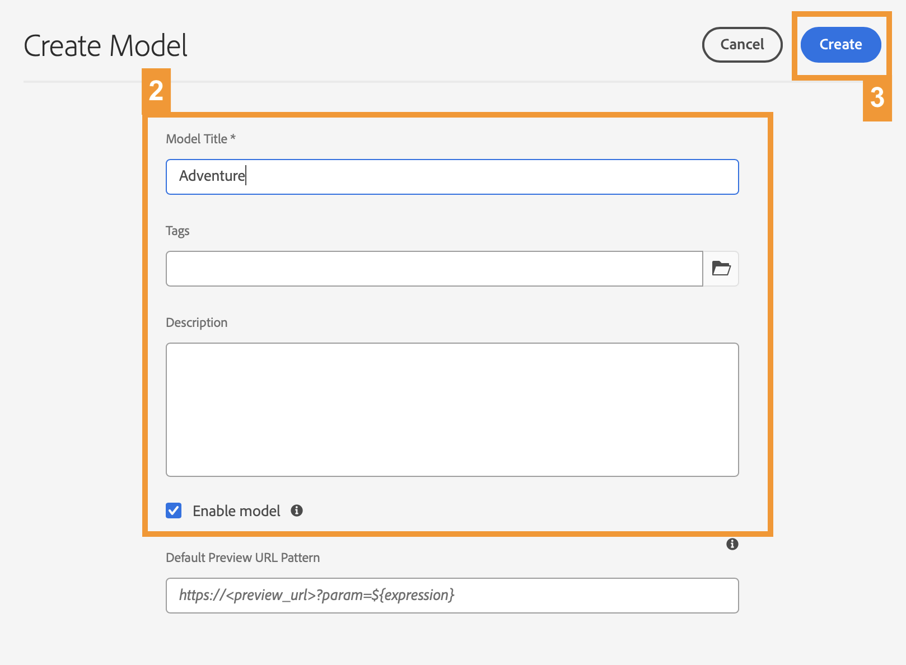

# 앱의 콘텐츠 구조 만들기 {#content-structure}

>[!CONTEXTUALHELP]
>id="aemcloud_sites_trial_admin_content_fragments_overview"
>title="앱의 콘텐츠 구조 만들기"
>abstract="이 일련의 대화형 지침을 따라 헤드리스 컨텐츠의 기본 구조 역할을 하는 구조(컨텐츠 조각 모델이라고 함)를 만드는 방법을 알아봅니다."

>[!CONTEXTUALHELP]
>id="aemcloud_sites_trial_admin_content_fragments_overview_guide"
>title="모델 콘솔 실행"
>abstract="Adobe Experience Manager as a Cloud Service에서 콘텐츠에 대한 재사용 가능한 스키마(콘텐츠 조각 모델)를 만드는 방법에 대해 살펴보겠습니다. 비디오를 시청하여 이 단계가 중요한 이유에 대해 알아보십시오.   이 학습 모듈에서는 여행 사이트를 예로 사용하고 여행을 나타내는 모델을 만드는 과정을 거칩니다. 이후 모듈에서 이 모델을 참조하므로 제공된 대로 이름 지정 스키마를 따라야 합니다.  아래 버튼을 클릭하여 새 탭에서 이 모듈을 실행한 다음 이 안내서를 따르십시오."
>additional-url="https://video.tv.adobe.com/v/3413261" text="콘텐츠 구조 소개 비디오"

>[!CONTEXTUALHELP]
>id="aemcloud_sites_trial_admin_content_fragments_overview_guide_footer"
>title="축하합니다! Headless 데이터의 구조를 나타내는 콘텐츠 조각 모델을 만드는 방법에 대해 배웠으며, 크기 조정되고 표준적인 방법으로 옴니채널 콘텐츠를 제공하기 위한 첫 번째 단계를 수행했습니다."
>abstract=""

## 모델 만들기 {#create-model}

콘텐츠 조각 모델 콘솔이 새 탭에서 열립니다. 콘텐츠 조각 모델 콘솔을 새 모델을 만들고 기존 모델을 관리하는 모델 라이브러리로 생각해 보십시오.

이 예제에서는 여행 웹 사이트에 특화된 여행의 데이터 구조를 나타내는 모델을 만듭니다. 우리는 이 모델의 여행을 하나의 여행으로 언급할 것이다 **모험.**

1. 화면 오른쪽 상단의 **만들기** 버튼을 클릭하여 콘텐츠 조각 모델을 만들기 시작합니다.

1. 모델 생성 마법사가 시작되어 모델 생성을 안내합니다. 필수 정보를 입력합니다.

   * **모델 제목** - 모델에 대한 간략한 설명이며 일반적으로 모델의 용도를 나타냅니다. 새 모델이라고 하겠습니다 `Adventure`.
   * **모델 활성화** - 이 옵션은 기본적으로 선택되어 있으며 이 모델을 기반으로 콘텐츠 조각을 만들 수 있도록 선택해야 합니다.

1. 필수 필드가 채워지면 왼쪽 상단에서 **만들기**&#x200B;를 클릭하여 모델을 만듭니다.

1. **완료** 대화 상자에서 모델이 생성되었음을 확인합니다. 대화 상자에서 **열기**&#x200B;를 클릭하여 편집기의 새 콘텐츠 조각 모델을 새 탭에서 엽니다. 그런 다음 모델에 필드 추가 단계로 계속 진행합니다.

## 모델 편집기 사용 {#configure-model}

이제 모델인 **모험** 는 여행 웹 사이트에서의 방문을 나타내지만 기간, 대상, 활동 등과 같은 세부 사항은 없습니다. 모델을 사용하기 전에 데이터 구조를 정의해야 합니다.

콘텐츠 조각 모델 편집기에서 모델의 콘텐츠를 정의하는 데이터 유형과 속성을 구성할 수 있습니다.

>[!TIP]
>
>에 대해 몇 가지 중요한 필드를 추가할 예정입니다 **모험**. 이후 모듈에서는 를 사용하고 모델에 추가하므로 제공된 대로 이름 지정 스키마를 따르십시오.

1. 드래그 **한 줄 텍스트** 필드의 필드 **데이터 유형** 편집기 오른쪽에 있는 패널로 이동하여 컨텐츠 조각 모델에 드롭합니다.

1. 데이터 유형이 배치되면 **데이터 유형** 열이 자동으로 **속성** 탭으로 변경되어 방금 배치된 데이터 유형의 세부 정보를 정의할 수 있습니다. 이 첫 번째 필드에는 여행이나 모험의 제목을 저장하려고 합니다. 다음 속성을 입력합니다.

   * **렌더링:** **텍스트 필드** - 모험을 만들 때, 이 필드는 모험의 제목을 저장할 것입니다.
   * **필드 레이블:** `Title` - 새 모험을 만들 때 이 필드에 표시되는 레이블입니다.

1. 필드의 속성을 정의하면 다시 로 전환할 수 있습니다. **데이터 유형** 오른쪽 패널에서 탭을 선택하고 을(를) 끌어다 놓아 추가 필드를 추가합니다.

이러한 방식으로 필요한 데이터 구조를 지원하기 위해 모델에 필요한 만큼 필드를 추가할 수 있습니다. 데이터 필드 유형은 다르지만 모델에 데이터 필드를 추가하는 프로세스는 동일하게 유지됩니다.

다음 섹션으로 계속 이동하여 을 완료하고 저장하는 데 필요한 필드를 추가합니다. **모험** 모델

## 모델에 필드 추가 {#additional-fields}

당신은 이미 그 모험의 제목을 위한 필드가 있다. 이제 이동 설명, 가격 및 주요 이미지를 캡처하려면 필드를 추가해야 합니다.

>[!TIP]
>
>다음 **모험** 모델은 AEM용 WKND 샘플 사이트를 기반으로 합니다. 다음을 수행할 수 있습니다 [여기에서 사이트 방문](https://wknd.site/us/en/adventures/yosemite-backpacking.html) 필요한 경우 자세히 학습하려면 이 학습 모듈에 대한 지식이 필요하지 않습니다.

위와 동일한 단계를 수행하여 이러한 필드를 추가합니다. 유일한 차이는 설정해야 하는 속성입니다.

1. 필드를 추가하여 설명을 끌어서 놓아 저장합니다 **여러 줄 텍스트** 필드를 입력하고 다음 속성을 입력합니다.

   * **렌더링:** **텍스트 영역** - 모험을 만들 때 이 필드에는 간단한 여행 설명이 저장됩니다.
   * **필드 레이블:** `Description` - 새 모험을 만들 때 이 필드에 표시되는 레이블입니다.

1. 필드를 추가하고 을(를) 끌어다 놓아 모험 비용을 저장합니다 **한 줄 텍스트** 필드를 입력하고 다음 속성을 입력합니다.

   * **렌더링:** **텍스트 필드** - 모험을 만들 때 이 필드에는 여행 비용이 저장됩니다.
   * **필드 레이블:** `Price` - 새 모험을 만들 때 이 필드에 표시되는 레이블입니다.

1. 이동을 나타내는 이미지를 저장할 필드를 추가합니다. AEM의 이미지는 **자산**. 따라서 이러한 사용자를 위한 필드를 만들려면 **컨텐츠 참조** 이미지의 자산을 참조할 필드입니다.

   * **렌더링:** **컨텐츠 참조** - 모험을 생성할 때 이 필드는 이 여정을 나타내는 이미지 자산을 가리킵니다.
   * **필드 레이블:** `Image` - 새 모험을 만들 때 이 필드에 표시되는 레이블입니다.

1. 콘텐츠 조각 모델에 필요한 모든 필드가 추가되었으면 창의 오른쪽 상단에 있는 **저장**&#x200B;을 클릭합니다.

1. 모델이 저장되면 콘텐츠 조각 모델 콘솔로 돌아갑니다.
