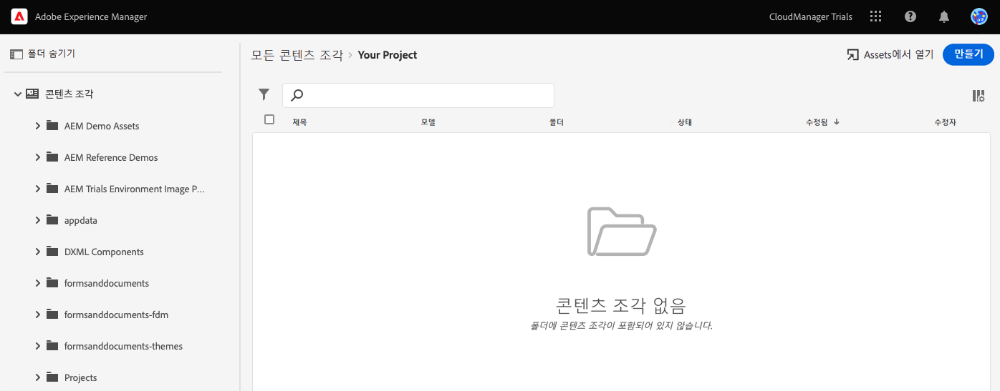
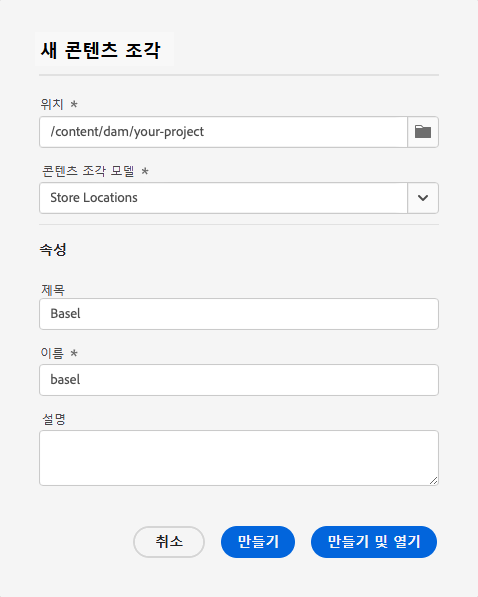
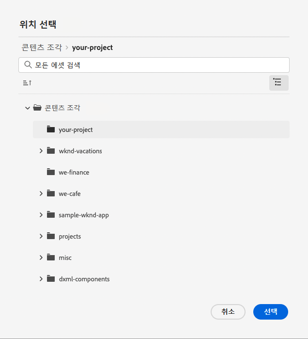
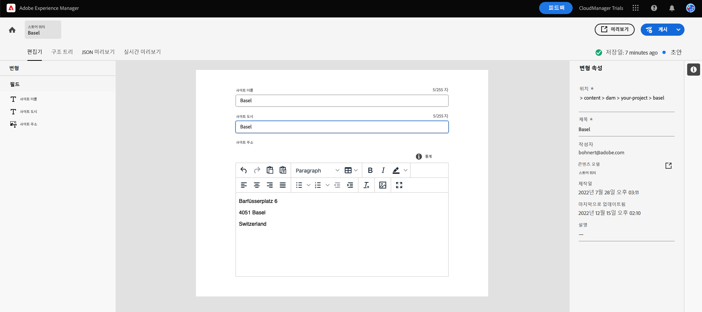
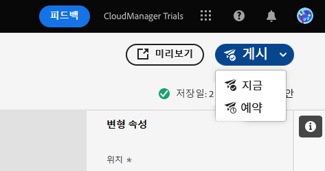
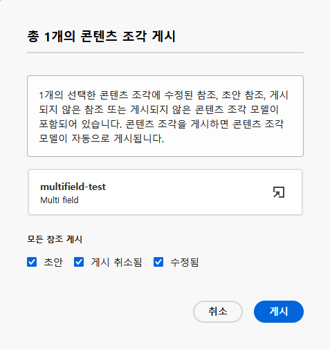
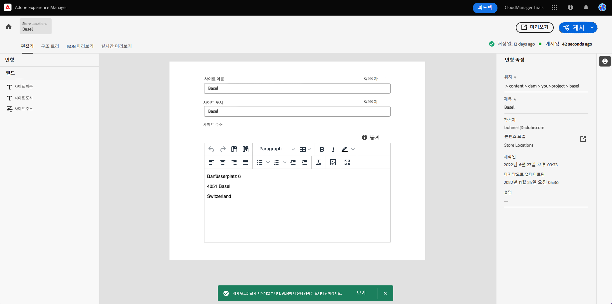
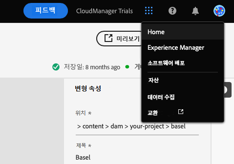

# Headless 콘텐츠 만들기 {#create-content}

제품 내 학습 모듈에 따라 [이전에 만든 콘텐츠 조각 모델](content-structure.md)을 사용하여 페이지 작성에 사용할 수 있는 콘텐츠를 만들거나 headless 콘텐츠의 기반으로 사용하는 방법에 대해 알아보십시오. 이 문서는 대화형 둘러보기를 보완하는 역할을 하며, 동일한 단계를 다루고 해당하는 경우 추가 리소스에 대한 링크를 제공합니다.

>[!CONTEXTUALHELP]
>id="aemcloud_sites_trial_admin_content_fragments_create_content"
>title="새 콘텐츠 만들기"
>abstract="모듈 1에서 만든 모델을 기반으로 페이지 작성에 사용할 수 있거나 Headless 콘텐츠의 기반으로 사용할 수 있는 콘텐츠를 만드는 방법을 알아봅니다."

>[!CONTEXTUALHELP]
>id="aemcloud_sites_trial_admin_content_fragments_create_content_guide"
>title="콘텐츠 조각 콘솔 실행"
>abstract="AEM Headless CMS에서 “콘텐츠 조각”은 “콘텐츠 조각 모델”이라고 불리는 사전 정의된 구조에 맞는 콘텐츠의 모든 부분입니다. 이 연습에서는 콘텐츠 조각 모델에 대한 콘텐츠를 만드는 방법을 알아봅니다.  아래를 클릭하여 새 탭에서 기능을 실행하고 이 학습 문서에 따라 첫 번째 콘텐츠 조각을 만들어 보십시오."
>additional-url="https://video.tv.adobe.com/v/328618" text="인트로 비디오용 플레이스홀더"

## 콘텐츠 조각 {#introduction}

AEM as a Cloud Service에서 콘텐츠 조각은 콘텐츠 조각 모델에서 정의한 구조를 기반으로 하는 headless 콘텐츠 조각입니다. 콘텐츠 조각 콘솔에서 시작하여 고유한 콘텐츠 조각을 만들 수 있습니다. 콘텐츠 조각 콘솔은 headless 콘텐츠 라이브러리로 간주할 수 있습니다. 콘솔을 사용하여 새 콘텐츠 조각을 만들고 기존 조각을 관리합니다. 콘솔이 비어 있으므로 새 조각을 만들어 봅시다!

인앱 지침을 벗어나 직접 콘텐츠 조각 콘솔로 이동하려면 페이지 왼쪽 상단에 있는 Adobe 아이콘을 사용하여 찾을 수 있습니다. 그러면 AEM의 전역 탐색이 열립니다. 여기에서 **탐색** 탭을 선택한 다음 **콘텐츠 조각**&#x200B;을 선택합니다.

>[!TIP]
>
>AEM 탐색에 대해 자세히 알아보려면 이 문서의 [추가 리소스 섹션](#additional-resources)에서 AEM 기본 처리에 대한 내용을 참조하십시오.

## 콘텐츠 조각 만들기 {#create-fragment}

콘텐츠 조각은 headless 콘텐츠를 나타냅니다. 단, 미리 정의된 콘텐츠 구조를 기반으로만 만들 수 있습니다. 이전에 만든 콘텐츠 조각 모델이 해당 구조 역할을 합니다.

1. 콘솔의 오른쪽 상단에 있는 **만들기** 버튼을 탭하거나 클릭하여 **새 콘텐츠 조각** 대화 상자를 열어 새 콘텐츠 조각 만들기를 시작합니다.

   

1. 인앱 지침을 따르는 경우, **위치**&#x200B;가 자동으로 채워집니다.

   1. 지침을 따르지 않는 경우, 경로 브라우저를 사용하여 프로젝트 폴더를 선택합니다.

   1. **새 콘텐츠 조각** 대화 상자에서 **위치** 필드의 **위치 선택** 버튼(폴더처럼 보이는 아이콘)을 탭하거나 클릭합니다.

      
   * 또는 콘텐츠 조각 콘솔의 왼쪽 탐색 패널에서 경로를 선택한 다음 **만들기**&#x200B;를 클릭합니다.

1. **콘텐츠 조각 모델** 드롭다운에서 이전에 드롭다운에서 만든 콘텐츠 조각 모델을 선택합니다.

1. 콘텐츠 조각에 대한 **제목**&#x200B;을 추가합니다.

1. **만들기 및 열기**&#x200B;를 탭하거나 클릭합니다.

## 콘텐츠 조각 편집기 {#edit-fragment}

새 콘텐츠 조각을 저장하면 조각의 실제 콘텐츠를 제공할 수 있는 콘텐츠 조각 편집기가 열립니다.

1. 편집기에는 선택한 모델에서 정의한 필드가 표시됩니다. 여기에서 편집하여 콘텐츠 조각을 완성할 수 있습니다. 진행 상황이 자동으로 저장됩니다.

   

1. 콘텐츠 조각 모델에 많은 필드가 있는 경우, 편집기 왼쪽에 있는 **변수** 패널을 사용하여 원하는 필드로 빠르게 이동할 수 있습니다. 오류가 있는 필드는 여기에 플래그가 지정됩니다.

1. 콘텐츠 조각을 외부 앱에서 사용할 수 있게 하려면 콘텐츠 조각을 게시해야 합니다. 편집기의 오른쪽 상단에서 **게시** 버튼을 탭하거나 클릭합니다.

1. 드롭다운에서 **지금**&#x200B;을 선택합니다. 나중에 게시하도록 예약할 수도 있습니다.

   

   >[!TIP]
   >
   >AEM에서 콘텐츠를 게시하는 방법에 대해 자세히 알아보려면 이 문서의 [추가 리소스 섹션](#additional-resources)에서 게시에 대한 내용을 참조하십시오.

1. AEM은 참조 확인을 자동으로 수행하여 콘텐츠 조각에 필요한 모든 리소스가 게시되었는지 확인합니다. 이 경우 만든 모델도 게시해야 합니다. **게시**&#x200B;를 탭하거나 클릭합니다.

   

1. 게시는 배너에서 확인합니다.

   

## 콘텐츠 조각을 만드는 방법을 배우셨습니다! {#conclusion}

이 모듈에서는 이전에 만든 모델을 기반으로 콘텐츠 조각을 만드는 방법에 대해 배웠습니다. 바로 콘텐츠 작성자가 구조화된 headless 콘텐츠를 만드는 방법입니다.

콘텐츠를 만들고 게시하였으므로 AEM의 API의 Graph QL을 통해 해당 콘텐츠를 추출할 수 있습니다. 이에 대해서는 GraphQL API를 통해 [콘텐츠 추출 모듈에서 배우게 됩니다.](extract-content.md)

탐색 막대의 오른쪽 상단에 있는 **솔루션** 버튼을 클릭하고 **Experience Manager**&#x200B;를 선택하여 체험판 홈 화면으로 돌아갈 수 있습니다.

## 추가 리소스 {#additional-resources}

콘텐츠 조각 및 AEM에 대한 자세한 내용은 이 추가 설명서를 검토하십시오.

* [기본 처리](/help/sites-cloud/authoring/getting-started/basic-handling.md) - 신규 사용자를 위한 AEM 탐색 및 사용 방법에 대한 설명서
* [콘텐츠 조각 관리 - 게시 및 참조](/help/assets/content-fragments/content-fragments-managing.md#publishing-and-referencing-a-fragment) - AEM에서 콘텐츠를 게시하는 방법에 대한 세부 정보
* [콘텐츠 조각](/help/assets/content-fragments/content-fragments.md) - 콘텐츠 조각 개요 및 콘텐츠 조각에 대한 전체 설명서 링크
* [콘텐츠 조각 관리](/help/assets/content-fragments/content-fragments-managing.md) - 콘텐츠 조각을 만들고 관리하는 방법
