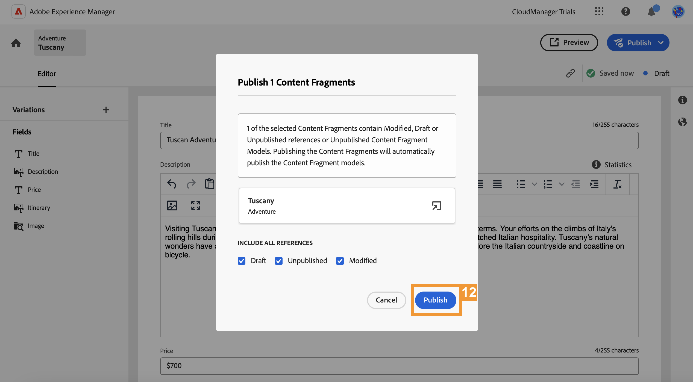

# Headless 콘텐츠 만들기 {#create-content}

>[!CONTEXTUALHELP]
>id="aemcloud_sites_trial_admin_content_fragments_create_content"
>title="새 콘텐츠 만들기"
>abstract="이전 모듈에서 만든 모델을 사용하여 페이지 작성에 사용할 수 있거나 Headless 콘텐츠의 기반으로 사용할 수 있는 콘텐츠를 만드는 방법을 알아봅니다."

>[!CONTEXTUALHELP]
>id="aemcloud_sites_trial_admin_content_fragments_create_content_guide"
>title="콘텐츠 조각 콘솔 실행"
>abstract="앱과 웹 사이트에서 원활하게 작동하는 일관된 고품질 콘텐츠를 만들면 훌륭한 고객 경험을 구축할 수 있습니다. 이 모듈에서는 이를 수행하는 방법을 설명하기 위해 첫 번째 콘텐츠 조각을 만드는 과정을 안내합니다.<br><br>아래 버튼을 클릭하여 새 탭에서 이 모듈을 실행한 다음 이 안내서를 따르십시오."

>[!CONTEXTUALHELP]
>id="aemcloud_sites_trial_admin_content_fragments_create_content_guide_footer"
>title="좋습니다! 이 모듈에서는 이전에 만든 모델을 기반으로 콘텐츠 조각을 작성하는 방법에 대해 배웠습니다. 이제 콘텐츠 팀이 개발 주기와 관계 없이 앱과 웹 사이트의 콘텐츠를 만들고 관리하는 방법에 대해 이해할 수 있습니다."
>abstract=""

## 콘텐츠 조각 만들기 {#create-fragment}

콘텐츠 조각은 Headless 콘텐츠를 나타내며 콘텐츠 조각 모델이라고 하는 사전 정의된 구조를 기반으로 합니다. 이전 모듈에서 이미 모델을 만들었습니다.

이 모듈에서는 컨텐츠 조각 콘솔을 사용하여 해당 모델을 기반으로 새 컨텐츠 조각을 만듭니다. 콘텐츠 조각 콘솔은 Headless 콘텐츠 라이브러리로 간주할 수 있습니다. 콘솔을 사용하여 새 콘텐츠 조각을 만들고 기존 조각을 관리할 수 있습니다.

1. 콘솔의 오른쪽 상단에서 **만들기** 버튼을 탭하거나 클릭합니다.

1. 새 콘텐츠 조각을 만들기를 시작할 수 있는 **새 콘텐츠 조각** 대화 상자가 열립니다. **위치**&#x200B;는 새 콘텐츠가 저장될 위치로 자동으로 채워집니다.

1. 에서 **컨텐츠 조각 모델** 드롭다운에서 **모험** 이전에 만든 컨텐츠 조각 모델.

1. 추가 `Tuscany` 설명적인 **제목** 컨텐츠 조각에 사용할 수 있습니다. 콘솔에서 조각을 식별하기 위한 것입니다.

1. **만들기 및 열기**&#x200B;를 탭하거나 클릭합니다.


>[!TIP]
>
>브라우저 설정에 따라 팝업 차단기가 새 브라우저 탭을 표시하지 않을 수 있습니다. 을 클릭한 후 새 조각이 열리지 않는 경우 **만들기 및 열기**&#x200B;브라우저 설정을 확인하십시오.

## 컨텐츠 조각에 컨텐츠 추가 {#add-content}

새 콘텐츠 조각을 저장하고 열면 콘텐츠 조각 편집기가 새 탭에서 열립니다. 여기에서 새 조각의 콘텐츠를 추가할 수 있습니다.

1. 콘텐츠 조각 편집기에는 선택한 모델에서 정의한 필드가 표시됩니다. 여기에서 각 필드에 내용을 추가하여 콘텐츠 조각을 완성할 수 있습니다. 진행 상황이 자동으로 저장됩니다.

1. 다음을 제공합니다. **제목** 을 입력하여 조각에 대해 `Tuscan adventure`.

1. 다음을 제공합니다. **설명** 다음 텍스트에 붙여넣어 조각을 생성합니다.

   ```text
   Visiting Tuscany on a bicycle is about experiencing the old world charm of Italy on your own terms. Your efforts on the climbs of Italy's rolling hills during this tour will be rewarded with sunny Mediterranean landscapes and unmatched Italian hospitality.  Tuscany’s natural wonders have always been a well of inspiration for arts and culture. Find out why as you explore the Italian countryside and coastline on bicycle.
   ```

1. 다음을 제공합니다. **가격** 을 입력하여 조각에 대해 `$700`.

1. 다음을 제공합니다. **이미지** 을 탭하거나 클릭하여 이동하는 것을 나타냅니다 **자산 추가** 에서 **이미지** 필드.

1. 자산 팝업에서 을 탭하거나 클릭합니다 **자산 찾아보기** 자산 라이브러리의 기존 자산에서 선택합니다.

   

1. 다음 **자산 선택** 대화 상자가 열립니다. 왼쪽 패널의 트리 탐색기를 사용하여 **모든 자산** > **aem-demo-assets** > **en** > **모험** > **자전거 타는 투스카니**.

1. 의 컨텐트 **자전거 타는 투스카니** 폴더가 오른쪽에 표시됩니다. 이미지를 선택합니다 `ADOBESTOCK_141786166.JPEG`.

1. 탭 또는 클릭 **선택**.

   

1. 선택한 이미지가 컨텐츠 조각에 표시됩니다. 편집기는 변경 내용을 자동으로 저장합니다.

1. 콘텐츠를 프로젝트에 추가하고 나면 편집기의 오른쪽 상단에서 **게시** 버튼을 탭하거나 클릭합니다. 이렇게 하면 콘텐츠 조각을 외부 앱에서 사용할 수 있습니다. 그런 다음 을(를) 선택합니다 **지금** 드롭다운 나중에 게시하도록 예약할 수도 있습니다.

   

1. **콘텐츠 조각 게시** 대화 상자가 표시됩니다. AEM은 참조 확인을 자동으로 수행하여 콘텐츠 조각에 필요한 모든 리소스가 게시되었는지 확인합니다. 이 경우 만든 모델도 게시해야 합니다. **게시**&#x200B;를 탭하거나 클릭합니다.

   

1. 발행물은 배너에서 확인합니다.

콘텐츠가 게시되고 콘텐츠 조각으로 앱이나 웹 사이트에 게재할 준비가 완료되었습니다.
