# 샘플 React 앱에서 컨텐츠 사용자 지정 {#customize-app}

헤드리스에 대한 AEM 평가판에는 헤드리스 컨텐츠를 표시하기 위해 간단한 React 앱이 미리 로드됩니다. 이 모듈에서는 이미지를 변경하여 해당 앱을 미리 보고 콘텐츠를 수정하는 방법을 배웁니다.

앱 자체는 컨텐츠 조각의 구조를 기반으로 합니다. AEM에서 컨텐츠 조각 편집기를 사용하여 앱 컨텐츠를 수정할 수 있습니다. 이 과정을 이해하는 데 도움이 되도록 AEM Trials 모듈을 통해 빠른 대화형 둘러보기를 통해 프로세스를 살펴봅니다. 이 문서는 대화형 투어의 추가 기능으로서 동일한 단계를 적용하고 적절한 추가 리소스에 연결합니다.

## 콘텐츠 조각 편집기 {#fragment-editor}

샘플 앱에 대한 컨텐츠 조각 편집기에서 시작합니다.

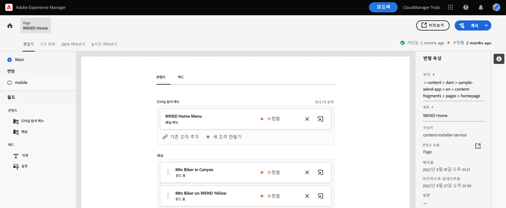

인앱 지침 외부에서 직접 컨텐츠 조각 편집기로 이동하려면 페이지 왼쪽 상단에 있는 Adobe 아이콘을 사용하여 찾습니다. 이렇게 하면 AEM의 전역 탐색이 열립니다. 여기에서 **탐색** 탭한 다음 **컨텐츠 조각**.

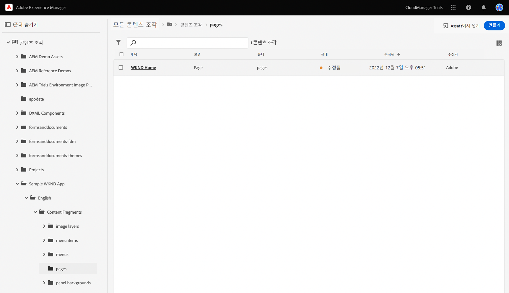

그러면 컨텐츠 조각 콘솔이 열립니다. 여기에서 왼쪽 패널의 컨텐츠 트리를 사용하여 앱 컨텐츠의 위치로 이동합니다. 이 경우 **컨텐츠 조각** -> **샘플 WKND 앱** -> **영어** -> **컨텐츠 조각** -> **페이지**.

을(를) 탭하거나 클릭합니다. **WKND 홈** 앱 컨텐츠에 대한 편집기를 시작하기 위해 컨텐츠 트리 오른쪽에 있는 콘솔에 표시되는 페이지 조각입니다.

>[!TIP]
>
>AEM의 탐색에 대한 자세한 내용은 [추가 리소스 섹션](#additional-resources) AEM 기본 처리에 대한 자세한 내용은 이 문서를 참조하십시오.

## 앱 미리 보기 {#preview}

앱을 수정하기 전에 먼저 앱의 현재 상태를 미리 보고 익숙해지십시오. 을(를) 탭하거나 클릭합니다 **미리 보기** 편집기 화면의 오른쪽 상단에 있는 버튼입니다.

데모 앱이 새 탭에서 열립니다.

앱 자체가 React에 구현된 가상의 WKND 아웃도어 라이프스타일 브랜드를 위한 간단한 전자 상거래 앱입니다. 샘플 컨텐츠를 탐색하려면 주변 을 클릭합니다.

계속하려면 컨텐츠 조각 편집기의 탭으로 돌아갑니다.

## 앱에서 텍스트 편집 {#edit-app}

이전에 언급했듯이 앱 자체는 컨텐츠 조각으로 구성됩니다. 이러한 조각은 앱을 만들기 위해 구조에 함께 연결됩니다.

컨텐츠 조각 편집기는 앱의 기본 레이아웃을 페이지로 표시합니다. 이 페이지는 다른 조각의 모음을 통해 나타나는 컨텐츠 조각입니다. 다음 **패널** 앱의 다른 페이지를 나타내며 각각 고유한 컨텐츠 조각을 나타냅니다. 이러한 조각을 수정하여 앱 콘텐츠를 변경할 수 있습니다.

1. 탭 또는 클릭 **캐니언의 Mtn Biker** 에서 **패널** 섹션을 참조하십시오.

   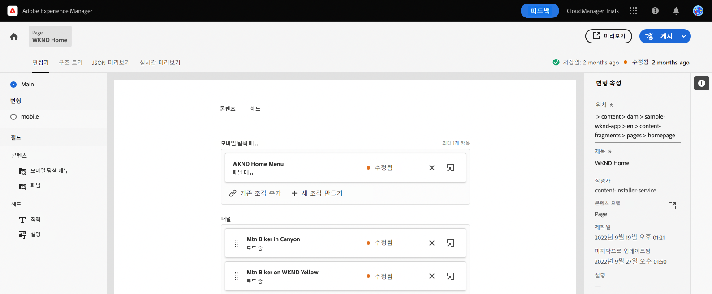

1. 편집자가 산 바이커를 위한 헤더 패널을 엽니다. 각 패널은 앱의 페이지 내에서 서로 다른 컨텐츠를 나타내는 레이어로 구성됩니다.

   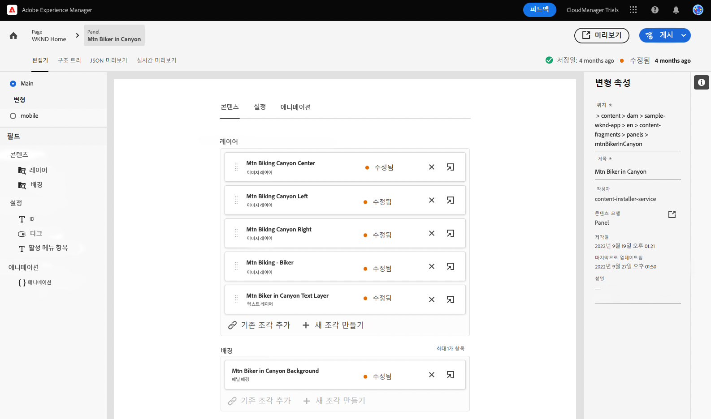

1. 텍스트 레이어를 선택합니다 **캐년 텍스트 레이어의 Mtn Biker**. 그러면 편집기에서 레이어의 세부 사항이 열립니다. 레이어는 여러 컨텐츠 조각으로 구성됩니다.

   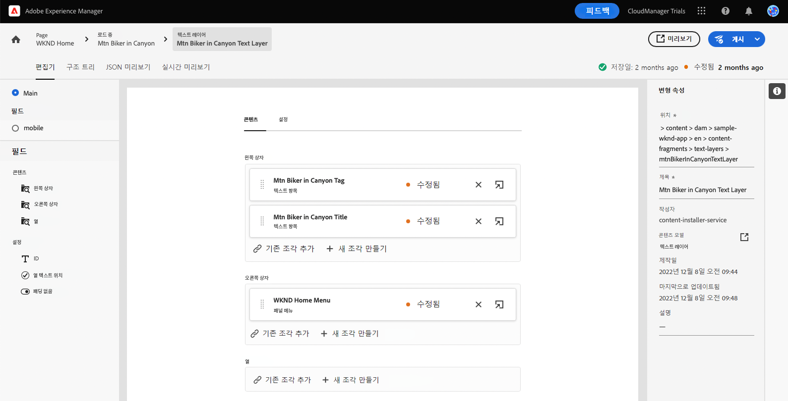

1. 을(를) 선택합니다 **캐년 타이틀의 Mtn Biker** 텍스트 항목입니다. 컨텐츠 조각 편집기가 열리고 이 조각의 컨텐츠가 표시되고 수정할 수 있습니다.

   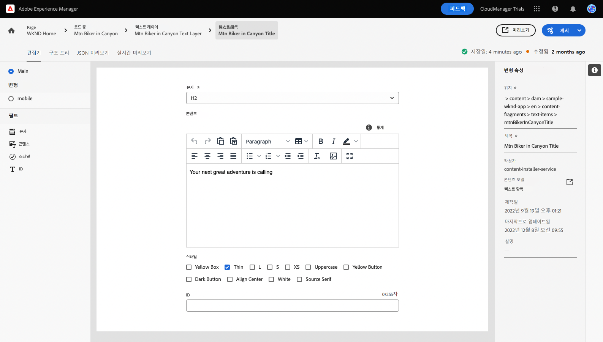

1. 텍스트 변경 `Your next great adventure is calling` to `Choose your own adventure`. 편집기에 의해 변경 사항이 자동으로 저장됩니다.

1. 미리 보기 를 클릭하여 변경 사항을 확인합니다. 데모 앱이 새 탭에서 열립니다.

   

컨텐츠 조각 편집기의 탭으로 돌아가서 모듈을 계속 진행합니다.

## 앱의 기본 이미지 변경 {#change-image}

앱에서 일부 텍스트를 수정했으므로 앱의 기본 이미지를 변경해 보십시오. 먼저 해당 컨텐츠를 찾아야 합니다.

편집기의 왼쪽 상단에 있는 탐색 표시는 컨텐츠 계층 구조에 있는 위치를 보여줍니다.

1. 탭 또는 클릭 **캐니언의 Mtn Biker** 탐색 표시를 사용하여 해당 페이지로 돌아갑니다.

   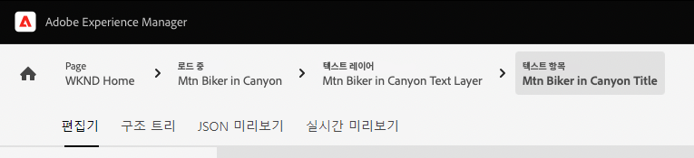

1. 앱의 다양한 레이어가 있는 패널로 돌아갑니다. 레이어는 텍스트 컨텐츠만 나타내지 않습니다. 앱의 모든 콘텐츠를 나타냅니다. 따라서 컨텐츠 조각 편집기를 사용하여 이미지를 교환할 수도 있습니다.

   

1. 을(를) 선택합니다 **Mtn Biking - Biker** 이미지 레이어. 컨텐츠 조각 편집기가 열리고 이 조각의 컨텐츠가 표시되고 수정할 수 있습니다.

   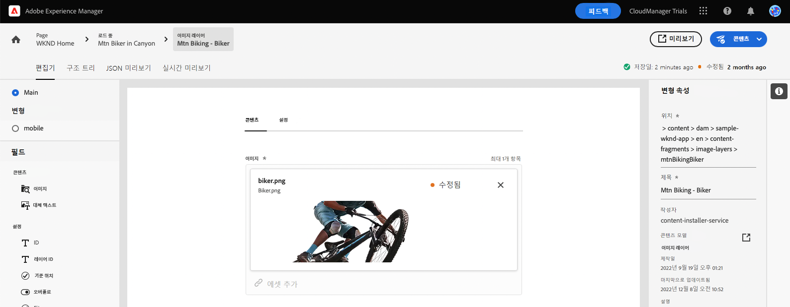

1. 을(를) 탭하거나 클릭합니다 **X** 바이커 이미지를 제거합니다. 이미지가 사라지면 이 컨텐츠 조각 모델에 이미지가 필요하므로 편집기에 오류가 표시됩니다.

   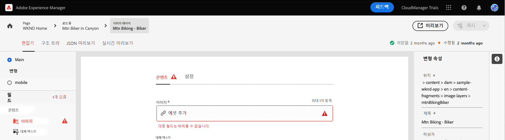

1. 탭 또는 클릭 **자산 추가** 에서 노란색 바이커 이미지를 찾습니다. **sample-wknd-app** > **en** > **이미지 파일**. 왼쪽의 트리 보기를 사용합니다 **자산 선택** 대화 상자에서 컨텐츠 계층 구조를 탐색합니다.

   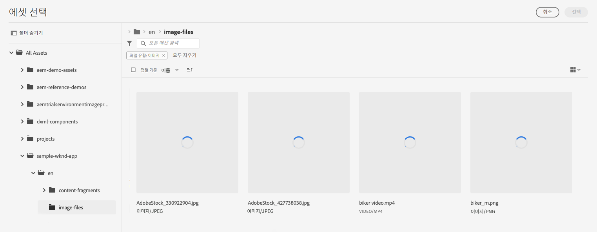

1. 텍스트 필터 `yellow`. 를 사용하십시오 **모든 자산 검색** 맨 위의 필드 **자산 선택** 창을 클릭하여 이미지를 검색합니다. 검색 텍스트를 입력하고 Enter 키를 누르거나 검색으로 돌아갑니다.

   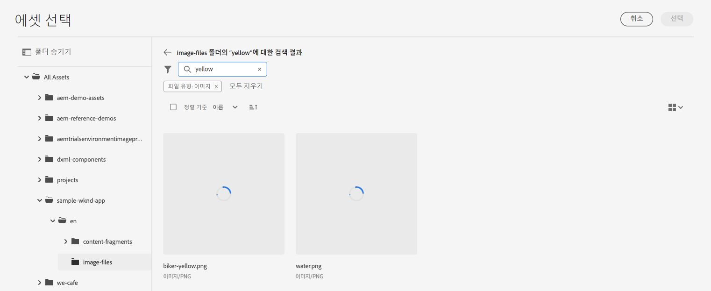

1. 을(를) 탭하거나 클릭하여 선택합니다 `biker-yellow.png` 이미지를 탭하거나 클릭합니다 **선택**.

   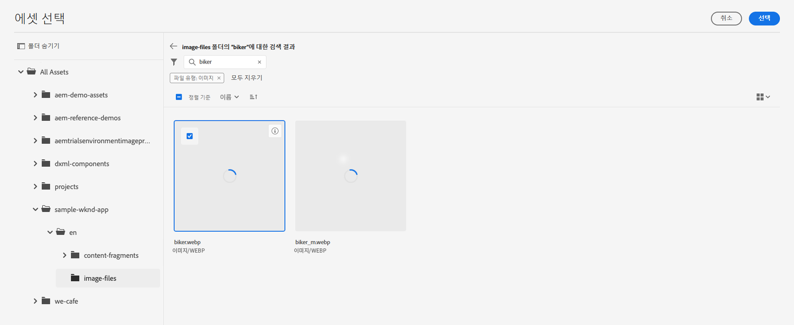

1. 바이커의 이미지가 선택한 이미지로 대체되었습니다. 편집기에 변경 내용이 자동으로 저장됩니다.

   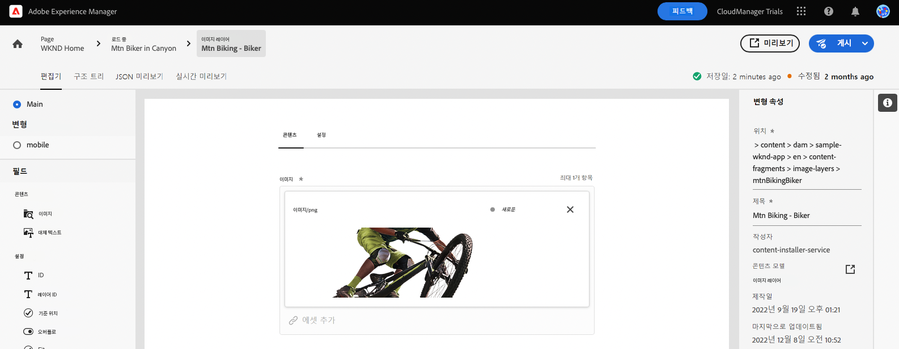

## 쇼퍼블 모멘트 만들기 {#create-moment}

이제 바이커의 이미지를 업데이트했으므로, 바이커의 노란색 반바지에 대한 쇼퍼블 순간을 추가할 수 있습니다.

1. 먼저 페이지 조각에 대한 컨텐츠 조각 편집기로 돌아갑니다. 편집기의 왼쪽 상단에 있는 탐색 표시는 컨텐츠 계층 구조에 있는 위치를 보여줍니다. 탭 또는 클릭 **WKND 홈** 탐색 표시를 사용하여 해당 페이지로 돌아갑니다.

   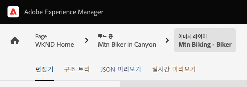

1. 을(를) 선택합니다 **WKND 노랑의 Mtn Biker** 패널.

   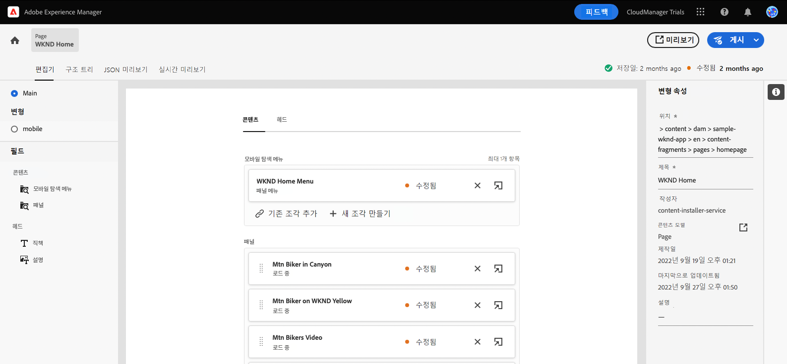

1. 이제 바이커의 이미지를 구성하는 레이어를 볼 수 있습니다. 을(를) 선택하여 바이커의 노란색 반바지에 쇼퍼블 순간을 추가합니다. **Mtn Biking - 쇼퍼블** 레이어.

   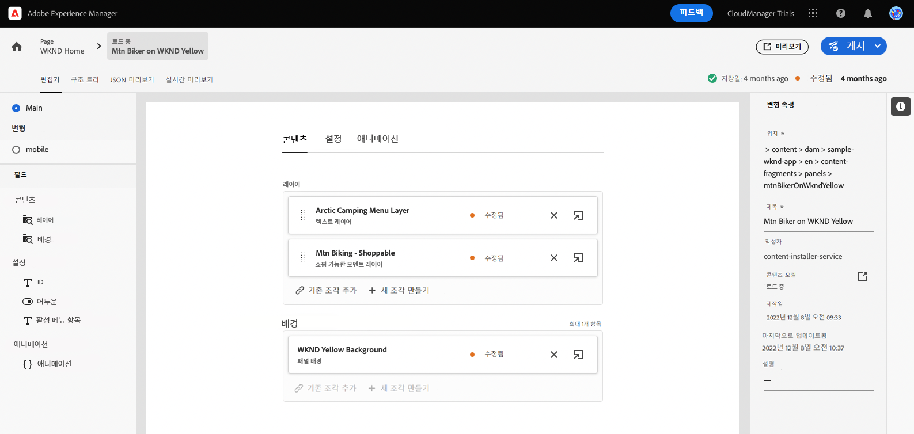

1. 쇼퍼블 순간을 만들려면 해당 순간을 나타내는 새 컨텐츠 조각을 만들어야 합니다. 을(를) 탭하거나 클릭합니다 **+ 새 조각 만들기** 바이커의 반바지에 대한 쇼퍼블 순간을 추가하기 위한 버튼.

   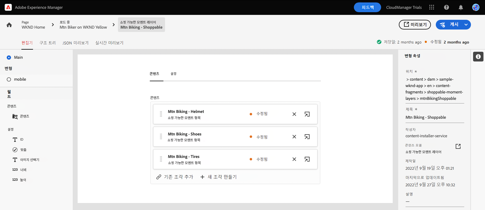

1. 컨텐츠 조각은 구조화된 헤드리스 데이터를 나타내므로 컨텐츠 조각을 생성할 때마다 먼저 컨텐츠를 기반으로 할 모델을 선택해야 합니다. 을(를) 선택합니다 **쇼퍼블 모멘트 항목** 모델 **컨텐츠 조각 모델** 드롭다운.

   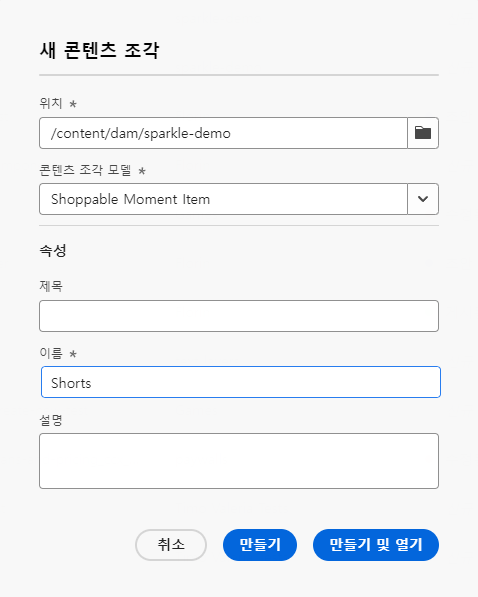

1. 이 새로운 쇼퍼블 순간을 나타내는 컨텐츠 조각에 이름을 지정합니다. 예를 들어, 을 입력합니다. `Shorts` 로 **이름** 필드.

   

1. 탭 또는 클릭 **만들기 및 열기**.

1. 새 컨텐츠 조각에 대한 편집기가 열립니다.
   * 쇼퍼블 순간에는 **텍스트** 다음과 같은 필드 `Yellow shorts`.
   * 이 쇼퍼블 순간이 오버레이되어야 하는 위치에 X와 Y를 설정합니다.
      * **X**: `-18`
      * **Y**: `-28`
   * 조각 변경 사항은 편집기에 의해 자동으로 저장됩니다

   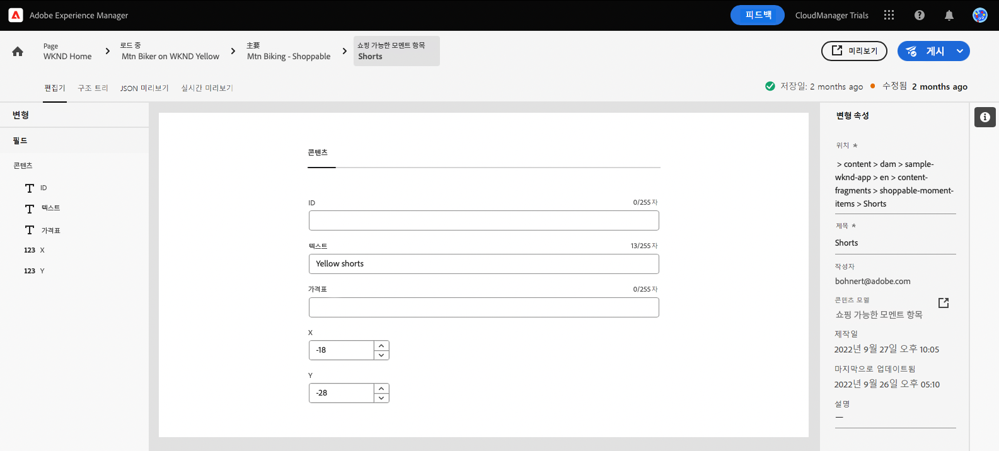

1. 탭 또는 클릭 **미리 보기** 이 위치를 테스트하고 필요에 따라 조정합니다.

   

## 샘플 React 앱을 사용자 지정하는 방법을 배웁니다. {#conclusion}

이 모듈에서 샘플 React 앱을 사용자 지정하는 방법을 알아보았습니다. 먼저 기존 텍스트를 편집하는 방법을 알아보았습니다. 그런 다음 이미지를 해당 이미지의 다른 인스턴스로 교체했습니다. 마지막으로 쇼퍼블 모멘트 항목이 만들어지고 위치하는 방식을 보았습니다.

을(를) 확인하십시오 [추가 리소스 섹션](#additional-resources) 를 참조하십시오.

사용자 지정 앱에서 사용하기 위해 컨텐츠 조각 및 헤드리스 콘텐츠를 만드는 방법을 알아보려면 모듈을 검토하여 시작할 수 있습니다 [앱의 컨텐츠 구조를 만듭니다.](content-structure.md)

를 클릭하여 체험판 홈 화면으로 돌아갈 수 있습니다. **솔루션** 탐색 막대의 오른쪽 상단에 있는 버튼 및 선택 **Experience Manager**.

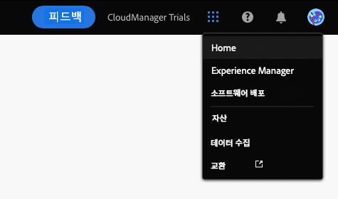

## 추가 리소스 {#additional-resources}

컨텐츠 조각 및 AEM에 대한 자세한 내용은 이 추가 설명서를 참조하십시오.

* [컨텐츠 조각 모델](/help/assets/content-fragments/content-fragments-models.md) - 컨텐츠 조각 모델에 대한 전체 설명서
* [컨텐츠 조각](/help/assets/content-fragments/content-fragments.md) - 컨텐츠 조각 및 컨텐츠 조각에 대한 전체 설명서 링크 개요
* [기본 처리](/help/sites-cloud/authoring/getting-started/basic-handling.md) - 새 사용자를 위한 AEM 탐색 및 사용 방법에 대한 설명서
