# GraphQL API를 통한 콘텐츠 추출 {#extract-content}

지금까지 headless용 AEM 체험판에서 [고유한 콘텐츠 조각 모델을 생성](content-structure.md)했을 뿐만 아니라 [콘텐츠 조각으로 고유한 headless 콘텐츠를 만들었습니다.](create-content.md) 이제 콘텐츠 조각 및 GraphQL API를 headless 콘텐츠 관리 시스템으로 사용하여 콘텐츠를 제공하는 방법을 배울 수 있습니다.

GraphQL은 외부 클라이언트 애플리케이션이 단일 API 호출을 사용하여 필요한 콘텐츠에 대해서만 AEM을 쿼리할 수 있도록 하는 쿼리 기반 API를 제공합니다.

먼저 **목록** 및 **byPath** 쿼리와 같이 두 가지 유형의 쿼리를 실행하는 방법을 배웁니다. 그런 다음 이전에 만든 콘텐츠 조각에서 콘텐츠를 검색하는 방법을 배웁니다. 이 문서는 대화형 둘러보기를 보완하는 역할을 하며, 동일한 단계를 다루고 해당하는 경우 추가 리소스에 대한 링크를 제공합니다.

>[!TIP]
>
>GraphQL API에 대한 자세한 내용은 GraphQL API 안내서에 대한 이 모듈의 끝에 있는 [추가 리소스 섹션](#additional-resources)을 참조하십시오.

>[!CONTEXTUALHELP]
>id="aemcloud_sites_trial_admin_content_fragments_graphql"
>title="GraphQL API를 사용하여 콘텐츠 추출"
>abstract="이 모듈에서는 Headless 콘텐츠 관리 시스템으로 콘텐츠 조각 및 GraphQL API를 사용하는 방법을 알아봅니다."

>[!CONTEXTUALHELP]
>id="aemcloud_sites_trial_admin_content_fragments_graphql_guide"
>title="GraphQL 탐색기 실행"
>abstract="GraphQL은 외부 클라이언트 애플리케이션이 단일 API 호출을 사용하여 필요한 콘텐츠에 대해서만 AEM을 쿼리할 수 있도록 하는 쿼리 기반 API를 제공합니다. 이 안내서를 따라 두 가지 다른 유형의 쿼리를 실행한 다음 이전 모듈에서 만든 콘텐츠 조각에서 콘텐츠를 검색하는 방법을 알아보십시오.<br><br>아래를 클릭하여 새 탭에서 기능을 실행하십시오."
>additional-url="https://video.tv.adobe.com/v/328618" text="인트로 비디오용 플레이스홀더"

## GraphQL 탐색기 {#graphql-explorer}

GraphQL 탐색기에서 시작합니다. 여기에서 headless 콘텐츠에 대한 쿼리를 작성하고 실행할 수 있습니다.

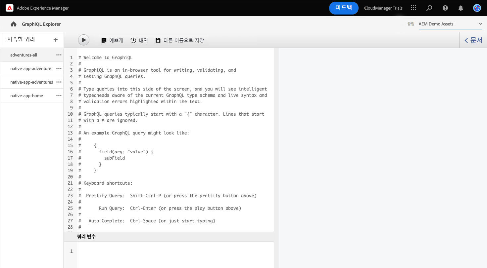

인앱 지침을 벗어나 직접 GraphQL 탐색기로 이동하려면 페이지 왼쪽 상단에 있는 Adobe 아이콘을 사용하여 찾을 수 있습니다. 그러면 AEM의 전역 탐색이 열립니다. 여기에서 **도구** 탭을 선택한 다음 **일반** -> **GraphQL 쿼리 편집기**&#x200B;를 차례로 선택합니다.

>[!TIP]
>
>AEM 탐색에 대해 자세히 알아보려면 이 문서의 [추가 리소스 섹션](#additional-resources)에서 AEM 기본 처리에 대한 내용을 참조하십시오.

AEM 체험판에는 테스트 목적으로 콘텐츠를 추출할 수 있는 콘텐츠가 미리 로드된 엔드포인트가 함께 제공됩니다.

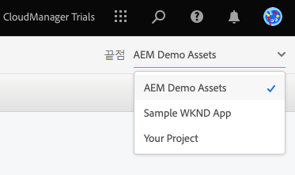

편집기의 오른쪽 상단에 있는 **엔드포인트** 드롭다운 메뉴에서 **AEM 데모 자산** 엔드포인트를 선택합니다(아직 해당되지 않은 경우).

## 목록 쿼리 복사 및 실행 {#list-query}

AEM as a Cloud Service에서 GraphQL API를 작동하는 방식을 파악하기 위해 간단한 목록 쿼리부터 시작합니다. 이 목록 쿼리 예제는 특정 콘텐츠 조각 모델을 사용하는 모든 콘텐츠 목록을 반환합니다. 인벤토리 및 카테고리 페이지는 일반적으로 이 쿼리 형식을 사용합니다.

1. 다음 코드 조각을 복사합니다.

   ```text
   {
       adventureList {
         items {
            _path
            adventureTitle
            adventurePrice
            adventureTripLength
            adventurePrimaryImage {
              ... on ImageRef {
               _path
               mimeType
               width
               height
             }
           }
         }
      }
    }
   ```

1. 그런 다음 복사한 코드를 붙여넣어 쿼리 편집기의 기존 콘텐츠를 바꿉니다.

   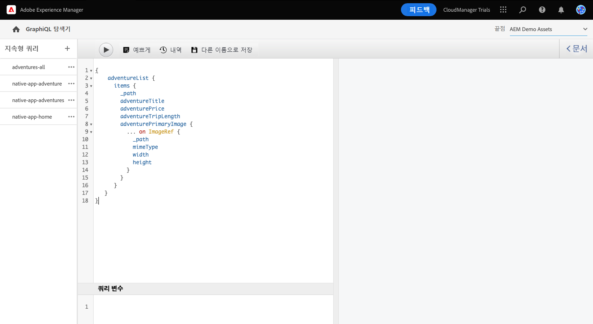

1. 붙여넣기가 완료되면 쿼리 편집기 왼쪽 상단의 **재생** 버튼을 클릭하여 쿼리를 실행합니다.

1. 쿼리가 실행되면 쿼리 편집기 옆의 오른쪽 패널에 결과가 표시됩니다. 쿼리가 잘못된 경우, 오른쪽 패널에 오류가 표시됩니다.

   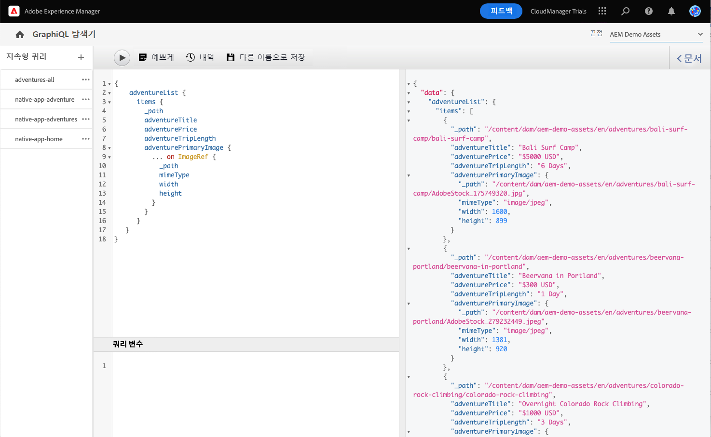

모든 콘텐츠 조각의 전체 목록에 대한 목록 쿼리의 유효성을 검사했습니다. 이 프로세스를 사용하면 앱과 웹 사이트에서 AEM에서 만든 콘텐츠를 검색하는 방법을 보여 주는 결과와 함께 앱이 기대하는 응답을 보장할 수 있습니다.

콘텐츠를 표시해야 하는 다양한 채널 및 플랫폼에서 이제 이 쿼리 또는 유사한 항목을 사용하여 headless 콘텐츠를 검색할 수 있습니다.

## byPath 쿼리 복사 및 실행 {#bypath-query}

byPath 쿼리를 실행하면 특정 콘텐츠 조각에 대한 자산을 검색할 수 있습니다. 특정 콘텐츠 세트에 중점을 둔 페이지 및 제품 세부 정보 페이지에는 일반적으로 이러한 유형의 쿼리가 필요합니다.

1. 다음 코드 조각을 복사합니다.

   ```text
    {
     adventureByPath(
       _path: "/content/dam/aem-demo-assets/en/adventures/bali-surf-camp/bali-surf-camp"
     ) {
       item {
         _path
         adventureTitle
         adventureDescription {
           json
         }
         adventurePrimaryImage {
           ... on ImageRef {
             _path
             width
             height
           }
         }
       }
     }
   }
   ```

1. 그런 다음 복사한 코드를 붙여넣어 쿼리 편집기의 기존 콘텐츠를 바꿉니다.

   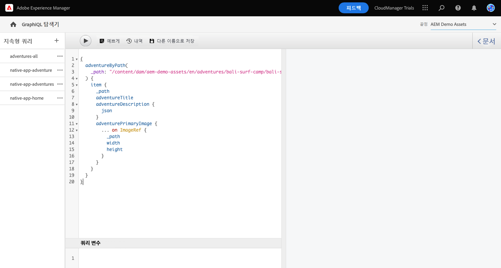

1. 붙여넣기가 완료되면 쿼리 편집기 왼쪽 상단의 **재생** 버튼을 클릭하여 쿼리를 실행합니다.

1. 쿼리가 실행되면 쿼리 편집기 옆의 오른쪽 패널에 결과가 표시됩니다. 쿼리가 잘못된 경우, 오른쪽 패널에 오류가 표시됩니다.

1. 쿼리가 실행되면 쿼리 편집기 옆의 오른쪽 패널에 결과가 표시됩니다. 쿼리가 잘못된 경우, 오른쪽 패널에 오류가 표시됩니다.

   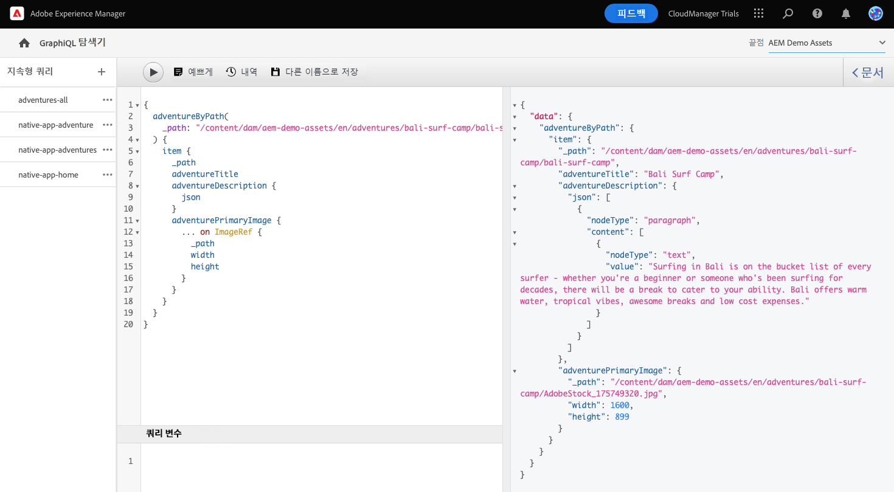

모든 콘텐츠 조각의 전체 목록에 대한 목록 쿼리의 유효성을 검사했습니다. 이 프로세스를 사용하면 앱과 웹 사이트에서 AEM에서 만든 콘텐츠를 검색하는 방법을 보여 주는 결과와 함께 앱이 기대하는 응답을 보장할 수 있습니다.

콘텐츠를 표시해야 하는 다양한 채널 및 플랫폼에서 이제 이 쿼리 또는 유사한 항목을 사용하여 headless 콘텐츠를 검색할 수 있습니다.

## 자체 콘텐츠에 대한 쿼리 실행 {#own-queries}

두 가지 기본 유형의 쿼리를 실행했으므로 직접 만든 콘텐츠에 대한 쿼리를 설정하고 실행할 준비가 되었습니다.

1. 자체 콘텐츠 조각에 대해 쿼리를 실행하려면 **AEM 데모 자산** 폴더에서 **사용자 프로젝트** 폴더로 엔드포인트를 변경합니다.

   

1. 쿼리 편집기에서 기존 콘텐츠를 모두 선택하고 삭제하여 시작합니다. 그런 다음 여는 괄호 `{`를 입력하고 Ctrl+Space 또는 Option+Space를 누르면 콘텐츠 조각 모델에 정의된 모델의 자동 완성 목록이 표시됩니다. 목록에서 `List`로 끝나는 생성 모델을 선택합니다.

   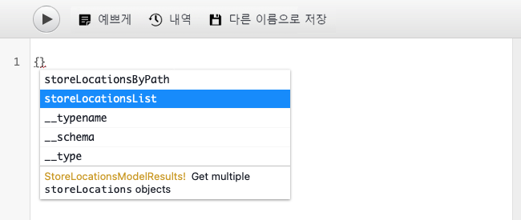

1. 선택한 콘텐츠 조각 모델의 쿼리에 포함되어야 하는 항목을 정의합니다. 다시 여는 괄호 `{`를 입력한 다음 Ctrl+Space 또는 Option+Space를 눌러 자동 완성 목록을 표시합니다. 목록에서 `items`를 선택합니다.

   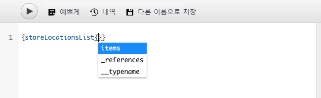

1. 선택한 콘텐츠 조각 모델의 쿼리에 포함되어야 하는 필드를 정의합니다. 다시 여는 괄호 `{`를 입력한 다음 Ctrl+Space 또는 Option+Space를 누르면 콘텐츠 조각 모델에서 사용 가능한 자동 완성 목록 필드가 표시됩니다. 목록에서 원하는 모델 필드를 선택합니다.

   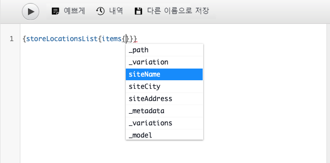

1. 여러 필드를 쉼표(`,`) 또는 공백으로 구분하고, Ctrl+Space 또는 Option+Space를 다시 눌러 추가 필드를 선택합니다.

1. 작업하는 동안 **정렬** 버튼을 탭하거나 클릭하여 읽기 쉽도록 코드 서식을 자동으로 지정할 수 있습니다.

   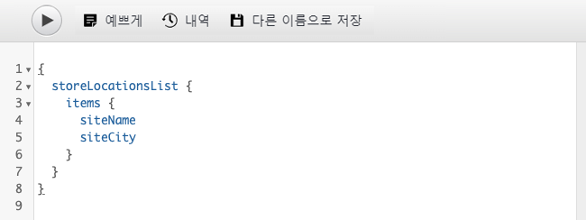

1. 완료되면 쿼리 편집기 왼쪽 상단의 **재생** 버튼을 탭하거나 클릭하여 쿼리를 실행합니다.

   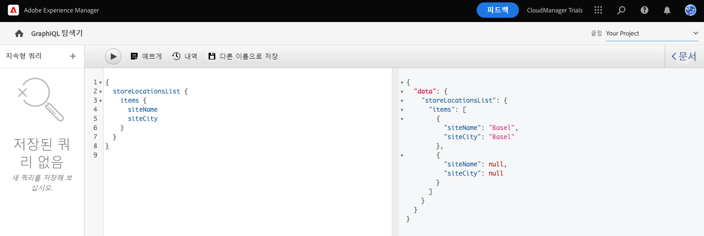

사용자의 콘텐츠를 옴니채널 디지털 환경에 구현하는 방식입니다. 추가 샘플 쿼리에 대한 정보는 [추가 리소스 섹션](#additional-resources)을 참조하여 GraphQL API로 얼마나 많은 작업을 수행할 수 있는지 알아보십시오.

## 콘텐츠를 쿼리하는 방법에 대해 배웠습니다! {#conclusion}

잘하셨습니다! 두 가지 기본 쿼리 유형과 자체 콘텐츠를 쿼리하는 방법에 대해 배웠습니다. 추가 샘플 쿼리에 대한 정보는 [추가 리소스 섹션](#additional-resources)을 참조하여 GraphQL API로 얼마나 많은 작업을 수행할 수 있는지 확인해 보십시오.

추출된 콘텐츠가 사용자 정의 React 앱에서 어떻게 사용되는지 알아보려면 [샘플 React 앱의 콘텐츠 사용자 정의](customize-app.md) 모듈을 검토하십시오.

탐색 막대의 오른쪽 상단에 있는 **솔루션** 버튼을 클릭하고 **Experience Manager**&#x200B;를 선택하여 체험판 홈 화면으로 돌아갈 수 있습니다.

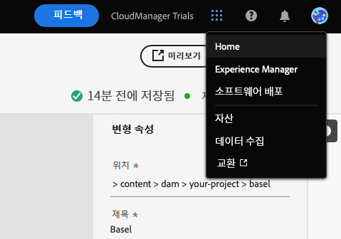

## 추가 리소스 {#additional-resources}

콘텐츠 조각 및 AEM에 대한 자세한 내용은 이 추가 설명서를 검토하십시오.

* [GraphQL API 안내서](https://experienceleague.adobe.com/docs/experience-manager-learn/getting-started-with-aem-headless/graphql/multi-step/explore-graphql-api.html)
* [기본 처리](/help/sites-cloud/authoring/getting-started/basic-handling.md) - 신규 사용자를 위한 AEM 탐색 및 사용 방법에 대한 설명서
* [AEM을 통해 GraphQL을 사용하는 방법 알아보기 - 샘플 콘텐츠 및 쿼리](https://experienceleague.adobe.com/docs/experience-manager-cloud-service/content/headless/graphql-api/sample-queries.html)
