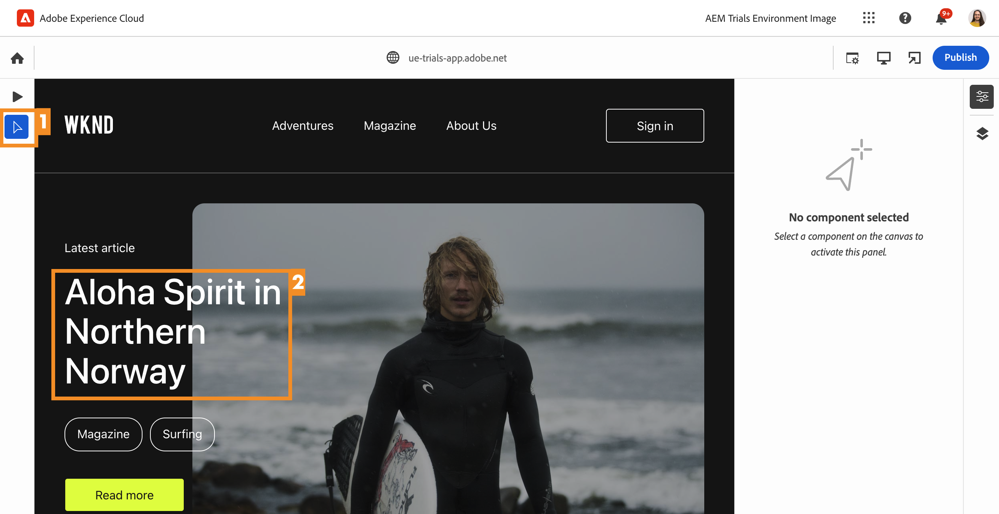
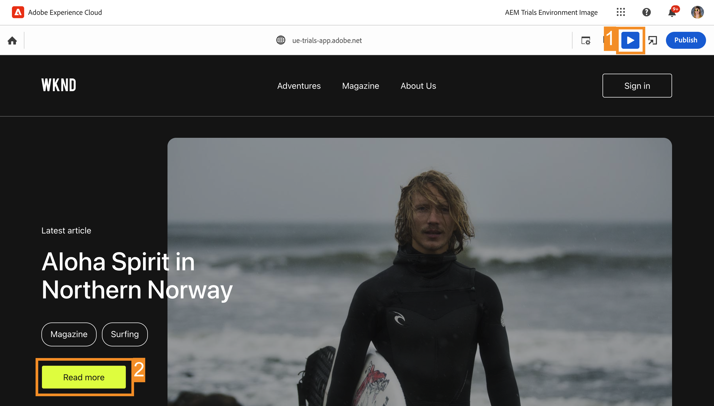

# Universal Editor로 컨텍스트에서 편집 {#editing-in-context}

>[!CONTEXTUALHELP]
>id="aemcloud_sites_trial_edit_inline_universal_editor"
>title="Universal Editor로 컨텍스트에서 편집"
>abstract="Headless 앱이 Universal Editor를 사용하여 작성자가 컨텍스트에서 손쉽게 편집을 수행할 수 있도록 하는 방법을 확인하십시오."

>[!CONTEXTUALHELP]
>id="aemcloud_sites_trial_edit_inline_universal_editor_guide"
>title="Universal Editor 실행"
>abstract="이 안내서에서는 Universal Editor를 살펴보고, 이를 통해 누구나 어떤 구현에서든 콘텐츠의 모든 측면을 편집할 수 있도록 하여 콘텐츠 속도를 향상시키는 방법에 대해 알아봅니다.  아래를 클릭하여 새 탭에서 이 모듈을 실행한 다음 이 안내서를 따르십시오."

>[!CONTEXTUALHELP]
>id="aemcloud_sites_trial_edit_inline_universal_editor_guide_footer"
>title="이 모듈에서는 Universal Editor를 사용하여 컨텍스트에서 콘텐츠를 맞춤화하는 방법을 배웠습니다."
>abstract=""

## 컨텍스트에서 텍스트 편집 {#edit-text}

컨텍스트에서 즉시 편집하면 이전 모듈에서 본 콘텐츠 조각 편집기에서와 같이 구조화된 Headless 콘텐츠에 대해 편집하는 것보다 유리한 경우가 많습니다.

>[!NOTE]
>
>이 체험판에서 Universal Editor를 사용하려면 Chrome을 브라우저로 사용해야 하며 시크릿 모드가 아니어야 합니다. 이는 Universal Editor가 아니라 체험판 환경의 제한 사항입니다.

Universal Editor를 사용하면 컨텍스트에서 즉시 텍스트를 신속하게 편집할 수 있으므로 간단하고 직관적인 콘텐츠 작성이 가능합니다.

1. 편집할 최신 문서의 제목을 선택하려면 두 번 클릭하십시오.

   

1. 구성 요소가 텍스트 구성 요소임을 보여 주는 탭을 사용하여 파란색 테두리에 표시된 대로 구성 요소를 선택합니다. 커서는 텍스트 입력 대기 중인 테두리에 있습니다. 텍스트를 `Aloha Spirit in Lofoten`로 변경합니다.

   

1. 텍스트 구성 요소의 외부를 선택하면 변경 사항이 자동으로 저장됩니다.

변경 내용은 Universal Editor의 작성 환경에서 자동으로 저장됩니다. 독자가 볼 수 있도록 하려면 이와 별도로 게시해야 하며, 이 작업은 이후 단계에서 수행합니다.

## 컨텍스트에서 미디어 편집 {#edit-media}

Universal Editor를 사용하여 콘텐츠 컨텍스트에서 이미지를 교체할 수도 있습니다.

1. 서퍼의 이미지를 선택하여 선택합니다.

1. 구성 요소 레일에서 자산의 세부 정보를 볼 수 있습니다. **추천 이미지** 썸네일을 선택합니다.

   

1. **자산 선택** 창에서 아래로 스크롤하여 `surfer-wave-02.JPG` 이미지를 선택하여 선택합니다.

1. **자산 선택** 창에서 **선택**&#x200B;을 선택합니다.

   

이미지가 선택한 이미지로 교체됩니다.

## 독자와 동일한 형태로 콘텐츠 경험 {#emulators}

Universal Editor를 사용하면 컨텍스트 내 콘텐츠와 상호 작용할 수 있으며 사용자의 디바이스에 전달되는 콘텐츠를 확인할 수 있습니다.

1. 기본적으로 편집기는 콘텐츠의 데스크탑 버전을 렌더링합니다. 범용 편집기 도구 모음의 오른쪽 상단에서 에뮬레이터 버튼을 선택하여 대상 장치를 변경합니다.

   

1. 독자가 사용하는 디바이스의 가로세로 비율이 다양할 수 있으므로 편집기는 페이지가 사용자에게 어떻게 표시되는지 확인하기 위해 에뮬레이션 모드를 제공합니다. 예를 들어 세로 모드 모바일 디바이스 옵션을 선택합니다.

   

1. 편집기에서 콘텐츠를 확인합니다. 또한 에뮬레이터 아이콘을 변경하여 현재 모드를 반영합니다. 에뮬레이터 메뉴 외부의 아무 곳이나 선택하여 메뉴를 닫고 콘텐츠와 상호 작용합니다.

1. 에뮬레이터를 데스크탑 모드로 되돌립니다.

또한 에뮬레이터의 정확한 차원을 지정하고 에뮬레이션된 디바이스를 회전하면 잠재적인 모든 대상 디바이스에서 콘텐츠를 확인할 수 있습니다.

## 미리보기 및 게시 {#preview}

편집기에서 수정할 콘텐츠를 선택해야 하므로 편집기에서는 링크를 따라가거나 탭하거나 클릭하여 콘텐츠와 상호 작용할 수 없습니다. 미리보기 모드를 사용하면 콘텐츠 내의 링크를 따라갈 수 있고 게시에 앞서 사용자와 동일한 형태로 콘텐츠를 경험할 수 있습니다.

1. 범용 편집기 도구 모음에서 를 선택합니다. **미리 보기**.

1. 이제 주 문서의 **자세히 보기** 링크를 선택합니다.

   

1. 문서를 살펴본 다음 **뒤로** 링크를 사용해 주 페이지로 돌아갑니다.

   

1. 이제 편집기의 오른쪽 상단에서 **게시** 버튼을 선택하여 콘텐츠를 게시합니다.

   

콘텐츠가 게시됩니다.

## 콘텐츠 조각 편집 {#editing-fragments}

Universal Editor에는 Headless 콘텐츠의 구조화된 편집이 즉시 편집보다 유리할 때 콘텐츠 제작 경험을 가속화하기 위해 콘텐츠 조각 편집기에 대한 빠른 액세스 기능도 있습니다.

1. 을(를) 탭하여 미리 보기 모드 끄기 **미리 보기** 단추를 클릭합니다.

   

1. 페이지에서 아래로 스크롤하여 **모험** 섹션으로 이동합니다.

1. **발리 서핑 캠프**&#x200B;와 같은 모험 중 하나를 선택하여 선택합니다.

   * 선택한 구성 요소의 파란색 윤곽선을 확인합니다. 콘텐츠 조각을 선택하면 탭에 해당 콘텐츠 조각의 이름이 표시되어야 합니다. 이 경우에는 **발리 서핑 캠프**&#x200B;입니다.
   * Universal Editor를 사용하여 페이지에서 오브젝트를 선택할 수 있기 때문에 콘텐츠 조각의 일부인 구성 요소를 개별적으로 선택할 수도 있습니다. 전체 콘텐츠 조각 구성 요소를 선택하려면 일러스트레이션에 표시된 위치를 선택합니다.

1. 구성 요소 레일에 **편집** 아이콘이 나타납니다. **편집** 아이콘을 선택하여 새 탭에서 콘텐츠 조각 편집기를 엽니다.

새 탭에서 이제 Universal Editor에서 선택한 콘텐츠 조각을 편집할 수 있습니다.
