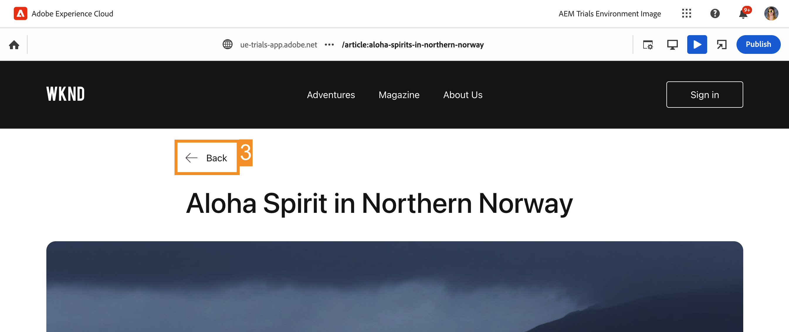

# 컨텍스트에서 편집 {#editing-in-context}

>[!CONTEXTUALHELP]
>id="aemcloud_sites_trial_edit_inline_universal_editor"
>title="컨텍스트에서 편집"
>abstract="Headless 앱이 유니버설 편집기를 활용하여 문맥 편집에서 작성자의 손가락 끝에 마찰을 덜 일으키는 방법을 살펴보십시오."

>[!CONTEXTUALHELP]
>id="aemcloud_sites_trial_edit_inline_universal_editor_guide"
>title="Universal Editor 실행"
>abstract="이 안내서에서는 Universal Editor를 살펴보고 이를 통해 누구나 어떤 구현에서든 콘텐츠의 모든 측면을 편집할 수 있도록 하여 콘텐츠 속도를 향상시키는 방법에 대해 알아봅니다.  아래를 클릭하여 새 탭에서 이 모듈을 실행한 다음 이 안내서를 따르십시오."

>[!CONTEXTUALHELP]
>id="aemcloud_sites_trial_edit_inline_universal_editor_guide_footer"
>title="이 모듈에서는 범용 편집기를 사용하여 컨텍스트 및 위치에서 콘텐츠를 사용자 지정하는 방법을 배웠습니다."
>abstract=""

## 컨텍스트에서 텍스트 편집 {#edit-text}

이전 모듈에서 본 콘텐츠 조각 편집기에서와 같이 구조화된 headless 콘텐츠 편집보다 현장 및 컨텍스트에서 편집하는 것이 종종 유용할 수 있습니다.

>[!NOTE]
>
>이 체험판에서 유니버설 편집기를 사용하려면 시크릿 모드가 아닌 Chrome을 브라우저로 사용해야 합니다. 이는 유니버설 편집기가 아닌 체험판 경험의 한계입니다.

범용 편집기를 사용하면 상황에 맞는 적절한 방식으로 텍스트를 편집할 수 있으므로 간단하고 직관적인 콘텐츠 작성이 가능합니다.

1. 편집기는 기본적으로 다음 위치에 로드되어야 합니다. **텍스트** 모드. 그렇지 않은 경우 다음을 탭하거나 클릭하십시오. **텍스트** 편집기 왼쪽에 있는 모드 레일의 아이콘

1. 최신 문서의 제목을 탭하거나 클릭하여 편집합니다.

   

1. 구성 요소는 텍스트 구성 요소임을 나타내는 탭이 있는 파란색 테두리로 표시된 대로 선택됩니다. 커서가 텍스트 입력 대기 중인 테두리에 있습니다. 텍스트를 다음으로 변경 `Aloha Spirit in Lofoten`.

   

1. Enter/return 키를 누르거나 텍스트 구성 요소 외부를 탭하거나 클릭하면 변경 사항이 자동으로 저장됩니다.

유니버설 편집기는 작성 환경 내에 변경 사항을 자동으로 저장합니다. 독자가 볼 수 있도록 여전히 게시해야 합니다. 이 작업은 이후 단계에서 수행합니다.

## 컨텍스트에서 미디어 편집 {#edit-media}

범용 편집기를 사용하여 콘텐츠 컨텍스트에 남아 있는 동안 이미지를 교체할 수도 있습니다.

1. 편집기 변경 **미디어** 을 탭하거나 클릭하여 모드 **미디어** 모드 레일의 단추

1. 서퍼의 이미지를 탭하거나 클릭하여 선택합니다.

1. 구성 요소 레일에서 에셋의 세부 정보를 볼 수 있습니다. 탭 또는 클릭 **바꾸기**.

   

1. 다음에서 **에셋 선택** 창을 아래로 스크롤하고 `surfer-wave-02.JPG` 이미지를 선택하여 선택합니다.

1. 탭 또는 클릭 **선택** 다음에서 **에셋 선택** 창.

   

이미지가 선택한 이미지로 교체됩니다.

## Reader과 마찬가지로 컨텐츠 경험 {#emulators}

유니버설 편집기를 사용하면 콘텐츠가 사용자의 장치에 전달될 때 콘텐츠를 보고 콘텐츠 컨텍스트 내에서 콘텐츠와 상호 작용할 수 있습니다.

1. 기본적으로 편집기는 콘텐츠의 데스크탑 버전을 렌더링합니다. 편집기의 오른쪽 상단에서 에뮬레이터 버튼을 탭하거나 클릭하여 대상 장치를 변경합니다.

   

1. Reader은 종횡비가 다른 다양한 장치에 있을 수 있으므로 편집기는 페이지가 사용자에게 표시되는 방식을 확인하기 위해 에뮬레이션 모드를 제공합니다. 예를 들어 세로 모드에서 모바일 장치 옵션을 선택합니다.

   

1. 편집기에서 콘텐츠 변경 사항을 참조하십시오. 에뮬레이터의 아이콘도 에뮬레이터가 있는 모드를 반영하도록 변경됩니다. 에뮬레이터 메뉴를 닫거나 클릭하여 콘텐츠와 상호 작용합니다.

1. 에뮬레이터를 데스크탑 모드로 되돌립니다.

에뮬레이터에 정확한 치수를 지정하고 에뮬레이트된 디바이스를 회전시켜 잠재적인 대상 디바이스에서 콘텐츠를 볼 수도 있습니다.

## 미리 보기 및 게시 {#preview}

편집기에서 콘텐츠를 선택하려면 콘텐츠를 탭하거나 클릭해야 하므로, 편집기에서는 콘텐츠가 편집 모드에 있을 때 탭하거나 클릭하여 링크를 따라가거나 콘텐츠와 상호 작용할 수 없습니다. 미리보기 모드를 사용하여 게시하기 전에 콘텐츠 내의 링크를 따라가서 사용자처럼 경험할 수 있습니다.

1. 편집기 왼쪽의 모드 레일에서 을 탭하거나 클릭합니다 **미리 보기**.

1. 이제 다음을 탭하거나 클릭합니다. **자세히 보기** 기본 기사 링크.

   

1. 문서를 검색한 다음 **뒤로** 링크를 클릭하여 기본 페이지로 돌아갑니다.

   

1. 이제 다음을 탭하거나 클릭합니다. **게시** 편집기의 오른쪽 상단에 있는 단추를 클릭하여 콘텐츠를 게시합니다.

   

콘텐츠가 게시되었습니다.

## 컨텐츠 조각 편집 {#editing-fragments}

Headless 콘텐츠를 구조적으로 편집하는 것이 즉석 편집보다 더 유리할 때 콘텐츠 작성 경험을 가속화하기 위해 범용 편집기를 사용하면 콘텐츠 조각 편집기에 빠르게 액세스할 수도 있습니다.

1. 페이지에서 아래로 더 스크롤하여 **모험** 섹션.

1. 편집기 왼쪽의 모드 레일에서 을(를) 선택합니다. **구성 요소**. 편집기에서 페이지 구성 요소를 선택할 수 있습니다.

1. 모험 중 하나를 탭하거나 클릭하여 선택합니다.

   * 선택한 구성 요소의 파란색 윤곽선을 확인합니다. 탭에는 다음이 표시됩니다. **참조** 콘텐츠 조각을 선택한 경우.
   * 범용 편집기에서 페이지에서 개체를 선택할 수 있으므로 콘텐츠 조각의 일부인 구성 요소를 개별적으로 선택할 수도 있습니다. 그림에서 표시된 위치를 탭하거나 클릭하여 전체 콘텐츠 조각 구성 요소를 선택합니다.

1. 새 항목 **편집** 아이콘이 모드 레일에 나타납니다. 을(를) 탭하거나 클릭합니다 **편집** 아이콘을 클릭하여 새 탭에서 콘텐츠 조각 편집기를 엽니다.

이제 새 탭에서 범용 편집기에서 선택한 콘텐츠 조각을 편집할 수 있습니다.
